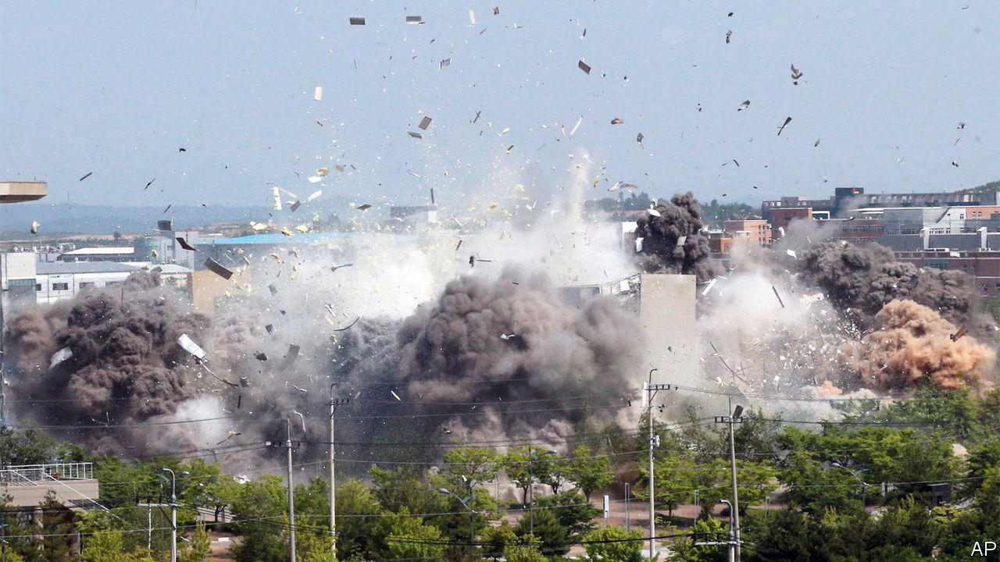

## Fighting mockery with munitions

# North Korea blows up the South’s de facto embassy

> And with it, detente on the Korean peninsula

> Jun 18th 2020SEOUL

AS THEATRICS go, it was impeccable. Shortly before 3pm on June 16th, a big cloud of smoke billowed suddenly from the site of the inter-Korean liaison office in the North Korean border city of Kaesong. As the dust settled, the building and much of its surroundings re-emerged, reduced to rubble. North Korean state media triumphantly reported that the office had been destroyed in a “terrific explosion”.

Along with the liaison office, which since opening in September 2018 had operated as a de facto embassy between the two Koreas, the North blew up what little was left of a two-year period of inter-Korean detente. The move followed a spring filled with several short-range-missile tests, weeks of lurid rhetoric against the South by the regime’s propaganda organs and the severing of communication lines with the South on June 9th. The regime is clearly trying to manufacture a fresh crisis. Outsiders have no clue as to why.

The pretext for the demolition was that North Korean defectors (“human scum”, as the North calls them) continue to launch anti-regime leaflets attached to balloons into the North. The defectors have also sent over chocolate biscuits, to remind northerners how much richer the capitalist, democratic South is, and flash drives full of Wikipedia pages. Kim Jong Un, North Korea’s despot, regards both mockery and accurate information as “hostile acts”.

To soothe tensions, the South had promised to stop the leaflet-launchers in 2018. In response to the North’s threats, it recently tried again to crack down on the defector groups, outraging domestic fans of free speech. Even so, Mr Kim’s regime was not satisfied. When it comes to silencing critics, it has more exacting standards.

One theory is that the North is trying to press its neighbour to make bigger economic concessions. Or perhaps it wants the South to coax America back to the negotiating table, giving Mr Kim another chance to win sanctions relief. Even before the latest escalation, inter-Korean relations had been in poor shape. Economic co-operation (read: the South’s money flowing into the North’s coffers) between the two countries cannot go ahead without the easing of sanctions, which in turn depends on progress in talks with America aimed at removing the North’s nuclear weapons. These have made no headway since a summit between Donald Trump and Mr Kim last year broke down.

However, if extracting concessions by raising pressure is the strategy, the likelihood of success is low. Mr Trump, who is preoccupied by covid-19 and re-election, has paid little attention to North Korea in recent weeks. After the Kaesong explosion, America’s State Department blandly urged the regime to “refrain from counter-productive actions”. South Korea, for its part, sharpened its usually conciliatory tone. A general blustered that North Korea would “pay the price” if it took further military action. If anything, the affair has made Moon Jae-in, South Korea’s president, less receptive to Mr Kim’s demands.

Another possible motive for the North’s recent histrionics is domestic. The propaganda campaign that preceded the demolition of the liaison office was spearheaded by Kim Yo Jong, the dictator’s younger sister, who raged at the “rubbish-like mongrel dogs” who had the temerity to “fault...our supreme leadership”. The regime may be seeking to raise Ms Kim’s profile by strengthening her hardline credentials, reckons Andray Abrahamian of George Mason University Korea.

Kim Jong Un has been unusually absent from public view this year, prompting rumours about his health and speculation about who might succeed him. His sister tops the list of possible candidates. An added bonus of the current campaign might be to distract from domestic economic difficulties caused by North Korea’s stringent quarantine to shield itself against covid-19 (of which it still, fantastically, claims to have no cases). Whatever the motives, outsiders hope that when it comes to blowing things up, the North will continue to restrict itself to empty buildings. ■