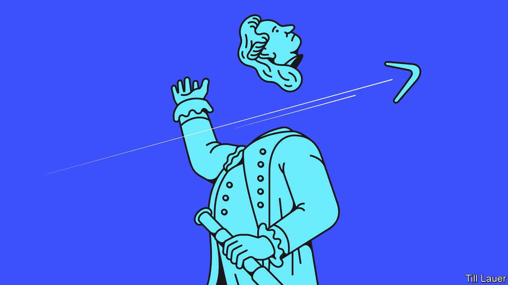

## Banyan

# Racism in Australia is not just a thing of the past

> A new generation of Aboriginal leaders is puncturing the country’s cosy self-image

> Jun 20th 2020

POLICE ON HORSEBACK gathered in a circle to defend the statue of Captain James Cook in Sydney’s Hyde Park. Australians inspired by American protests, and calling attention to the plight of their country’s indigenous peoples, might have toppled the statue. The moment was replete with historical irony. The “discoverer” of Australia met his end on a Hawaiian beach, at the hands of a crowd of angry natives. The police seemed determined not to let it happen to him a second time.

The whole messy issue of Australia’s past rose up and wound itself in knots around Cook’s bronze form. The conservative prime minister, Scott Morrison, condemned the protesters. But he drew a distinction between Australia’s history of white settlement and America’s. Australia had been “a pretty brutal place”, he conceded, “but there was no slavery.”

That is some gloss to the real story of white settlement. Australia’s indigenous peoples have endured land seizures, massacres, servitude and, well into the second half of the 20th century, children forcibly removed by government agencies and church missions in the name of racial assimilation—the so-called stolen generations. An uproar over his comments compelled Mr Morrison to backtrack and clarify that he had meant no legal slavery. To many of his government’s supporters, muttering over their barbies, the furore was political correctness gone mad.

Nobody denies that Australia’s indigenous peoples face bleak odds. Aboriginals and Torres Straits Islanders are 3% of the population but 27% of prisoners. Their life expectancy is eight years less than the national average. They do terribly at school.

But Australia has made strides to improve the Aboriginal condition, starting with a referendum in 1967 granting full citizens’ rights to indigenous Australians. In 1992 a High Court case over land title overturned the long-held legal fiction that Australia had been an uninhabited terra nullius for the taking. And in 2008 the then prime minister, Kevin Rudd, formally apologised to the “oldest continuing cultures in human history” over the stolen generations and other past mistreatment. Mr Rudd’s and successive governments have committed to “closing the gap” in socioeconomic outcomes.

Many Australians therefore share Mr Morrison’s contention that Australia is not a fundamentally racist country but its opposite, a “fair” one. From this some conclude that Aboriginals’ remaining problems—the drinking, the domestic violence, the supposed indolence—are of their communities’ own making, not a consequence of discrimination. One columnist even claims that the protesters are “enablers for systemic and entrenched indigenous problems to fester”.

In the past, bottom-up efforts by indigenous folk to improve their lot tended to work only if the political climate encouraged it. The “Uluru statement from the heart” in 2017, which called for constitutional change to give indigenous Australians a special voice in laws and policies that concerned them, was rejected by the ruling coalition, on the ground that the proposed body would constitute a third legislative chamber.

That argument, Mr Rudd contends, is “bullshit”: the body would have had no authority to introduce or vote on legislation. Rather, the rejection was a dog-whistle to the same kinds of voters who were encouraged to believe, after the High Court ruling on land rights, that Aboriginals would soon be camping in their back yard. Mr Morrison’s criticism of protesters was intended for much the same audience.

It is no surprise then that indigenous people believe Australia does not offer them a fair go. “There’s a view here that we’re all mates,” says Pat Anderson, an Aboriginal leader. “But this is a mythology they tell themselves.” Petty racism abounds. One Aussie-rules star, Adam Goodes, who complained when a 13-year-old called him an ape, was booed into early retirement.

Yet some think the social and political ground might soon shift. A younger generation of indigenous Australians, many better educated than their parents, is beginning to puncture the cosy self-image of Australia projected by the likes of Mr Morrison—using wit to get their point across. It was hardly salutary that a recent study concluded that three out of four Australians have a “racial bias” against Aboriginals. But it did bring cheer when Briggs, an indigenous rapper, tweeted that the fourth Australian was probably “conducting the survey”.

## URL

https://www.economist.com/asia/2020/06/20/racism-in-australia-is-not-just-a-thing-of-the-past
