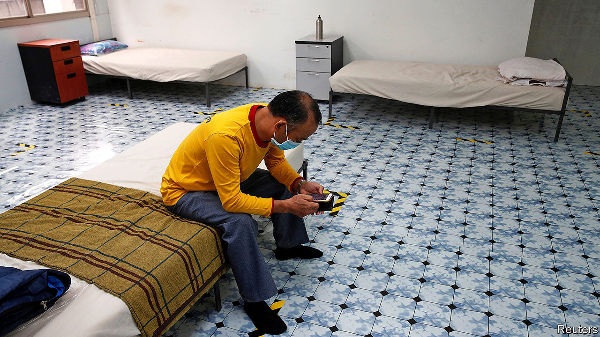

## Breathing room

# Singapore promises roomier digs for migrant workers

> The government wants to stop covid-19 from spreading in cramped dormitories

> Jun 18th 2020SINGAPORE

MIGRANT WORKERS are vital to Singapore’s economy, as they make up two-fifths of the labour force. But they are not a popular cause. The worst electoral showing for the ruling People’s Action Party (PAP) was in 2011, when the opposition put a call for fewer migrants at the heart of their campaign. So it is brave of the government to pick a fight with voters on the subject, with an election expected within months.

On June 1st Lawrence Wong, co-chair of Singapore’s covid-19 task-force, announced plans to build lower-density dormitories for some 100,000 migrant workers. The new housing, he warned, would inevitably encroach on other residential areas. When the government built workers’ dormitories in one central district in 2009, the PAP was subsequently thumped at the ballot box there.

Its willingness to try again is born of a public-health worry, not a surge of munificence. Nearly all Singapore’s 41,000 covid-19 cases have been among migrant workers. A quarter of them live in dorms packed with as many as 16 people per room. Regulations mandate an area of 4.5 square metres of living space per person, including shared facilities. The new dorms will boast a more salubrious six square metres each, excluding communal space, providing for ten to a room.

That is a big commitment for the world’s most densely populated country, bar Monaco. It is also a political risk. Migrant workers are a downtrodden lot, making an average of S$500 ($357) a month, says Debbie Fordyce of TWC2, an advocacy group. Most of their accommodation is hidden away in outlying areas. But when they stray into residential ones, they are often met with suspicion and scorn.

In the past decade, especially after a riot in 2013, residents have got the authorities to tighten surveillance over Little India, a district in central Singapore where 100,000 South Asian workers would gather weekly in pre-pandemic days to shop for groceries or pass the time. A member of parliament who described such gatherings as “walking time-bombs and public disorder incidents waiting to happen” petitioned the government to fence off communal areas.

Even as it promises migrants more spacious surroundings, however, the government is not getting soft-hearted. As Singapore prepares for a partial exit from lockdown on June 19th, it has insisted that migrant workers, many of whom do not own smartphones, must install and use a battery-draining contact-tracing app that most residents have rejected, largely on grounds of privacy.

But public attitudes may be softening. “Many Singaporeans have been coming forward, asking how they can help migrant workers through the pandemic,” says Michael Cheah, head of HealthServe, a charity. Many such benefactors are younger Singaporeans, he points out.

Citizen Adventures, a group of about 200 youth volunteers, led by Cai Yinzhou, befriends migrant workers. It has raised S$786,000 ($564,000) to help them through the crisis. “We don’t take for granted our relationship with the workers,” says Mr Cai. “But unfortunately that is not the case with other Singaporeans.” ■

Editor’s note: Some of our covid-19 coverage is free for readers of The Economist Today, our daily [newsletter](https://www.economist.com/https://my.economist.com/user#newsletter). For more stories and our pandemic tracker, see our [coronavirus hub](https://www.economist.com//news/2020/03/11/the-economists-coverage-of-the-coronavirus)

## URL

https://www.economist.com/asia/2020/06/18/singapore-promises-roomier-digs-for-migrant-workers
