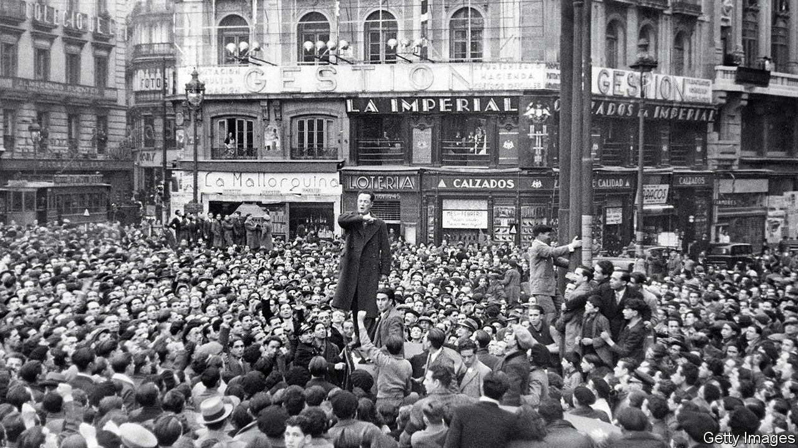

## Too many setbacks

# A historian sets out to explain Spain’s tumultuous past

> The country’s modern history has been tragic. But today its predicament is less exceptional

> Jun 18th 2020MADRID

A People Betrayed. By Paul Preston.Liveright; 768 pages; $35. William Collins; £30.

IN 2018 A court in Madrid sentenced several former officials of the ruling conservative People’s Party (PP) to long prison terms for taking kickbacks on public contracts. It cast doubt on the credibility of evidence given by Mariano Rajoy, the prime minister, who had appeared as a witness. Within a fortnight Mr Rajoy was out, his government the first to be ousted by a censure motion since Spain returned to democracy and constitutional monarchy in the late 1970s, after the long dictatorship of Francisco Franco. Pedro Sánchez, the Socialist leader, breezed into power pledging to restore the dignity of Spanish politics.

Two years and two general elections later, he heads a weak minority coalition with Podemos, a far-left party. Instead of dignity, there is crispación, Spain’s word for no-compromise adversarial politics. Even before the pandemic receded, the vitriol was back. The PP and Vox, a newish party of the hard right, accuse Mr Sánchez of mismanaging the disease (though the PP regional government in Madrid did no better). Podemos, preposterously, accuses the opposition of seeking a coup. Meanwhile, Catalan separatism smoulders; some of its leaders are in jail after their illegal declaration of independence in 2017. Juan Carlos, the king who helped nurse democracy to life, abdicated in 2014. He is now being investigated over a contract in Saudi Arabia.

No wonder many moderate Spaniards fear that a golden age of democratic progress has come to an end, and that the country is reverting to older, more destructive habits. So the latest book by Paul Preston, a British historian of modern Spain, is timely. A political history of the past 150 years, “A People Betrayed” has a thesis: that the country has been held back by corruption and political incompetence, which have in turn led to breakdowns of social cohesion that have often been met with state violence. This especially applies, the author argues, to relations between the central government and Catalonia.

Mr Preston begins with an earlier restoration of the monarchy, in 1876, and the creation by Antonio Cánovas del Castillo, a conservative statesman, of a civilian democracy based on electoral manipulation by corrupt caciques (political bosses). “Excluded from organised politics, the hungry masses could choose only between apathy and violence,” Mr Preston writes. Many chose the latter, in the form of anarchist terrorism. Attempts at reform, from above or below, failed. With the encouragement of Alfonso XIII, a meddling and frivolous king, General Miguel Primo de Rivera took power in 1923. His fall brought down the monarchy (again).

The republic that followed offered a new start. But its attempts to curb the power of the army and the church, grant home rule to Catalans and Basques and implement land reform, all amid the Depression of the 1930s, may have been too ambitious. Resistance to this programme was accompanied by a drift to extremes of both right and left. This culminated in the military rebellion of July 1936 and the Spanish civil war. Having ground out a bloody victory with the crucial initial help of Hitler and Mussolini, Franco erected a brutal, introverted dictatorship.

It was also a corrupt one, as Mr Preston shows. Franco bought off potential rivals with opportunities for enrichment. His own family, and their entourage, were grasping. Franco took a secret stipend from the telephone company and sold donated coffee from Brazil on the black market. His wife, Carmen, was the terror of Madrid jewellers, who dared not present their bills.

After two decades of failed economic autarky, in 1957 Franco brought in technocrats who opened up the economy, triggering growth that created a middle-class urban society. Political modernisation would come only with Franco’s death, when moderates in the regime came to terms with an opposition that had learned the bitter lessons of past extremism. Despite threats from military diehards and the Basque terrorism of ETA, democracy thrived as the Socialists and PP alternated in power. But in the 21st century blemishes appeared. An unchecked property boom led to a bust and a slump. Officials abused savings banks and took bribes for re-zoning land.

Mr Preston knits all this together into a compellingly readable narrative (even if parts are familiar from his earlier books). He picks his arch-villains well. They include General Severiano Martínez Anido, a sadistic satyr who tried to crush the Catalan anarchists through murder, torture and agents provocateurs; Juan March, a profiteer and tobacco-smuggler who financed Franco’s coup; Alejandro Lerroux, an “outrageous rogue and virtuoso carpetbagger” who opportunistically moved from left to right; and Francisco Largo Caballero, a naive and vain Socialist leader whose mouthing of revolution and sabotage of effective government helped doom the republic.

Despite everything, though, Spain became a developed and socially tolerant democracy—and at times Mr Preston’s relentless indictment feels overstated. For example, recent Spanish historiography is less coruscating in its judgment of the restoration political system. The author is too ready to blame Basque terror and Catalan separatism on the clumsiness of Madrid, rather than on their practitioners. With some exceptions, the recent corruption was naively provincial rather than the grand larceny of a March or Franco. Albeit tardily, it has been punished. Spain ranks 30th out of 198 countries in Transparency International’s index of perceptions of corruption, ahead of Israel, Poland and Italy.

Why has Spain’s history been so tragic? Spaniards are rightly fed up with being cast by foreigners as violent fanatics, and a backward exception in Europe. Mr Preston, too, rejects that. Most historians highlight a weak state, difficult geography with industrialisation mainly in peripheral regions, an army that refused to accept the loss of empire, and missed political opportunities. “Too many setbacks”, as Santos Juliá, a Spanish historian who died last year, entitled his final book.

While disgust at corruption has played a role, the political strains of today owe more to the slump and the emergence of rival populisms in the form of Catalan nationalism, Podemos (with its mixture of Leninism and Peronism) and Vox. In this respect, contemporary Spain looks like the rest of Europe as much as like its own past. ■