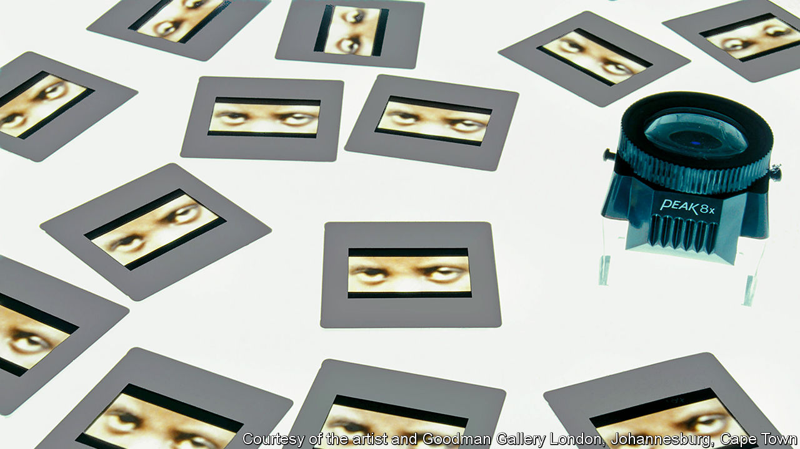

## Opening the black box

# Alfredo Jaar makes art from the news

> His latest video adapts footage of coronavirus burials on Hart Island off the Bronx

> Jun 18th 2020

LIKE MUCH of his art, “Between the Heavens and Me”, Alfredo Jaar’s most recent video, was drawn not from his imagination but from the news. In this case it began with a report on the BBC about Hart Island off the Bronx. The prison detail at the island’s cemetery—where, for decades, indigent New Yorkers were interred in mass graves—was working round the clock to bury the unclaimed bodies of those who had died, alone and unloved, with covid-19. “My brain could not comprehend what my eyes were seeing,” Mr Jaar says.

He slowed down the footage, replacing the commentary with a haunting tune by Anouar Brahem, a celebrated Tunisian oud player. Over and over the scene repeats itself: uniformed gravediggers stack coffins in a freshly dug trench with solemn deliberation, as if they are making an offering to Mother Earth. “Here we have the poorest people in New York,” Mr Jaar explains, “the anonymous, the invisible, the no-name people being buried by prison inmates, many of whom are poor and black like them. I wanted the film to be a lament.”

In an artistic tradition made famous by Andy Warhol and Robert Rauschenberg, his videos force viewers to consider the effects of their incessant exposure to horrific images. They also highlight the tendency of the news to focus on a tragedy, then move on. “News events cover reality in both senses of the word: reporting it even as they conceal it,” remarked Hartwig Fischer (now director of the British Museum) when he included Mr Jaar’s work in a show at the Kunstmuseum Basel in 2005.

Now 64, Mr Jaar was a teenager in Chile when Salvador Allende was ousted in a military coup, but has lived in New York since his mid-20s. He is not a conventional studio artist, reckoning he has travelled 7m miles (11.3m kilometres) to create art that is meant to provoke. He has staged over 100 “public interventions”, art-world-speak for performances in which audiences gather to watch or even take part. In 2019 he walked the streets of Edinburgh wearing a sandwich board reading “I Can’t Go On, I’ll Go On”, a quotation from Samuel Beckett. Next year, when a retrospective of his work opens at the Hiroshima City Museum of Contemporary Art, his board will read, “Teach Us To Outgrow Our Madness”. That is a reference to the Japanese Nobel laureate Oe Kenzaburo, but it is also what Mr Jaar feels like saying “when I see the madness that is taking over this planet”.

“People see new meaning in his work every time they confront it,” says Pablo León de la Barra, a curator at the Guggenheim Museum, which owns one of his best-known pieces, a series of electronic billboards called “A Logo for America”. One panel superimposes an image of the two American continents onto the word “AMERICA”, quietly insisting that there is more than one kind of American. Another enigmatically combines the words “This is not America” with a map of the United States. When it was shown in Times Square in 1987, during Ronald Reagan’s presidency, viewers interpreted the sequence as a critique of his administration’s interference in Nicaragua and Grenada. Displayed on the square again in 2014, it seemed a comment on the treatment of migrants. Now, Mr León de la Barra says, it might be regarded as a statement about racism.

Mr Jaar’s travels have ground to a halt this year. Confined to his apartment in SoHo, with books stacked to the ceiling and several thousand CDs, he has slept in the same bed for weeks on end for the first time in decades. He has been reading poetry, listening to the melancholic music of love and longing known as saudade, which is made most commonly by the Portuguese diaspora—and working. “It’s for my mental health, as much as anything else,” he says. He will have much to do when the lockdown lifts; four big exhibition projects have been postponed because of the pandemic, and more are in the offing.

In August Clara Kim, senior curator at Tate Modern in London, hopes to reopen “A Year in Art: 1973”, a show that includes “Studies on Happiness”, a video installation by Mr Jaar that portrays emotional reactions to the coup in Chile. “Violence might be invisible to us,” he says. “But it exists out there, and we will see the consequences of it sooner or later.” The power of his work, says Ms Kim, stems from his dual role as artist and witness—not just through the contemporaneous recording of violence, but in teasing out responses that stretch over decades.

In the mid-1990s Mr Jaar began to focus on the Rwanda genocide. Reports about the massacres compelled him to go to the country, he recalls; over several trips, he took thousands of pictures from which he has created installations around the world (see picture). Returning to New York he found some of his own images so shocking that in one work, “Real Pictures 1995”, he entombed the photographs in a series of black boxes, never to be opened.

Later this year Mr Jaar’s Rwandan work will appear at the Zeitz Museum of Contemporary African Art in Cape Town, the first time it has been exhibited in Africa. Audiences will once again be forced to think about, and beneath, scenes they have encountered on television or social media. “I want people to see these images,” Mr Jaar says, “to actually see them, in order to bring them inside in their brain, in their heart, in their soul, to try to understand what’s happening to us.” As Ezra Pound said of literature, Mr Jaar’s art is news that stays news. ■