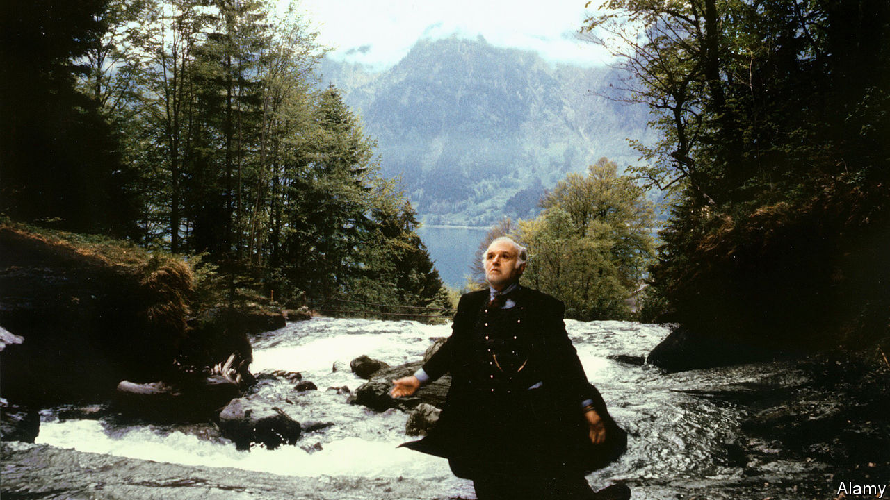

## Home Entertainment

# Time to climb “The Magic Mountain”

> Thomas Mann’s saga of high-altitude sickness is oddly uplifting

> Jun 20th 2020

WHEN HANS CASTORP makes a midsummer visit to Davos, where his tubercular cousin, Joachim, is being treated, he expects to be there for three weeks. A job at a shipbuilding firm awaits Hans, the unassuming son of a merchant family from Hamburg. But he develops a fever, and ends up staying in the Swiss Alps for seven years. In the mountains, time moves elastically—days lengthen and years hurry past—as it can in a lockdown.

The action of “The Magic Mountain”, wrote Thomas Mann in a foreword, takes place “a very long time ago”—and even though his novel, published in 1924, is set in the preceding decade, it evoked a vanished world. It refers to a Germany not yet crushed by the first world war and the subsequent reparations, a country that still has an empire, as well as strict hierarchies and conventions. These are scrupulously observed by the pan-European characters in the story, a Bildungsroman and dark comedy of manners in which even the dining tables are classified by social status.

Mann’s fictional sanatorium, the Berghof, is probably modelled on the Schatzalp, a mansion reachable only by foot or funicular, which today is a hotel. Practically the whole cast of his novel have tuberculosis, which at the turn of the 20th century killed one in seven people in Europe and America. He presents the symptoms unflinchingly, including “a coughing that had no conviction and gave no relief, that did not even come out in paroxysms, but was just a feeble, dreadful welling-up of the juices of organic dissolution”.

Yet though the disease is everywhere, it is discussed euphemistically. Newcomers are diagnosed as anaemic. As is still the case in the rich world, death is hidden. “You hear nothing of them, or only by chance afterwards,” Joachim says of patients who succumb. “Everything is kept strictly private.” Hans learns that corpses are brought down the mountain by bobsleigh.

Surprisingly for a tale of fatal lung disease, however, the tone is gently ironic, a levity that offsets the symbolism and philosophy. Officially, Hans is a visitor, but he lives the life of a patient, which revolves around gossip, walks, infatuations, intellectual discussions, five hearty meals a day and a strict regimen of bed rest, temperature-taking and alcohol rubs. Hans takes to this high-altitude life better than Joachim, an officer who longs to return to the army. He does—and comes back to the mountain even sicker. Hans, by contrast, seems cured, and at the close leaves for the even deadlier battlefield.

As with his elongated stay at the sanatorium, so with the novel itself. Based on Mann’s own impressions of Davos, where his wife was treated, it was conceived as a short story, a humorous companion piece to “Death in Venice” (itself set during an outbreak of cholera). The author expected “The Magic Mountain” to find only a small audience. But in one of the strange transformations that illness can effect, it grew into an elegant, 900-page reflection on mortality, read and revered by millions. ■