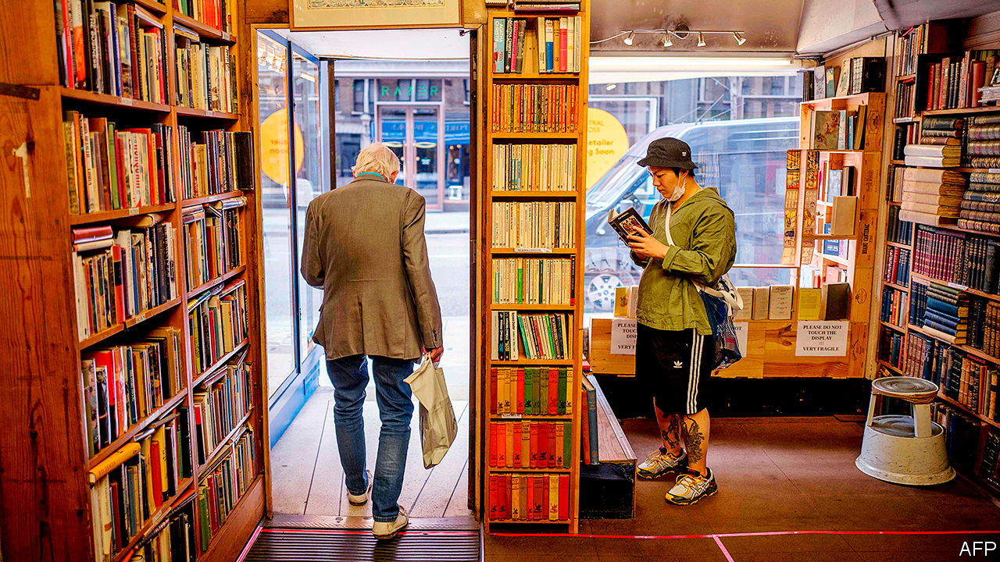

## Shopping is back

# Britain’s bookshops reopen

> They face a fight for survival. They’re used to that

> Jun 18th 2020ALDEBURGH

AT FIRST, THEY are tentative. Hovering about the door of the bookshop in the Suffolk town of Aldeburgh, they wait to be invited in. “Can I look at the cards?” a woman whispers, as if enquiring about contraband. A man spends several minutes forensically scrubbing his hands with sanitiser gel before wrestling on a pair of latex gloves. “I’m going to have to buy something now,” he quips. But once inside, the customers pootle absent-mindedly with no regard for the marked-out route, hunting for that paperback they heard about on the radio, something for the grandkids or just a bloody good yarn. Mary James, who owns the shop with her husband John, smiles indulgently. “People are finding the one-way system quite challenging,” she concedes.

England’s high streets, which were closed for nearly three months, are slowly returning to life. Bookshops and other stores deemed “non-essential” were permitted to reopen on June 15th. Almost all branches of Waterstones, a big chain, did so. Roughly half of England’s several hundred independent booksellers—including the Aldeburgh Bookshop—opened straight away. A steady flow of customers are returning. “It’s not like Primark,” Mrs James tells a customer over the phone, alluding to pictures of snaking queues outside a clothing retailer. “But there are people.”

That is welcome after a nervy start to the year for bookshops, which hardly make bumper profits even in boom years. The Jameses are typical: they furloughed their “four-and-a-half” employees at the start of lockdown and dispatched mail orders themselves. Like many such shops, they expect to scrape through, but will keep a tight rein on spending for some time. James Daunt, who runs Waterstones, is also taking a cautious approach. In the first two days of trading, sales at the Crouch End branch were up year-on-year but were down by 80% at Hatchards, a posh shop owned by Waterstones in central London. Mr Daunt thinks that customers are keen to return to their local high street but are wary of travelling to city-centre branches.

Bookshops are used to existential crises. They got a head start in learning to compete with Amazon, which challenged booksellers before taking on the rest of the high street. “We’ve had 25 years of practice,” says Meryl Halls of the Booksellers Association, a trade group. “We’re battle-hardened. Some retailers are just going into that firestorm now.” The number of independent bookshops in Britain plummeted from 1,894 in 1995 to 867 in 2016. But in recent years more have been opening than closing; smart owners are tempting back customers with events, book groups and cafés. “I don’t think anybody has fallen out of love with Amazon,” says Mr Daunt. “The pressure was so extreme they’ve had to improve themselves. Good independents have become exceptionally good.”

Mr Daunt points to another advantage that booksellers have over other retailers: “We’re very fortunate that we’ve got something people want.” Clothes shops that closed in March are sitting on stockpiles of this season’s fashions that will soon be old hat. But books hardly age. And bookshops provide a sense of community and serendipity that cannot be replicated online. Shoppers in Aldeburgh who come in for Jeffrey Archer’s or Lee Child’s latest novel might go out with “The British Herring Industry: The Steam Drifter Years 1900-1960”.

Some come in on a mission (“I know what I want: ‘The Salt Path’”). But, for most, browsing is the point. One woman picks up a large haul, including the latest title for the local book group. “We had one very unsatisfactory Zoom meeting because everybody in the club likes to talk at once,” she says. They now meet outdoors. Your correspondent, who pledged to spend lockdown working through a backlog of unread doorstoppers, comes out with four novels (two of them recommendations) and a wallet £51 ($64) lighter. Perhaps they should have stayed shut after all.■

Editor’s note: Some of our covid-19 coverage is free for readers of The Economist Today, our daily [newsletter](https://www.economist.com/https://my.economist.com/user#newsletter). For more stories and our pandemic tracker, see our [coronavirus hub](https://www.economist.com//news/2020/03/11/the-economists-coverage-of-the-coronavirus)

## URL

https://www.economist.com/britain/2020/06/18/britains-bookshops-reopen
