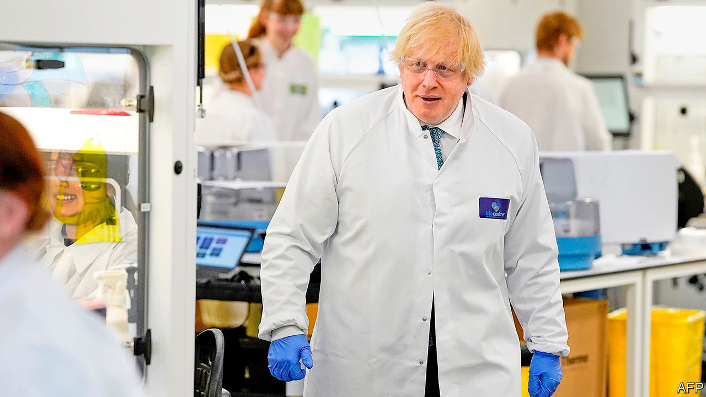
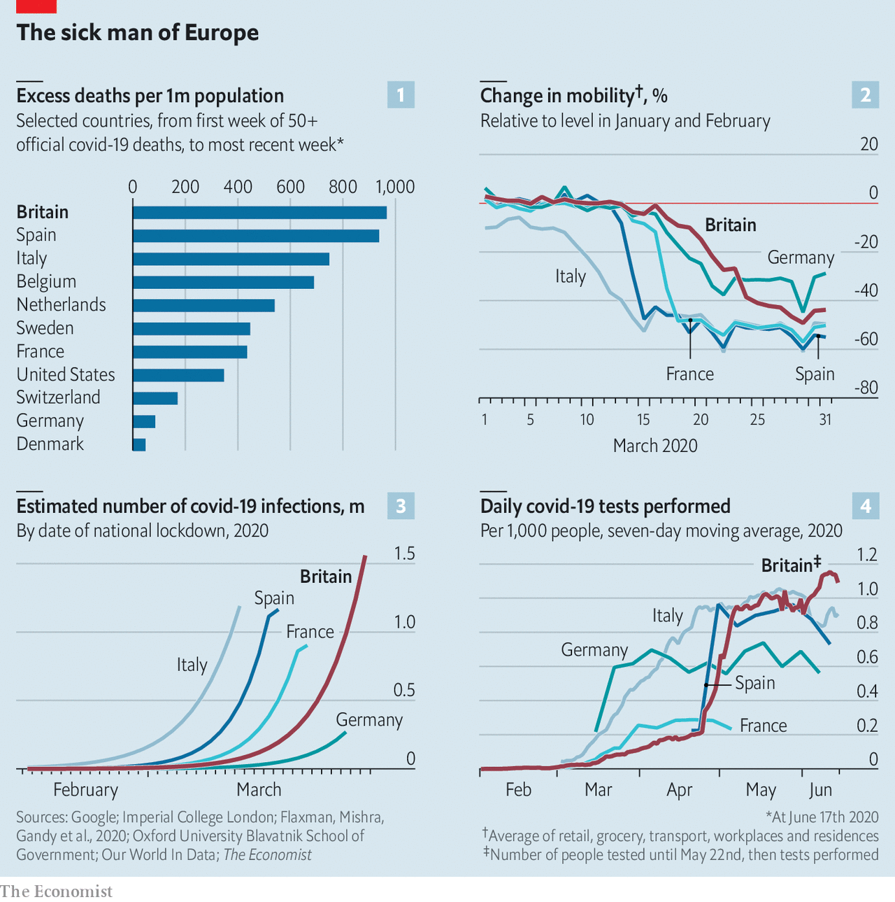
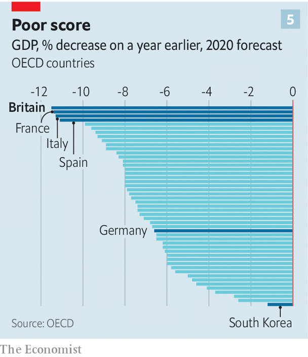
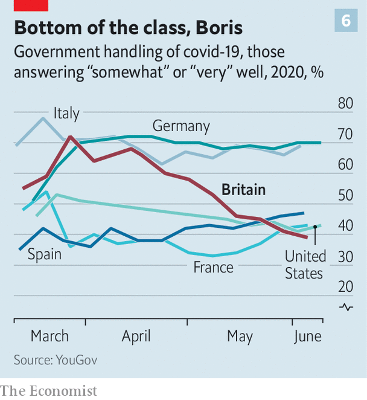

## An unfortunate case study

# The British state shows how not to respond to a pandemic

> It faced difficult circumstances. And has so far failed to rise to them

> Jun 20th 2020

COVID-19 WAS sweeping Europe. Images of overwhelmed hospitals in Lombardy played on television every night. Governments were beginning to put in place restrictions that would last for months. And Mike Padgham, the owner of four care homes in Scarborough and Pickering, in the north-east of England, faced a dilemma. Should he shut his homes to visitors?

If they had been in Alsace or Umbria, the government would have told him to. In Britain, it did not. Despite the lack of national guidance, Mr Padgham nevertheless went for it, closing the homes to all but essential visitors; something which annoyed relatives. “People thought we were jumping the gun,” he recalls. Two days later on March 13th, Public Health England, a government agency, advised those who were unwell to stay away from homes, but also noted the “positive impact” of visits. It took another fortnight for the government to tell care homes to turn visitors away.

Mr Padgham’s foresight was not enough to keep out the virus. There were five deaths in his homes—a small part of a bigger tragedy. Altogether, one in 14 residents in British care homes at the start of the pandemic is thought to have died from the virus. A comparison in May by the International Long-Term Care Policy Network found that a higher proportion of people in care homes in Britain had died than in France, Germany, Canada or Sweden.

Some aspects of the British response to the pandemic have been admirable. Its researchers are leading the search for drugs; an Oxford University trial has found the most promising one yet (see [article](https://www.economist.com//britain/2020/06/18/dexamethasone-cuts-covid-19-deaths)). The National Health Service has weathered the storm. Sweeping organisational changes—including postponing elective surgeries, discharging inpatients and buying private beds—saved it from being overwhelmed. But measured by the number of deaths over and above those that would normally be expected, Britain nevertheless appears to have the highest death rate in the developed world (see chart 1).

Lots of factors beyond the government’s control contributed to this. Care homes are a popular way to look after old folk. Britons are fatter than their fellow Europeans. The large ethnic-minority population is disproportionately likely to suffer from diabetes and heart disease, which increase the risk of severe covid-19. Genomic analysis suggests Britain imported lots of cases from Spain, before it was clear how prevalent the virus was there. One in seven Britons live in London, an international travel hub which prior to the pandemic received nearly 1,500 flights a day.

Yet the government’s poor response has contributed. On March 12th, having joked two weeks earlier about shaking hands in a hospital with covid patients, Boris Johnson, the prime minister, turned serious: “Families are going to lose loved ones before their time.” But the restrictions he announced were light: those with symptoms were told to stay at home for a week; those older than 70 instructed to avoid cruises. Meanwhile, continental Europe was already beginning to lock down.

Given the government’s well-publicised suspicion of “experts’” views about Brexit, some worried it would ignore the scientists’ advice on dealing with the pandemic. These fears were unfounded. The government’s advisory committee (the Scientific Advisory Group on Emergencies, or SAGE) helped shape policy—which was, in early March, to protect the vulnerable, while tailoring restrictions on others to ensure the health service was not overwhelmed. The virus would spread among the general population, which would build immunity to the disease.

At that stage, there was great uncertainty about numbers. Even so, some of SAGE’s advice seems questionable. On March 3rd the committee minuted that: “There is currently no evidence that cancelling large events would be effective,” on the grounds that those who might have attended would go to the pub instead. But not all would, and if they did, there would have been less risk of the infection spreading across the country, which it did. So large events went ahead, including a football match on March 11th between Liverpool and Atletico Madrid, attended by 3,000 Spanish fans.

Perhaps the government should have questioned the experts more closely. But it “was getting advice it wanted to hear”, notes Sir Lawrence Freedman of King’s College London, who worked on the inquiry into the Iraq war and has reviewed the government’s early response. Boris Johnson was focused on protecting the economy, and his instincts are liberal. “Of course people must make their own decisions,” he told a press conference. “I’m a believer, as I say, in freedom.” He was unlikely to scrutinise advice that went with his grain.

Then it became clear just how fast the disease was spreading. On March 13th, Neil Ferguson of Imperial College London, whose team has produced the outbreak’s most influential modelling, presented analysis to SAGE which showed hospitals would soon be overwhelmed. Policy changed—but not swiftly enough. On March 16th Mr Johnson advised people to avoid all unnecessary contact. On March 18th he announced that schools would close. It was not until March 23rd that he ordered people to stay at home.

As a result of the government’s tardiness, Britons were slower to change their behaviour than people in France, Spain or Italy (see chart 2). When the country finally locked down, the virus had spread further than in those countries (see chart 3). Professor Ferguson now estimates that, since the epidemic was doubling in size every three to four days, if the country had locked down on March 16th, the death toll would have been reduced by at least half.

Choosing when to lock down was a difficult decision. The same was not true of building testing and tracing capacity. In the middle of February, SAGE noted that PHE could trace only five new cases a week, and that it might be possible to raise this to 50 cases a week. By the time the virus was spreading fast PHE still only employed a couple of hundred contact tracers. The route that some of the most successful countries, such as Denmark, Germany and Switzerland have followed, of tracing infected people’s contacts and containing outbreaks of covid-19 locally, was thus closed to Britain.

The lack of testing was a bigger problem still. Early on, the shortage made it hard for scientists to get a true picture of how far the virus had spread, and SAGE repeatedly emphasised the need to increase capacity, to little avail. Even by the middle of April Britain was testing people at a third Germany’s rate. For six weeks, it lagged the rest of Europe (see chart 4).

At the time, PHE had sole responsibility for testing. In contrast to Germany, which used a large number of private and university laboratories, PHE tried to boost its own capacity. “They had shown they couldn’t ramp up supply, and that was because they were using homebrewed tests,” says an insider. It was only after the government belatedly set out a plan in early April to use university and private-sector facilities to run commercial tests, and passed responsibility for this to the Office for Life Sciences, a smaller, more agile government body, that capacity jumped.

The shortage had particularly grim consequences in care homes. With limited testing available, staff with symptoms were instructed to stay at home, which resulted in a spike in the use of agency workers, who moved from one home to another. Care homes also took lots of those rushed out of hospitals to free up beds, without the ability to test many of the new arrivals. Asymptomatic care-home workers gained access to testing only on April 29th. Scientists at Imperial College London tested staff at three care homes in the capital in April. In two homes, staff tested negative; in one, three of 19 were positive but asymptomatic, meaning they could have been spreading the virus unknowingly.

The decision on whether to make people wear face-coverings ought to have been a simple affair. Many scientists were lobbying for it, on the grounds that they cost nothing, laboratory tests show that even home-made masks can block transmission and countries that adopted them early also succeeded in containing the disease swiftly. On April 14th Sadiq Khan, the mayor of London, asked the government to make such an order. SAGE was ambivalent; on April 21st it said it regarded the evidence for them as “weak” but recommended that they should be worn in crowded public spaces. By June 4th, when the government announced that people should wear face-coverings on public transport, they were worn universally in East Asia and much of Europe had made them compulsory. Britain, along with America, was an outlier.

Why Britain took so long to follow is unclear; most likely it was because of a parochial failure to observe best practice abroad and an Anglo-Saxon fear of appearing nannying. It still does not require them in shops: most of the Britons crowding back into newly reopened retail outlets have their faces uncovered.

Economic life is restarting in Britain, but more slowly than elsewhere. Hospitality remains shuttered. While the best London offers is a takeaway pint from a handful of pubs, in Paris or Berlin one can enjoy a bottle of wine in a restaurant. According to a tracker maintained by the Blavatnik School of Government at the University of Oxford, the cumulative stringency of the government’s lockdown is now about 10% higher than the rich-country average.

Britain’s economic structure—it is under-represented in the worst-hit businesses, such as transport and hospitality, and has a lot of service jobs that can be done from home—should have insulated it somewhat against the covid-19 shock. But because of the long lockdown, it looks likely to be near the bottom of the global league table for growth in 2020 (see chart 5).

The best performing rich countries, such as South Korea, are those that managed to keep the pandemic under control. The worst hit economically, such as Spain and Italy, are those with much higher death rates. When public opinion will not tolerate elevated death rates, the trade-off between public health and the economy dissolves. A healthy population and a healthy economy go hand in hand.

That the British government has provided its people with neither is reflected in opinion polls (see chart 6). The prime minister himself remains fairly popular, but his ratings are in decline. He won sympathy when he succumbed to the disease, but has lost it in other ways. The revelations that he missed five consecutive meetings of the COBRA emergency committee when the virus was taking hold, and that Dominic Cummings, his chief adviser, broke the lockdown rules he helped design, fuelled suspicions that the government did not take the crisis sufficiently seriously.

The political consequences of this failure are likely to stay with Mr Johnson during his time in power (see [article](https://www.economist.com//britain/2020/06/20/boris-johnson-loses-his-grip)). The man who expected to be defined by his ability to “Get Brexit Done”, as his election slogan went, will be remembered for something else altogether. As one of his Conservative predecessors, Harold Macmillan, responded when asked what was most likely to blow a government off course: “Events, dear boy, events.”

Those events are far from over. Every day throws up a difficult new decision. It is unclear how to get schools to reopen or persuade parents to take their children back to the classroom. The government is under pressure to reduce the two-metre social-distancing rule, but more than 1,200 new infections a day are being identified in Britain, compared with a few hundred in Italy, France and Germany. Loosening social-distancing rules and reopening the economy under these circumstances is a risk.

Mr Johnson has a knack for getting away with things, and perhaps this gamble will come off. The previous ones he took with the nation’s health, however, did not. ■

Editor’s note: Some of our covid-19 coverage is free for readers of The Economist Today, our daily [newsletter](https://www.economist.com/https://my.economist.com/user#newsletter). For more stories and our pandemic tracker, see our [coronavirus hub](https://www.economist.com//news/2020/03/11/the-economists-coverage-of-the-coronavirus)

## URL

https://www.economist.com/britain/2020/06/19/the-british-state-shows-how-not-to-respond-to-a-pandemic
