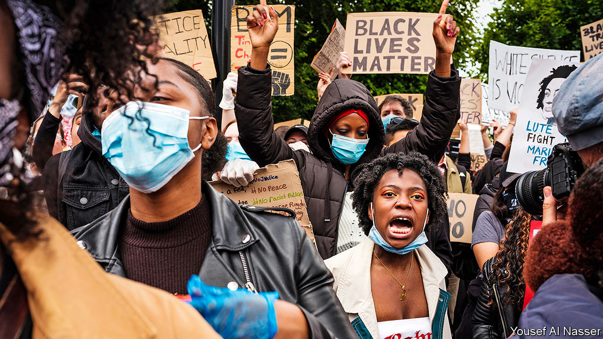

## Anti-racism protest

# What next for Black Lives Matter UK?

> A generational divide opens

> Jun 18th 2020

THE KILLING of George Floyd by cops in Minneapolis on May 25th sparked anti-racism protests across Britain, from obvious spots like Trafalgar Square in London to odd places like St Albans, a wealthy commuter town, and Cobham, a village in Surrey. Statues have been toppled and arguments aired. The government will set up a race-equality commission. But, having achieved so much so quickly, the British wing of Black Lives Matter (BLM) finds itself split between older revolutionaries and younger pragmatists.

BLM UK appeared in 2016, following several high-profile shootings of black people in America and in protest against Donald Trump and Brexit. Hundreds marched on Parliament, and a handful shut down a road at Heathrow Airport and a runway at City Airport. Its leading lights, many of whom came from the Occupy movement, wanted to dismantle capitalism through civil disobedience. These people, now in their 30s and 40s, are not responsible for recent protests.

A different lot of people have organised the gatherings over the past few weeks. Mostly young and more often black, they are a mixture of students and aspiring creatives. They ignored BLM UK’s advice not to gather in large groups because of the threat from covid-19. Many of them believe that the ambition of destroying capitalism is a frivolous distraction.

“We’ve talked to a lot of the older generation,” says Aba Amoah, a 22-year-old graduate who helps run a group called Justice for Black Lives that is part of the loosely constituted BLM galaxy. “They were like, ‘you need to stop doing what the system tells you to do.’” A self-described liberal, she believes that the movement must talk to powerful people if it is to get anywhere. They are influenced by writers like Reni Eddo-Lodge, who believes that raising awareness among whites is essential to fighting racism, and from black entertainers who expose racism without getting bogged down in theory.

Whereas the younger activists often see black musicians and other entertainers as models of empowerment, the older activists look on in exasperation as such people are invited onto news programmes to speak about black issues. “It’s part of the British media establishment’s ignorance of how seriously to take issues of racism,” says Adam Elliott-Cooper, a sociologist and co-founder of BLM UK. “They can just cart on any black person they want to come and talk, rather than it actually being something where people need to do research.”

Although the younger activists do not have a fully worked-out agenda, many want to see BLM UK become a British black caucus. This would create “battle funds” to spend money on, for instance, increasing black representation in white-dominated industries such as law and engineering. It would also act as a non-partisan pressure group, which would encourage political parties to compete for its approval. “Black people need to be able to get into white spaces,” explains Ms Amoah. “Otherwise another four years comes and everyone’s doing another protest.”■

## URL

https://www.economist.com/britain/2020/06/18/what-next-for-black-lives-matter-uk
