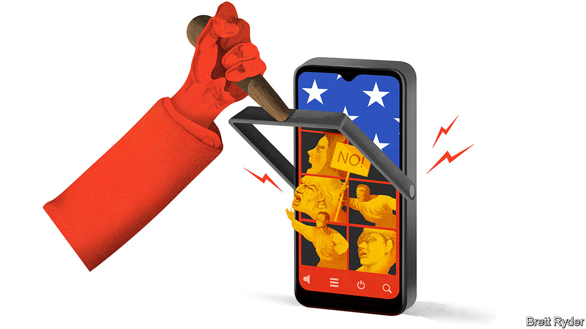

## Schumpeter

# Can Zoom be trusted with users’ secrets?

> Kowtowing to China is a big threat to its business

> Jun 20th 2020

FEW AMERICAN companies have done as well during the covid-19 crisis as Zoom. The lifesaver of lockdown joins a small coterie of tech firms whose product, like Google’s, you no longer need to explain to grandmas. Zoom’s staggering success was made clear this month when it reported a 169% surge in year-on-year sales during the three months to April 30th. Daily participants ballooned from 10m in December to 300m in April; profits soared alongside. Even analysts, rarely the most expressive of writers, let rip. One report started with “Wow”. Another, with “Holy Cow”.

Zoom’s achievements go beyond mere lucre. Its videoconferencing tools have the intuitive simplicity of an Apple product. It has made working from home feel not clunky, but chic. Moreover, its 50-year-old founder, Eric Yuan, cuts an intriguing figure. He has ridden an emotional roller-coaster this year as his company faced not just adulation, but scathing criticism for privacy lapses, security issues and Zoom-bombings. Yet the speed with which he acknowledged the setbacks, and rolled out a 90-day plan to fix them, offers a case study of a leader who tries to learn from his mistakes. On June 17th, for instance, Zoom said it was introducing end-to-end encryption for all users.

But Mr Yuan, an American citizen, has a more intractable problem. It concerns his country of birth, China. On June 11th it became clear how vulnerable Zoom was to the long arm of the Communist state when the firm, which prides itself on “the open exchange of ideas”, admitted it had temporarily shut down the accounts of three critics of the regime outside China. Investors barely noticed. Four days later Zoom’s market capitalisation reached a record high of $67bn. But it showed with devastating clarity how tech firms struggle to bridge the digital chasm between China and America. This poses an acute business risk for Zoom.

Zoom’s relationship with China is complex. The American company has meagre sales on the mainland. But 700 of its staff are based there, developing global products. It also has servers in China that it says are geo-fenced to store Chinese data only (though in April it admitted the rule may have been breached, a mistake it says it fixed). It says having its engineers in China helps reduce costs. It also hopes to increase sales to China. But its operations there force it to abide by Chinese law. Hence it suspended Zoom meetings with users in China and beyond commemorating the 31st anniversary of the massacre around Tiananmen Square on June 4th, which the Chinese government, hearing about them on social media, considered illegal. It also temporarily blocked an activist’s account in Hong Kong. Zoom admits it went too far, says it is developing tools to tackle the problem and pledges that requests from the Chinese government will no longer affect anyone outside mainland China.

That is a hard promise to keep for any company with operations in China. American values of free speech are at odds with those of a surveillance state. American firms that do business in China are used to treading a fine line. Those with a lot of Chinese customers and operations, such as Apple, seek to obey Chinese rules, but only in China. They argue that their Chinese businesses are ring-fenced from the rest of the world. Free speech and data security elsewhere are not compromised. Firms which, like Facebook, are barred from penetrating the Great Firewall can ignore China’s rules completely.

Zoom is different. It cannot easily fence off its Chinese operations from the rest of the world because its Chinese product developers are integral to its global business. Yet its activities in China mean it falls under laws that require companies to co-operate with the state and its intelligence services. That raises security and free-speech concerns not just within China but beyond it, too.

The repercussions have started. Some governments, such as Britain’s, have reportedly been warned by spy agencies to avoid secret discussions about China on Zoom. China hawks in America’s Congress are demanding that the company answer questions about its relationship with the Chinese government. Academics note that Chinese students at American universities may be particularly at risk if their inability to travel to America for covid-related reasons means they have to attend lectures in China via Zoom. James Millward of Georgetown University says it could chill academic freedom. He called on universities to develop an urgent “Plan B” to Zoom. End-to-end encryption to protect privacy may provide some reassurance. Chinese law, however, makes it hard to guarantee that the state will not seek to intrude.

That leaves Zoom with two unpalatable options. The first is the route that ByteDance, a privately held Chinese tech giant, is taking to ensure its short-video app, TikTok, is trusted in America. This means replacing some engineers in China with ones in America, and perhaps cutting off the Chinese business from the rest of the world. Such a rearrangement is hard to swallow for a firm like Zoom, whose mission is to foster global communication. It would cost time and money.

The alternative is to continue to bestride both systems and accept the consequence that trust—arguably the most important attribute of a communication tool like Zoom—is at the mercy of the Chinese Communist Party. Many users will have no problem with that; Zoom book clubs may be happy to bore Chinese eavesdroppers to death. But on sensitive topics in business and politics, wariness should prevail. Even though Zoom says there is no “back door” enabling snooping on its users, in the back of some minds is the thought of using a Soviet telephone during the cold war.

Zoom’s business may suffer as a result. Cisco’s Webex, Microsoft’s Teams and Google’s Meet can easily compete for its most sensitive clients. More significant, the kerfuffle reinforces how geopolitics is splitting the global internet into rival camps. Tech companies are increasingly facing the invidious choice of which side of the divide to be on. The word for that is not “wow”. It is “ugh”. ■

Correction (June 19th 2020): A previous version of this article stated that June 4th marked the 21st anniversary of the massacre around Tiananmen Square. Some of the wording of this article has also been amended for clarity.