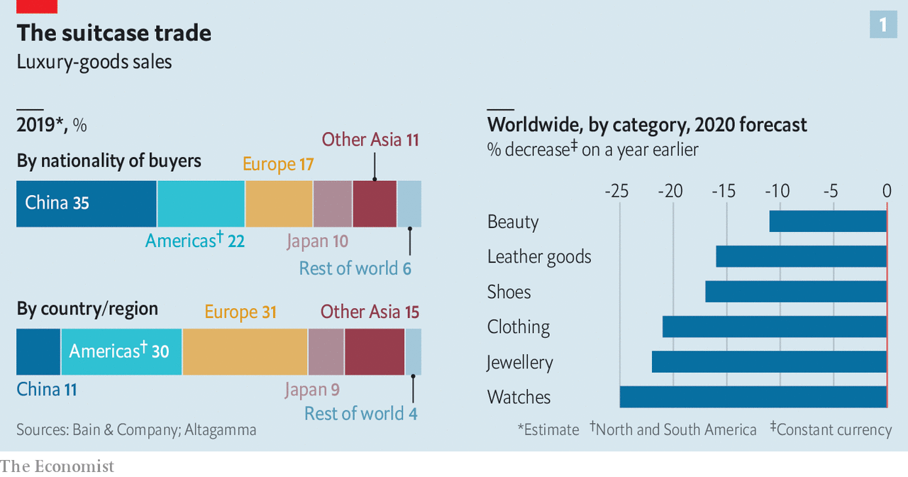
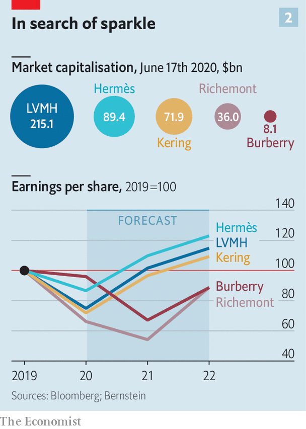

## Fashion victims

# How slow times in the luxury world will separate the bling from the chaff

> Posh purveyors are having to rethink their business model in a hurry

> Jun 18th 2020PARIS

MILAN, PARIS or New York this time of year would usually be teeming with fashionistas scrambling to get from the Balenciaga show to the Chanel party. Not in 2020. Fashion weeks have been cancelled, repurposed as posh catwalk webinars. Shops selling Hermès ties and Prada pumps are only just reopening, wondering what to do with stock of pre-covid-19 vintage. Instagram influencers normally on hand to feed the hype have nothing to snap.

The world of personal luxury goods—from handbags and haute couture to diamond rings and pricey Swiss watches—has been in hibernation. At the height of the pandemic between March and May sales slumped by 75% or so on a year earlier, according to the Boston Consulting Group. They have slowly picked up as Asia, then Europe and America, started reopening. Even so, the outlook for the luxury world is far from glittering.

The global recession hangs over a sector fuelled by consumer confidence. Beyond that short-term shock, the industry is facing an overhaul in how its baubles are made, where they are sold and to whom. Trends once expected to play out over a decade may unfold in mere quarters. Rapid change has set nerves jangling in a business meant to exude timeless tradition.

Start with who is buying and where. Although most purveyors of luxury are European (with America home to some of the lesser marques), most of their customers come from Asia. Asians bought more than half of the €281bn ($315bn) in bling sold last year. Chinese buyers alone have gone from 1% of purchases in 2000 to 35% last year, according to Bain, another consultancy. But most of that—perhaps 70%—was purchased overseas, often on jaunts to Europe. Just over a tenth of all luxury sales were actually booked in mainland China.

Unless intercontinental tourism rebounds faster than expected, new ways will have to be found to get Euro-chic into Chinese hands. Firms hope that shopping sprees will simply move from Paris to Shanghai. In the short run, this might boost margins: the likes of Louis Vuitton (part of LVMH, the biggest luxury group) and Gucci (part of Kering, another French giant) charge a third more in China than in Europe for the same products. Closing a few flagship stores in high-rent tourism hotspots such as Paris or Milan, which usually sell half their stock to tourists, could save firms money in property costs.

Yet any boost to margins may be short-lived. The difference between European and Chinese prices has narrowed. Those in China have been declining as apps make international price comparisons easier and firms woo shoppers facing ever more restrictions from Chinese authorities on bringing luxury items home from abroad. And more shops on the mainland, in cities they would once have deemed déclassé, may diminish the aura of exclusivity that shopping on Avenue Montaigne in Paris or New York’s Fifth Avenue confers. The de facto discounts were aimed at luring buyers to the West precisely for that reason.

The pandemic has accelerated other trends. Online sales of luxury goods, at 7-8% of the total on average, are around half those of mass-market fashion retailers like H&M and Zara. The closure of shops has, predictably, eased some of the reservations brands may have about selling their wares on the internet. LVMH has said online purchases are “significantly higher” as a share of sales than pre-pandemic. Sales through department stores—which are in terrible financial shape, notably in America—are also likely to shrink.

Meanwhile, costs may rise. Though they love to show off in-house “artisans” stitching handbags and the like, even the poshest maisons quietly outsource some of their production. Many rely on outsiders for more than half their products. These suppliers are often small family firms in Italy, which went into the pandemic with slim margins and slimmer financial buffers. Luxury groups are now having to assist them financially in a hurry lest they disappear for good.

All this paints a drab financial picture. Sales are forecast to fall by a third in 2020, and recover only by 2022 at the earliest. That will crimp margins, since luxury firms’ costs are largely fixed. Rents must still be paid and brands advertised—the poshest ones spend the best part of $1bn a year on marketing—even as sales droop.

In many industries, squished margins and falling sales might lead to a slew of takeovers. Few expect that to happen in luxury. Most of the big players have healthy balance-sheets and are expected to find ways to return to profitability (see chart 2). Many smaller marques are controlled by founders or their families, who are loth to sell in a downturn. If anything, consolidation might slow; all eyes are on whether LVMH will complete its $17bn takeover of Tiffany, an American jeweller, agreed weeks before covid-19 struck.

Not all parts of the industry are equally vulnerable. In a crisis, buyers stick to more established brands. “They want the best of the best,” says Luca Solca of Bernstein, a broker. Good news, then, for the likes of Louis Vuitton and Chanel, which have in fact pushed up prices in recent months. In contrast, brands hoping for a turnaround in their fortunes—Burberry is a perennial candidate—are less able to gain the attention a relaunch might otherwise garner.

Some segments have also been hit harder than others. Perfumes and cosmetics have held up best: a lockdown is no reason to forgo a skincare regime, apparently. Fashion houses face bigger problems, as cooped-up fashionistas see less need to replenish their wardrobes. Worse, unlike jewellery or handbags, surplus stock of apparel is rapidly going out of style. Overt discounts are frowned upon in luxury for fear of cheapening precious brands. Most at risk are fancy watchmakers like Richemont, which attract sellers at fairs and trade shows that have now been cancelled.

The question is whether amid this shake-up the luxury world can keep its grip on the wallets of the world’s big spenders. Fears that consumers would opt for a more ascetic post-pandemic future are dissipating: reports of “revenge shopping” as China emerged from lockdown implies that rich folks’ appetite for status symbols remains intact. But these worries are being replaced by those over Chinese shoppers developing a taste for nascent local brands, at the expense of the old-world stalwarts.

The biggest potential changes may concern the designers themselves. By late June the most exalted would normally start displaying autumn and winter collections in shop windows. This year they will make up for lost time by selling their summer season through the summer, as might seem sensible anyway. Giorgio Armani, an Italian veteran, has argued this should become the new norm. What a bold fashion statement that would be.■

Editor’s note: Some of our covid-19 coverage is free for readers of The Economist Today, our daily [newsletter](https://www.economist.com/https://my.economist.com/user#newsletter). For more stories and our pandemic tracker, see our [coronavirus hub](https://www.economist.com//news/2020/03/11/the-economists-coverage-of-the-coronavirus)

## URL

https://www.economist.com/business/2020/06/18/how-slow-times-in-the-luxury-world-will-separate-the-bling-from-the-chaff
