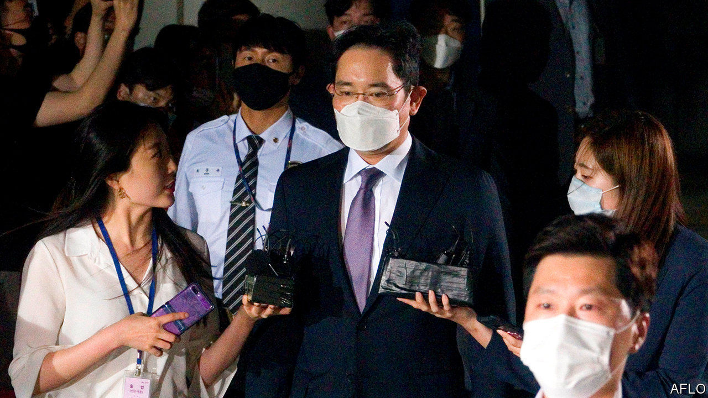

## Much ado about Samsung

# No end in sight for Samsung’s legal troubles

> South Korea’s biggest conglomerate faces more scrutiny from prosecutors—and the public

> Jun 18th 2020SEOUL

LEE JAE-YONG has seen a fair share of prison cells. Samsung’s de facto boss, and grandson of its founder, spent nearly a year behind bars for bribery before his sentence was suspended in February 2018. Then, on June 4th, prosecutors asked a court to have Mr Lee and two other executives from South Korea’s biggest conglomerate arrested ahead of indictments on fresh charges of unfair trading, stock-price manipulation and violating accounting rules, citing concerns that they might destroy evidence.

The judge demurred and declared that Mr Lee could await the start of his latest trial at home, rather than in police custody, arguing that the prosecution had already amassed enough relevant evidence. Although critics spied a certain leniency towards Mr Lee at work in the ruling, it does not mean that his or Samsung’s legal troubles are anywhere near over.

The latest allegations by state prosecutors relate to the role Mr Lee allegedly played in manipulating the terms of a merger between two Samsung affiliates, Samsung C&T and Cheil Industries. The tie-up cemented his control over the group in 2015. (Three executives have already been sentenced to prison for hiding or destroying evidence related to the investigation.) The bribery charges that saw him locked up were also related to the merger. Last year South Korea’s Supreme Court ordered a retrial in that case. (Samsung and Mr Lee deny any wrongdoing.)

Shortly before prosecutors requested the latest arrest warrant for Mr Lee, Samsung asked them to convene an external committee to opine on whether the charges merited a trial. (The committee is due to issue its non-binding recommendation by July.) Neither case is likely to be resolved before 2021. Both could land Mr Lee behind bars once again. 

The heightened legal scrutiny and uncertainty casts a shadow over the group’s decent performance in the pandemic. Samsung Electronics, the group’s listed crown jewel, reported higher sales and stable profits in the first quarter. In April Samsung Biologics, a biotech arm part-owned by Samsung C&T, signed a $362m deal to make an antibody treatment against covid-19.

The affair may also hurt the group’s efforts to get back in South Koreans’ good graces. In May Mr Lee apologised to his compatriots, acknowledging that the group had “not always strictly followed laws and ethics”. He pledged betterment, including an end to dynastic succession and to the group’s hostility towards labour unions. Samsung has also joined the fight against covid-19 by keeping its factories running and donating equipment to hospitals at home and abroad. All the self-flagellation was working: one widely cited analysis of online comments found that public sentiment towards Samsung improved following Mr Lee’s apology.

More images of him emerging from courtrooms looking sheepish may reverse that trend. That may be a reason why Samsung has been unusually vocal in defending its boss against the latest charges. On June 7th, three days after the prosecutors requested Mr Lee’s arrest, Samsung Electronics sent a statement to reporters reiterating that all activity relating to the merger had been “legal in compliance with relevant regulations and procedures”. It pleaded with them to refrain from “immoderate reports” that could damage the firm, and by extension the national economy, at a time of crisis.

Stressing lofty principles such as the national interest over petty concerns like law-abidance is a well-worn argument among South Korean conglomerates that get into trouble. The coming months will show if it is wearing thin.■

## URL

https://www.economist.com/business/2020/06/18/no-end-in-sight-for-samsungs-legal-troubles
