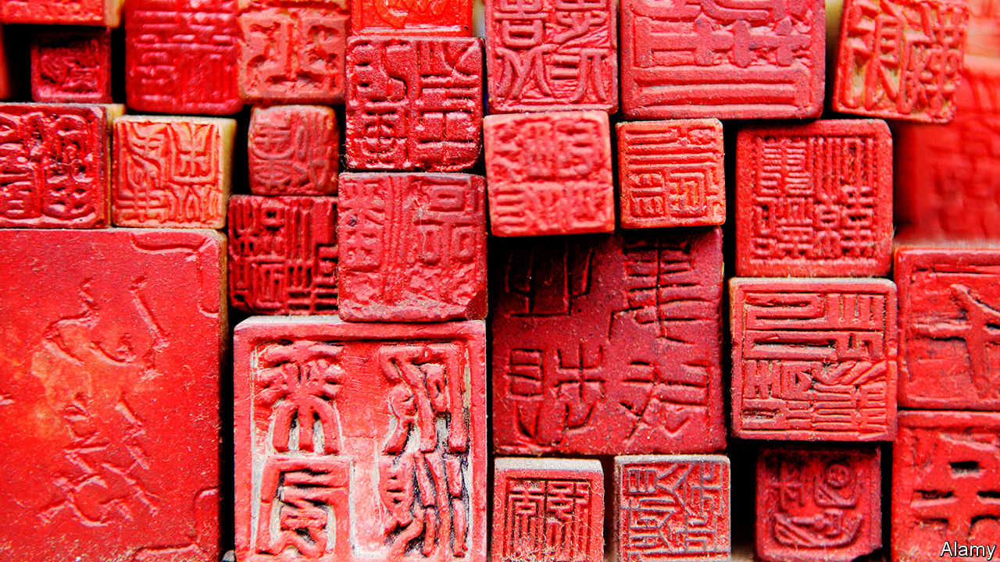

## Chopped and screwed

# Why corporate disputes in China still revolve around rubber stamps

> Who controls the chop controls the company

> Jun 18th 2020

CHINA IS IN the vanguard of new technology, from facial recognition to 5G networks. Many Chinese firms, though, rely on something from an earlier age: a hard, usually rubber chop with a firm’s name engraved on it, to be dipped in crimson ink and stamped on important documents. Chopping is seen as more authoritative than a mere signature. The 2,000-year-old tradition may seem quaint. But in China, who controls the chop controls the company.

Consider three ongoing kerfuffles. On June 4th the board of Arm China, the Chinese joint venture of a chip designer owned by Japan’s SoftBank, voted to remove its boss, Allen Wu. Just one snag: Mr Wu refused to go. Because he still holds the chop, he has continued to act in Arm China’s name, and threatened legal actions to defend his position. A week later Bitmain, which makes bitcoin-mining computers, announced that it had replaced its old chop with a new one. They looked virtually identical—Bitmain’s Chinese name in a red circle around a star—except for a new serial number. But it was enough to indicate that one of the feuding co-founders, Micree Zhan, now has the upper hand.

The oddest recent chop bust-up occurred in April. Li Guoqing, the ousted co-founder of Dangdang, a once-popular e-commerce platform, broke into its headquarters and, in a bid to retake the company, removed dozens of its official chops (besides the main chop, others are used for things like contracts and tax receipts). Dangdang declared the seized chops to be invalid. But on June 13th it was reported that the police had cleared Mr Li of wrongdoing, implying the chops are his for now.

Chops have figured in business fights elsewhere. In 2007 Russian police seized seals from Hermitage, an investment firm owned by Bill Browder, a deported financier, and used them to re-register its companies under others’ names. But in 2015 Russia eliminated the need for company seals. In Japan and South Korea, where chops are still used, tussles over them are rare.

In China’s sharp-elbowed business world chop rows remain more common—and mostly unreported. Managers sometimes misuse seals to enter side contracts. Lawsuits to reclaim a chop can drag on, says Eric Carlson of Covington & Burling, a law firm, so many cases are resolved out of court. But, he notes, technology is catching up with tradition. China is starting to deploy electronic chops, which are easier to monitor—and to strip from aggrieved wielders.

## URL

https://www.economist.com/business/2020/06/18/why-corporate-disputes-in-china-still-revolve-around-rubber-stamps
