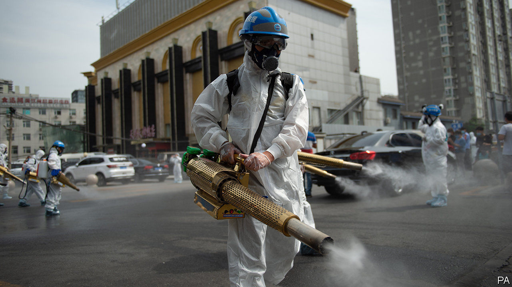

## It’s back

# An outbreak in Beijing of covid-19 is causing alarm

> It is a setback for a government that thought it had conquered the virus

> Jun 18th 2020BEIJING

“THE SAFETY and stability of the capital has a direct impact on the overall work of the party and government.” So Xi Jinping, China’s leader, reminded officials in February, as he urged them to pay particular attention to keeping Beijing free of covid-19. For most of the past eight weeks, city officials have had reason to feel chuffed, with no new cases involving local transmission (and usually only a handful at most every day elsewhere in China). Indeed, life had returned almost to normal in the capital, except for the rarity of foreign faces—the country’s borders remain shut to most non-citizens. Then the mood in Beijing suddenly changed.

Officials confirmed an outbreak of new infections on June 11th, concentrated in Fengtai, a south-western district. The number of cases in the city climbed steeply each following day. By the time The Economist went to press, 158 people in Beijing had been confirmed to have the disease. Many of them had visited or worked in Xinfadi, a sprawling wholesale market that is the single largest source of the city’s fresh fruit, vegetables, meat and seafood. The discovery of the coronavirus on a board on which salmon had been chopped prompted speculation by officials that the imported fish was a possible source. Many scientists deem this unlikely.

Officials describe the situation as “grim” and say the city is now in “wartime mode”. Two officials in Fengtai have been sacked “for misconduct in office during epidemic prevention and control”. The manager of the market has also been dismissed. The surrounding neighbourhood and dozens of others have been designated “high” or “medium” risk, meaning their residents are not allowed to leave the city. Other Beijingers will only be allowed to go elsewhere after securing a negative test result for the coronavirus. A massive campaign has been launched to trace and test the 356,000 people who, officials say, have been to the market since May 30th, have had close contact with someone who has gone there, or live nearby.

Officials are trying to show that they are responding decisively, while not appearing to panic. On June 16th, at a press conference held to announce the government’s response, officials who attended did not wear face masks. They spoke of “restrictions” and avoided the word “lockdown”.

But it feels like one. Many flights to and from Beijing, as well as many train and bus services, have been cancelled. Schools and universities, which had only recently started to reopen, have been ordered to shut down again. Businesses, including shops and restaurants, may remain open, but must step up precautions. People have been urged to work from home.

Smaller clusters have emerged in other parts of the country and have been met with similarly decisive countermeasures. But the stakes are higher in Beijing, because of its symbolic importance. A failure to control an outbreak in the capital would undermine the government’s efforts to portray its success in combating covid-19 as evidence of China’s political superiority.

Many of Beijing’s 21m people, like others elsewhere in China, appear confident in the government. “Dammit!” blurts a Mr Li, a shopkeeper in Chaoyang, a district in eastern Beijing. “I really thought we had made it through. It’s awful!” he says. But he says he accepts the need for new restrictions and that he believes they will succeed. If normal life is severely disrupted for long, however, patience may wear thin among those who have suffered blows to their livelihoods or education. That may have been on Mr Xi’s mind when he stressed stability. Officials will go all out in their efforts to crush this outbreak, not least to keep him happy. ■

Editor’s note: Some of our covid-19 coverage is free for readers of The Economist Today, our daily [newsletter](https://www.economist.com/https://my.economist.com/user#newsletter). For more stories and our pandemic tracker, see our [coronavirus hub](https://www.economist.com//news/2020/03/11/the-economists-coverage-of-the-coronavirus)

## URL

https://www.economist.com/china/2020/06/18/an-outbreak-in-beijing-of-covid-19-is-causing-alarm
