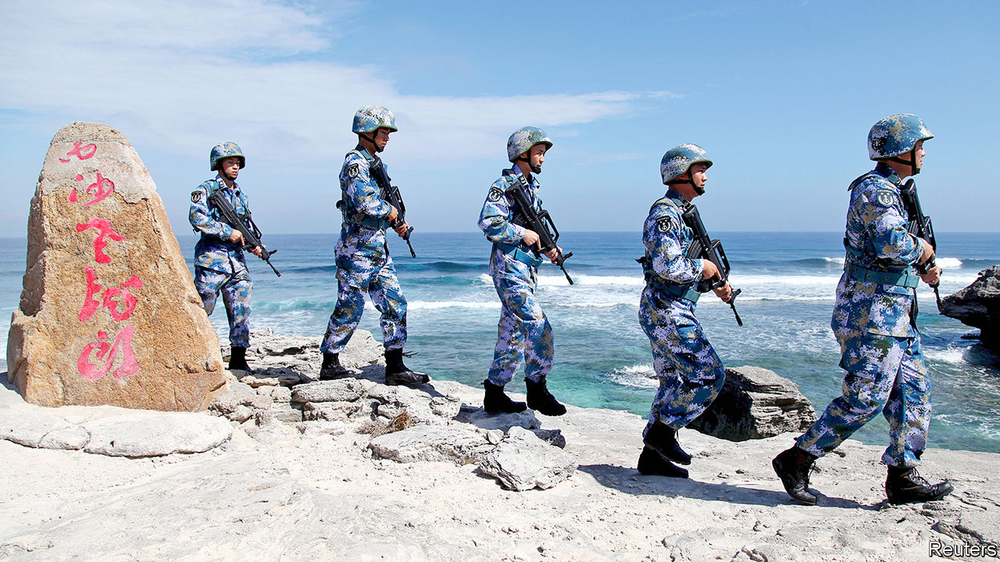
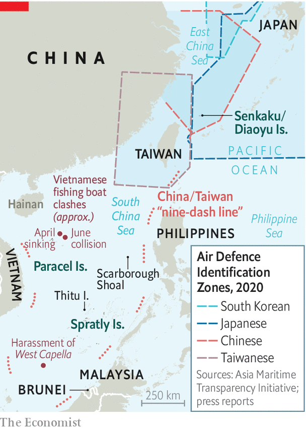

## Identify yourself

# China’s next move in the South China Sea

> Is it about to claim the skies above it?

> Jun 18th 2020

THE LAST time that three American aircraft-carriers prowled the Pacific Ocean was in 2017, shortly after President Donald Trump had threatened to “totally destroy” North Korea. In mid-June a trio of carriers returned—the USS Ronald Reagan and USS Theodore Roosevelt in the Philippine Sea and USS Nimitz farther east. Together they brought more fighter jets than most countries in Asia possess. Chinese commentators had little doubt what the point was this time: to show China that despite covid-19, America still has muscle.

American officials are not so explicit about the meaning of the exercise. But they are clearly disturbed by recent Chinese moves in the South China Sea. On April 3rd China’s coastguard sank a Vietnamese fishing boat near the Paracel islands (see map). On June 10th another one was rammed in the same area by a Chinese ship. In April and May Chinese coastguard vessels harassed West Capella, a Malaysian drillship near Borneo, prompting America and Australia to send warships. In the Spratly archipelago, China’s “maritime militia”, disguised as a fishing flotilla, has been swarming near Thitu, an island controlled by the Philippines but claimed by China. America’s secretary of state, Mike Pompeo, has accused China of taking advantage of distraction caused by covid-19 to engage in “provocative behaviour”.

Jostling in the South China Sea is nothing new. For decades, China and other littoral countries, including Brunei, Malaysia, the Philippines and Vietnam, have competed and clashed over its atolls, shoals, reefs and sandbars. China has largely emerged the victor. And despite promising America in 2015 that it would not militarise the area, it has built ports, runways and bunkers in the Spratlys and installed missiles on these island fortresses.

Recently China has been tightening its grip in symbolic ways. In April it created two administrative districts covering the Spratlys and Paracels. They are under Sansha, a notional “city” that China established in 2012 as the sea’s government. It also named 80 new geographical features in the South China Sea, including 55 submerged ones. Now there is speculation that China may turn to the skies above.

For a decade, Chinese leaders have mulled the creation of an Air Defence Identification Zone (ADIZ) over the South China Sea. America was the first country to declare an ADIZ, in 1950. Fearing a surprise nuclear attack, it demanded that planes approaching its airspace follow various rules, such as radioing their course and destination. At least half a dozen other countries now also have such zones.

China established its first ADIZ in 2013 over the East China Sea. Controversially, it covered the uninhabited Senkaku islands. These are controlled by Japan but claimed by China (which calls them the Diaoyu). America promptly sent two bombers to fly through the zone without permission, to show it would pay no heed. But most countries, including America, grudgingly told their civilian airlines to play safe and comply with the new rules. Chinese leaders are now “waiting for the right time” to declare plans for an ADIZ in the South China Sea, according to the South China Morning Post, a newspaper in Hong Kong.

China’s recent moves in the South China Sea have fuelled concern that the time may be nigh. An ADIZ there might be easier for China to monitor than the one in the East China Sea, says Zack Cooper of the American Enterprise Institute, a think-tank. It could use not only radars on Hainan island or the Chinese mainland coastline, but also the new ones it has placed on the Spratlys and Paracels. China could fill in any gaps using surveillance planes or fighter jets, both of which it has deployed on these islands, or else with radar-equipped destroyers. China could probably track “the vast majority of foreign aircraft” entering the ADIZ, says Mr Cooper.

American military planes would undoubtedly ignore China’s rules, as they do in the East China Sea. So why bother? The answer is that even a partially successful ADIZ might benefit China. Although an ADIZ does not imply sovereignty over the airspace it covers, it can be used to show authority. In 2010, for instance, Japan extended its ADIZ to cover one of its islands, part of whose airspace had for decades lain within Taiwan’s ADIZ. There is no evidence that China has used its existing ADIZ to disrupt civilian air-traffic, but it may see it as a tool for doing so in a crisis. And China may see an ADIZ in the South China Sea as a way of justifying more air patrols there.

But there are drawbacks. China’s claim to the South China Sea is vague. Its maps show a “nine-dash line” which loops around the entire sea, but the government does not give the line’s co-ordinates nor say what it means. In the East China Sea, China’s ADIZ largely follows its claimed continental shelf. If an ADIZ in the South China Sea were to be drawn only around the scattering of Chinese-held features, it could “fatally undermine” any attempt by China to claim everything within the line, says Alessio Patalano of King’s College London. But if it were to follow that line, there would be a bigger uproar. For years, the ten-member Association of South-East Asian Nations has been divided over how to handle China. Several members are keen to mollify it, while a few would prefer to be tough. A virtual summit is due later this month. An ADIz could tip the diplomatic balance, says Collin Koh of the S. Rajaratnam School of International Studies in Singapore. The bloc’s efforts to negotiate a code of conduct with China to regulate behaviour in the sea could be a casualty.

America’s decision to send warships, drones and bombers to patrol near the beleaguered West Capella (until the drillship left the area in May), and its current deployment of the three carriers, is a signal of support for China’s rivals. In a letter to the UN on June 1st America decried China’s “excessive maritime claims”. It has been sending growing numbers of warships to challenge those claims by sailing through waters that China says it owns. The most recent such “freedom of navigation operation”, on May 28th, was the fifth this year. Even without an ADIZ, the sparring will intensify. ■

Correction (June 21st 2020): A previous version of this article stated that Japan had extended its Air Defence Identification Zone (ADIZ) to cover a Japanese-held island claimed by Taiwan, which Taiwan had included in its own ADIZ. In fact the island, Yonaguni, is not claimed by Taiwan and Taiwan's ADIZ had included only part of Yonaguni's airspace.

## URL

https://www.economist.com/china/2020/06/17/chinas-next-move-in-the-south-china-sea
