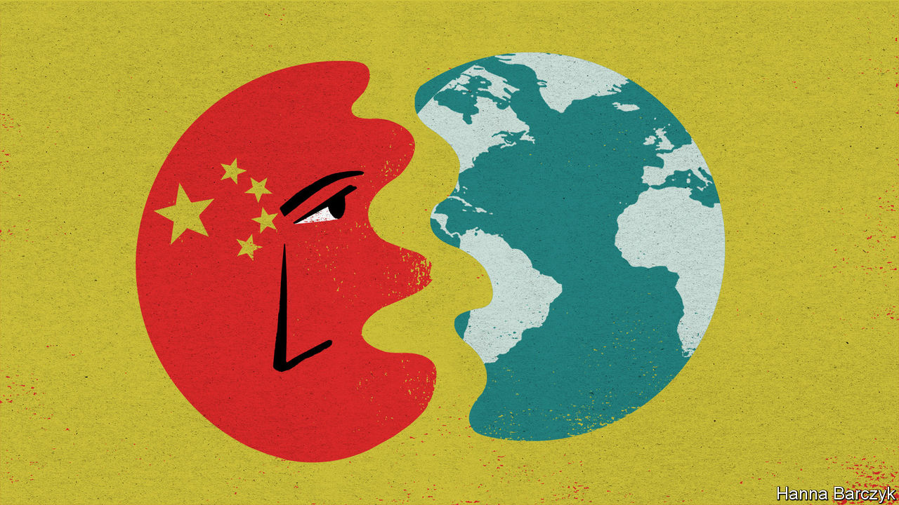

## Chaguan

# Why China bullies

> It sees a world distracted by covid-19, and too economically weak to hold it back

> Jun 18th 2020

CHINA IS OFTEN called a country in thrall to nationalism. The reality is more complex than that, and more cynical. For proof, look at the remarkable calm (so far, at least) that has reigned since June 15th, when Chinese and Indian troops fought their deadliest border skirmish in almost half a century. On a sweltering afternoon in Beijing, nearly three days after that Himalayan clash, a couple of bored-looking police were the only sign of extra security around India’s embassy.

China’s state-run media had by then issued terse reports of a violent border incident. Lots of internet users reposted news items about dead Indian soldiers. There was only limited grumbling about the failure of official Chinese sources to reveal details of casualties suffered by the Chinese army. Indeed, some netizens treated the story as a joke, mocking India’s soldiers as feeble.

Compare that muted response with the rage provoked last October by the manager of an American basketball team, Daryl Morey of the Houston Rockets, when he retweeted the slogan: “Fight for freedom, stand with Hong Kong”, in support of anti-government protests in that territory. Millions of Chinese demanded Mr Morey’s sacking. Within two days Chinese broadcasters announced that they would not show Rockets games.

Chinese nationalism is often compared to a tiger which Communist Party bosses have fed for years—and which they are now condemned to ride, for fear of being eaten if they dismount. In reality, popular nationalism resembles a deep, man-made reservoir, created by the damming-up and channelling of long-existing forces. Most of the time, Chinese leaders can restrain or unleash public rage at will. Only in the biggest crises do they feel constrained to open the floodgates to ease dangerous pressure.

Public grievances are especially strong when America, Japan or other much-condemned countries are involved. Chaguan was a reporter in Beijing in May 1999 when NATO warplanes bombed China’s embassy in Belgrade, killing three journalists. Chinese leaders dismissed American promises that this was an accident, and for four days let students hurl rocks at the American and British embassies. Violence was controlled like water from a tap. Smashing windows and diplomats’ parked cars was allowed. But when youngsters tried to burn the American embassy’s flag with a flaming rag on a long bamboo pole, Chaguan watched paramilitary police beat them back. “Traitors!” howled the crowd.

Often dismissed by Chinese as poor and chaotic, India is not in the rogue’s gallery of imperialist bullies that China’s young learn about at school. Vitally, two-way trade with India is rather modest: 11 countries are larger trade partners for China. All those factors leave Chinese rulers free to downplay a crisis with India. For even when China appears reckless, it is calculating rewards and risks.

A revealing paper published last year by Ketian Zhang of George Mason University, in Virginia, charts how China has been throwing its weight around in its region. Titled “Cautious Bully: Reputation, Resolve and Beijing’s Use of Coercion in the South China Sea”, it tests claims that China’s willingness to use force is explained by its growing military strength or the assertiveness of its leaders. Actually, China used its armed forces more in 1990s, when they were weak, the paper notes. Today China prefers to use its coastguard, its maritime militia and other agencies to bully neighbours. China was rather aggressive under Hu Jintao, the country’s distinctly cautious leader in 2002-12. Drawing on Chinese archives and interviews with officials, Ms Zhang offers a “cost-balancing theory” of decision-making: that China uses coercion “when the need to establish a reputation for resolve is high and the economic cost is low”. Thus China was quiet in the South China Sea in the early 2000s, when it wanted a free-trade deal with the Association of South-East Asian Nations. Later it became assertive after deciding that this group needed Chinese trade more than the other way round—and had to be deterred from seeking international help in the South China Sea. China especially likes to inflict asymmetric economic pain, as when it banned imports of bananas from the Philippines during a territorial dispute in 2012, devastating Filipino farmers but barely hurting its own consumers.

That pattern continues. Recent Chinese boycotts have targeted things like Australian beef or Houston Rockets games, but not more vital commodities. All this casts another light on China’s assertiveness during this pandemic year, and the notion that China is taking advantage of a world distracted by covid-19 to throw its weight around. It is true that China has been aggressive in recent months. Beyond its readiness to skirmish on the Indian border, it has decided to impose a draconian national-security law on Hong Kong, slapped trade boycotts on Australia and other Western nations, and sent coastguard ships to sink or harass foreign vessels in the contested waters of the South China Sea. It is also true that the world is geopolitically distracted. It is hard for governments to chide China over democracy in Hong Kong, say, while also negotiating to buy Chinese ventilators. But economics matters, too.

This is a time of slumping global demand for China’s goods and interrupted supply chains. Chinese officials are betting on domestic demand to drive their country’s recovery from covid-19. To control the virus, the mainland’s borders are closed to almost all foreigners. Chinese parents are thinking twice about sending students to universities in America, Australia and Europe. Chinese officials growl that Hong Kong-based foreign banks must support the national-security law, for they are eminently replaceable.

All in all, China feels less reliant on other countries than it has for a while. That same China is also being unusually assertive. Follow the logic through, and having limited economic ties with China may not make other countries safer. India is the latest country to be confronted with that dilemma. It will not be the last. ■

Editor’s note: Some of our covid-19 coverage is free for readers of The Economist Today, our daily [newsletter](https://www.economist.com/https://my.economist.com/user#newsletter). For more stories and our pandemic tracker, see our [coronavirus hub](https://www.economist.com//news/2020/03/11/the-economists-coverage-of-the-coronavirus)