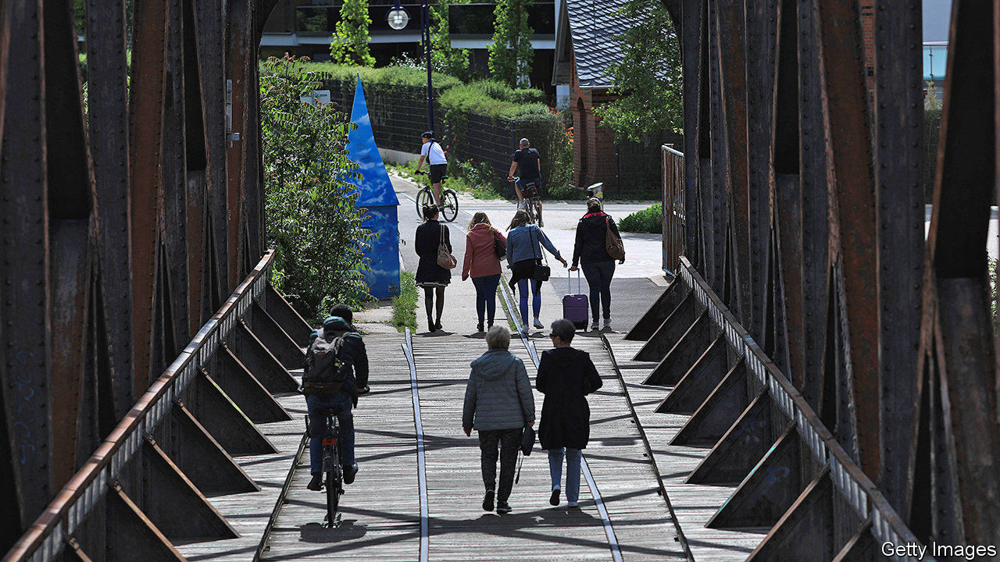
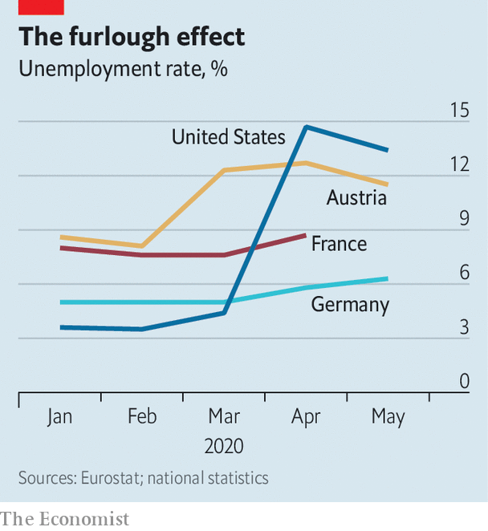

## Why furlough works

# Germany spends big to save jobs

> Other Europeans are following its example

> Jun 18th 2020BERLIN

FOR MANY economists, the model for a covid-19 furlough scheme has been Germany’s. It already had a good record, managing to avoid big job losses during the global financial crisis of 2008-09. Then, the German government paid the bulk of wages of people who had temporarily stopped working, rather than letting their employers fire them altogether. It did not prevent a nasty recession, but remarkably few jobs were lost.

Can other countries successfully copy Germany? German economists answer “Jein”—both yes and no. First of all, Kurzarbeit (Germany’s furlough scheme) is being tested on an unprecedented scale. Whereas at the peak of the financial crisis in May 2009 just under 1.5m German workers were furloughed, 7.3m employees in Germany were on short-term work in May, according to the Ifo Institute for Economic Research, a think-tank.

Second, no one knows when the effects of the pandemic will end, or whether there will be a second wave, whereas during the financial crisis it was generally (and rightly) assumed that the recession would be brutal but short. Also, Germany’s scheme dovetailed well with other aspects of German corporate governance, such as workers’ representation on company boards. These stopped bosses firing employees as soon as the economy turned sour.

Nearly all pundits agree that Kurzarbeit is a useful tool. Alexander Herzog-Stein of the Hans Böckler Institute, a think-tank close to trade unions, likens it to a bridge—“but there must be a shore on the other side.” The German scheme is limited to 12 months. The state usually pays 60% of net wages (67% for employees with children), though the government recently decided to raise those contributions incrementally to a maximum of 80% (and 87%) for employees who have been furloughed for seven months or more. During the financial crisis many furloughed workers had well-paid jobs at manufacturing plants. This time, many come from low-paid jobs in retail or hospitality. They would find it hard to make ends meet on 60% of their pay.

The German scheme has been doing the trick. The registered unemployment rate rose to 6.3% in May, up from 5.8% in April. But mass lay-offs have been avoided. The same goes for furlough programmes in France, Italy, the Netherlands and Spain. France’s chômage partiel was benefiting 8.6m workers at the end of April. The state pays up to 84% of net salary, to a ceiling of €4,608 a month. Employees on the minimum wage still get the full amount. As with the German scheme, it is flexible: firms can claim just a part of a worker’s salary if he or she is putting in reduced hours.

These generous schemes in France and Germany have attracted crooks. The French labour ministry has spotted several types of fraud. Some companies have claimed subsidised wages for employees who have kept working (sometimes even on overtime). Others have submitted claims for more than employees actually earn. By some estimates, as much as 10% of furlough pay is lost to fraud. Muriel Pénicaud, France’s labour minister, has announced that 50,000 companies’ returns will be scrutinised until the end of the summer.

Those sceptical of furlough schemes argue that they are costly and keep alive badly run companies that should die. The cost is indeed gargantuan, but so is the cost of deep recessions. The usual German Kurzarbeit pay is the equivalent of what, on average, people younger than 50 are paid in their first year at work. Some workers would stay in employment anyway, so the payment is wasted on them. Yet it is probably worth subsidising them, saving tens of thousands of jobs, even if that keeps some corporate duds alive for a bit longer.

Oliver Stettes of the Cologne Institute for Economic Research says Austria illustrates why such schemes are working. The registered unemployment rate there rose to 12.8% in April (5.5 percentage points more than a year before). However, once a much improved scheme was brought in, replacing up to 90% of wages, the jobless rate steadied at 11.5% in May. Short-time work schemes are a useful way to bridge a short period of low demand for economies that do not suffer from fundamental structural weaknesses. Depending on the shape of the recovery, unemployment in euro-zone countries may eventually rise once the money runs out—but less than it would have done without furlough schemes. ■

Editor’s note: Some of our covid-19 coverage is free for readers of The Economist Today, our daily [newsletter](https://www.economist.com/https://my.economist.com/user#newsletter). For more stories and our pandemic tracker, see our [coronavirus hub](https://www.economist.com//news/2020/03/11/the-economists-coverage-of-the-coronavirus)