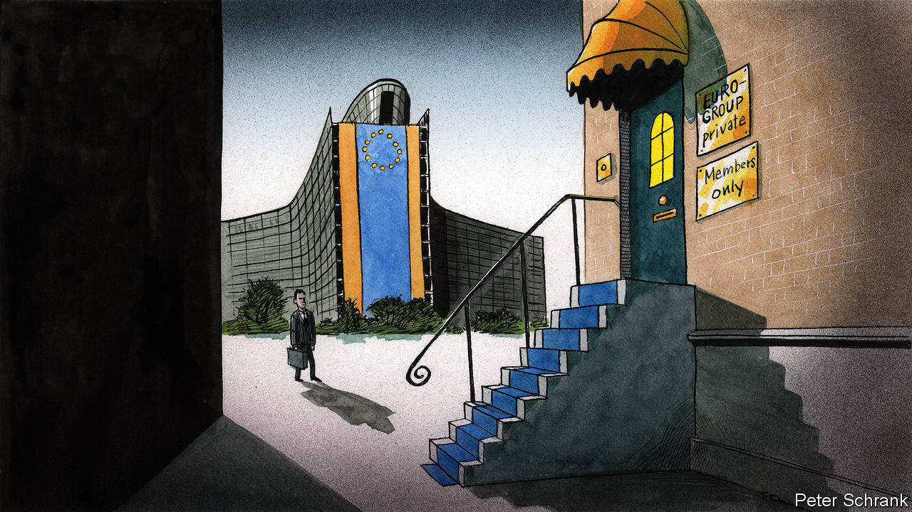

## Charlemagne

# How a dining club briefly took over the EU

> What next for the Eurogroup?

> Jun 18th 2020

THE EUROGROUP is arguably the European Union’s strangest institution. It started life as a dining club for euro-zone finance ministers to gossip before the official meetings of ministers from the whole EU, yet morphed into a forum where the fate of nations was decided. During the euro-zone crisis, the terms of bail-outs totalling more than €500bn ($550bn) were agreed at its informal, closed-door meetings, at which no minutes were taken (but alcohol and cigarettes were). Even its legal existence is a matter of debate. A recent opinion from a legal adviser at the European Court of Justice suggested that any cases brought against the Eurogroup were inadmissible. The club’s only official rules are that euro-zone finance ministers shall meet for regular informal chats and give its presidents two-and-a-half-year stints. Beyond that, it is a free-for-all. Its working methods can be changed at will. It is Brussels as its best and worst: unaccountable, opaque and brutally efficient. At times it was the closest thing the euro zone had to a government.

Now, the hunt is on for a new jockey to steer this peculiar beast. After two-and-a-half years as the group’s president, Mário Centeno, the Portuguese finance minister, is stepping down. Haggling over his replacement is already under way. Nadia Calviño, Spain’s economy minister and a former official in the European Commission, is in the running and well-regarded. But that is only part of the battle.

The EU is a club that includes a preponderance of small countries. Their ministers may opt for one of their own, lest their bigger peers start to throw their weight around. When it comes to selecting the new president, each euro-zone minister has one vote. This means the three Baltic states (collective population: 6m; combined GDP: €110bn) will have greater say than France and Germany (collective population: 151m; GDP: €6trn). So Paschal Donohoe and Pierre Gramegna, the finance ministers of Ireland and Luxembourg respectively, also have a shot at the job.

Whoever wins will take over a less prominent institution. The Eurogroup reigned almost supreme in the euro-zone crisis. But in the current mess it cuts a smaller figure. When the euro teetered, the Eurogroup was a useful intergovernmental forum for the two sides: those who had money (such as the German government) and those who needed it (such as the Greek one). It operated as a ministerial fight club, where governments could brawl without diplomatic incident. Heads of government “needed a place where you could have a more bare-knuckled exchange”, said George Papaconstantinou, a former Greek finance minister, who was often on the wrong end of such exchanges.

In the current crisis, however, the pain is not limited to the euro zone. All EU economies have collapsed simultaneously, albeit to different degrees. Coming up with a solution that covers only the currency area is no longer necessary now that Britain—the largest and most veto-ready non-euro member—has left the bloc. Without Britain, the remaining non-euro countries—eight out of 27—are vastly outnumbered in terms of population and economic clout. All bar Denmark are obliged to join the euro eventually, even if some drag their feet deliberately. “Multi-speed Europe is dead,” says Lucas Guttenberg from the Jacques Delors Centre, a think-tank, referring to the idea that willing EU members could integrate while others stayed put. “It is one-speed Europe with some laggards.” In such circumstances, the Eurogroup seems a relic.

Fundamentally, the Eurogroup was a stopgap, a way of papering over the cracks inherent in a monetary union without fiscal transfers. Now, however, European leaders are showing a willingness to plug these holes themselves. In April the Eurogroup tried to cook up a fiscal response to the coronavirus crisis. While ostensibly large—it included €540bn-worth of loans—it was deemed inadequate by countries such as Spain, which demanded that any cash come in the form of grants, never to be paid back. EU leaders—led by France and Germany—went even further, channelling their inner federalists by discussing a proposed €750bn package, including €500bn in handouts paid for by debt issued collectively by the EU, rather than individual governments.

The next president of the Eurogroup has the task of making the body relevant again, or reading its last rites. Pessimists think the club will not last long. “In the long term the Eurogroup is destined to fade away,” says one commission official. It could easily be ingested into other EU institutions, which have a proper legal footing. Not all are so sure. Old hands offer reminders that Eurogroup meetings were happily ignored at the start of the millennium, before the EU began a decade of crises after the financial crash. Its time may come again. If someone taps the euro zone’s bail-out funds, then finance ministers will happily stick their beaks into the spending of their peers once more. Plus, the current enthusiasm for bold steps towards integration among EU leaders may not last, leading to a return of the wheeling and dealing of finance ministers in their strange meeting.

Others propose more radical schemes to keep the Eurogroup relevant. After a decade in retreat, Europe’s federalists are on the offensive. Handing the group’s presidency to an EU commissioner rather than a finance minister would create a de facto EU treasury, argues Andrew Duff of the European Policy Centre, a think-tank. Appointing someone like Paolo Gentiloni, the EU commissioner in charge of the economy and a former Italian prime minister, would make sense, given that the commission is likely to be the one in charge of the €750bn in extra crisis spending. Current members of the club are less keen. Finance ministers prefer someone with skin in the game. Ultimately, the EU’s money comes from national capitals. But without such a move, the Eurogroup may end up searching for a new, more modest role. Perhaps being a plain old dining club is not so bad after all. ■

## URL

https://www.economist.com/europe/2020/06/18/how-a-dining-club-briefly-took-over-the-eu
