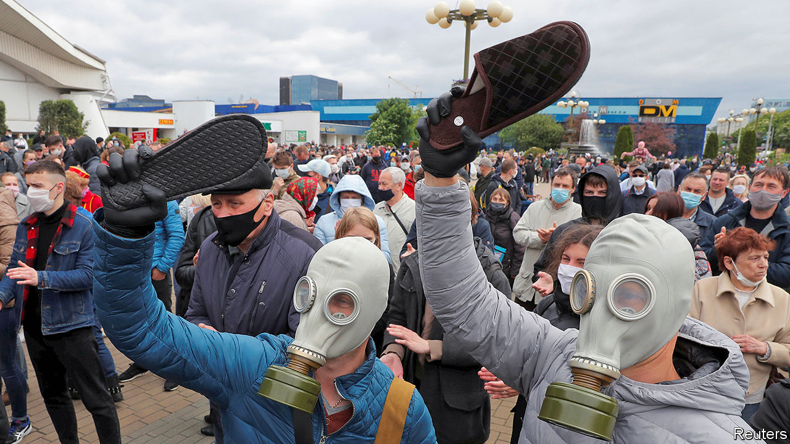

## Miffed in Minsk

# Waving slippers at the “cockroach” president of Belarus

> Alexander Lukashenko, who touted vodka for covid-19, faces real opposition

> Jun 20th 2020

THEY CAME wielding slippers, with which to squish the man they call “the cockroach”. Alexander Lukashenko, an idiosyncratic autocrat, has retained many of the oppressive structures and symbols of the Soviet Union in Belarus for the past quarter-century. But as the country heads towards a presidential election on August 9th, there are signs that the long-preserved edifice is crumbling.

After years of economic stagnation and falling incomes, discontent is as widespread as it was in the early 1990s. That earlier wave of protest swept Mr Lukashenko, a former collective-farm boss, to power. Since then he has kept winning elections with a mixture of populism, paternalism, repression and subsidies from Russia. How many Belarusians really support him is unknown—he has banned independent opinion polls. However, a hint of his unpopularity can be found in the fact that people are queuing for hours to nominate someone else as a presidential candidate.

Mr Lukashenko’s handling of covid-19 has been almost comically inept. He dismissed it as a “psychosis”. He urged people to protect themselves by drinking vodka, driving a tractor and steaming in a banya (sauna). He staged a military parade on May 9th, claiming “it is better to die on your feet than live on your knees.” Now he wants a sixth term in office.

Belarusians have largely ignored his advice. Many wear face masks and maintain social distance. Volunteers have raised money to buy protective gear for doctors and kit for hospitals. “Who else, if not us?” read a post on the volunteers’ Facebook page. Private businesses have joined in. The energy generated by all this activism has flowed into politics, says Franak Viacorka, a Belarusian journalist.

Sergei Tikhanovsky, a former businessman and vlogger, saw an opportunity. He launched a movement called “A country for life”. Mr Tikhanovsky is a charismatic populist, sometimes likened to Volodymyr Zelensky, a former TV comedian who is now the president of Ukraine, and Alexei Navalny, a blogger turned opposition leader in Russia. Mr Tikhanovsky vowed to “stop the cockroach”, as he called Mr Lukashenko (alluding to his moustache, which makes him look like a character in a children’s poem called “The Mighty Cockroach”). Mr Tikhanovsky tied a giant slipper to the roof of his car—a popular weapon for splatting pests of the order Blattodea—and drove around the country talking to ordinary people and streaming live videos.

Within days, the police arrested him. They also “found” $900,000 in his apartment, and suggested that he was a foreign agent. So Mr Tikhanovsky’s wife put herself forward as a candidate. Thousands of people came out to sign her nomination papers. Some carried slippers.

Unlike previous protests in Belarus, the current wave involves lots of middle-class urbanites and parts of the elite, who have spotted a viable alternative as two other independent challengers have emerged from within the system. One is Valery Tsapkalo, a former ambassador to the United States and a founder of Belarus’s successful IT cluster. The other, more serious, challenger is Viktor Babaryko, a former banker. (He was the boss of Belgazprombank, a subsidiary of Russia’s Gazprombank.)

Mr Lukashenko appears rattled. He fired his moderate prime minister, allegedly for his links to Mr Babaryko, and ordered his security services to raid Belgazprombank. In the past week a dozen cases have been launched against Mr Babaryko’s allies. Belgazprombank, which Mr Lukashenko alleges to be a tool of Russian influence, has been placed under the administration of the central bank. To all of this, Mr Babaryko responds that the authorities do not understand that “the Belarus that existed before, and which they trampled under their feet, no longer exists.” ■

Editor's note (June 19th 2020): Since the publication of the story, Viktor Babaryko, the main rival of Alexander Lukashenko, the authoritarian president for quarter century, has been arrested along with his son who ran his presidential campaign. They were on the way to submit 400,000 signatures for registering Mr Babaryko as a candidate for the August 9th election, when they were detained. 

## URL

https://www.economist.com/europe/2020/06/20/waving-slippers-at-the-cockroach-president-of-belarus
