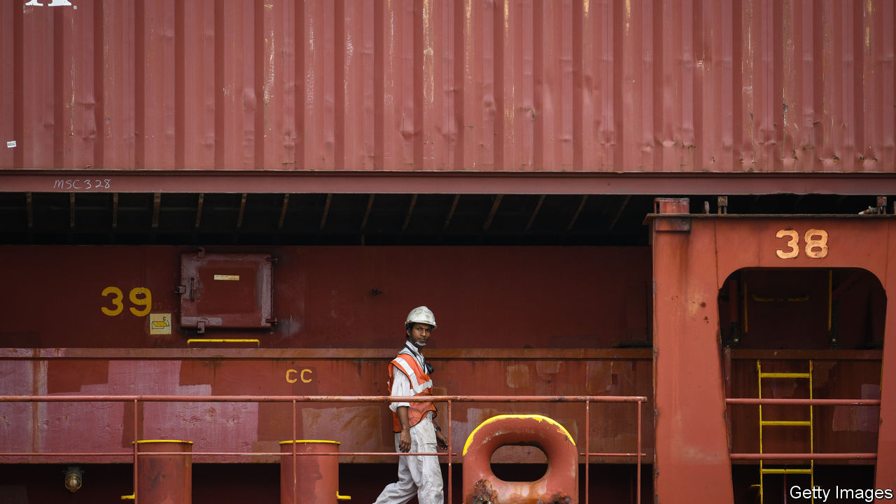

## Ninety percent of everything

# As the virus rages on shore, merchant seamen are stranded on board

> The merchant seamen who keep the world warmed and fed are trapped in floating prisons

> Jun 18th 2020

“I’M NOT COMFORTABLE in my chair with such a crew,” says the captain of a cargo vessel in the South Atlantic en route from Bermuda to Singapore. He is eight months into a four-month contract, and almost everyone on board has also already worked at least double his contracted time. He hopes Singapore will accept that sailors who have seen almost no one but each other for months pose no infection risk and permit a crew change. If not, some may refuse to keep working. On June 16th an industry-wide agreement to allow emergency contract extensions expired, but that is no guarantee that ports will open up. “Believe me,” he says, “the situation is critical.”

When Rose George, a journalist, wrote about the shipping industry in 2013, she called her book “Ninety Percent of Everything” to convey its importance to global trade. But during the covid-19 crisis almost none of the mariners who keep the world fed, warmed and entertained have been allowed on shore. At any moment 1.2m are in cargo vessels on the high seas. (Half as many again work on cruise ships or vessels transporting goods within a single country’s territory.) At least 250,000 have finished their contracts and have no idea when they will be relieved. Similar numbers are stuck at home with no idea when they will next get work. Both totals are rising by tens of thousands each week.

In normal times, crewing the world’s merchant fleet is a logistical miracle. Ship-management firms handle the rosters, signing crew on, flying them from their home countries to a convenient port, and getting them off their ships again and on a plane home. Many mariners are from developing countries, in particular India, Indonesia and the Philippines. They often start and end their contracts in hubs such as Dubai, Hong Kong and Singapore. Contracts are typically of three to nine months, with one month’s variation in either direction to make planning easier.

The virus has thrown an almighty spanner in the works. Countries that classified lorry drivers, pilots and cabin crew as essential workers overlooked merchant seamen, even though their work underpins the global economy. Some will accept their citizens, but ships may not be calling at a suitable port, and management companies may not be able to line up relief. With few scheduled flights, the sailors who manage to disembark may not be able to get home.

At first they were proud to be able to help in the global emergency, says Lars Robert Pedersen of BIMCO, which represents the owners of about 60% of the world’s merchant fleet. They are used to hard work and long contracts. But when official neglect continued, sailors’ morale became a problem. “They are fed every day, and they are getting paid, but that’s not the point,” he says. “They are effectively imprisoned on board their ships.”

Owners and managers are trying to make confinement more bearable with free internet and wage top-ups, says Andreas Hadjipetrou, the managing director of Columbia Shipmanagement. “One captain asked for gym equipment and karaoke,” he says. “The crew created a band and sent us a video clip.” More importantly, they are doing everything they can to facilitate crew changes—which take not just planning, but a hefty dose of luck.

Among the merchant seamen relieved during the lockdown is Hrisheet Barve, a ship’s captain and an Indian from the state of Goa. By the end of May he and 16 crew members, also Indian, were months over contract. Since they were sailing along India’s coast, he proposed to the ship’s management company, Anglo-Eastern, that it divert to the port of Cochin in the state of Kerala for a crew change. The company agreed, despite the cost and delay. Even though the men were all nationals, disembarking required lengthy negotiations with the shipping ministry and port and state officials. They had seen no one else for months, but still had to spend two weeks in quarantine.

By the end, says Captain Barve, he was very worried about his men’s mental state. “When you’re all in the same boat—pun not intended—you can pull each other down.” And tired, miserable sailors are unsafe, he adds. “It just takes one captain to make a mistake and run a tanker aground and cause an oil spill. They will say it was a navigational error but the real culprit will be that he was working way longer than he should have been.”

The International Maritime Organisation, the arm of the UN that deals with shipping, has drawn up a protocol for crew changes during the pandemic. It requires governments to classify merchant seamen as essential workers, thus enabling them to travel and cross borders. Ports and airports need facilities for testing and quarantine, and safe connections. “We have the standard operating procedure ready to act on,” says Bjorn Hojgaard of Anglo-Eastern. “We just need help from regulators.”

The industry hopes that governments will be prodded into action by the sudden expiry of so many seamen’s contracts. The International Transport Workers’ Federation (ITF) says it will support any seamen who refuse to work. If that leaves too few people to operate a ship safely, its insurance policy could lapse, and full liability fall on the captain and owner, who might then decide it was too risky to keep going. The trade that has flowed so smoothly throughout the pandemic might finally gum up. “Everyone is happy to reap the benefits of global trade,” says Stephen Cotton, the ITF’s general secretary. “But no one seems willing to step up when it comes to safeguarding those who deliver the things they need every day.” ■

## URL

https://www.economist.com/finance-and-economics/2020/06/18/as-the-virus-rages-on-shore-merchant-seamen-are-stranded-on-board
