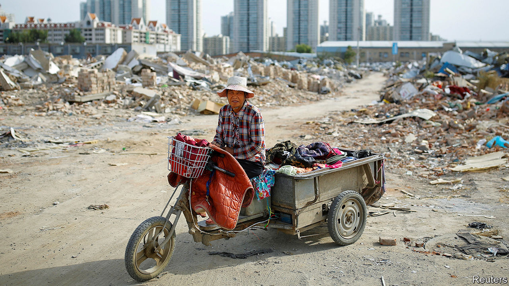

## Clarifying the battle lines

# China’s poverty line is not as stingy as commentators think

> Nor is China as poor as Li Keqiang implies

> Jun 18th 2020HONG KONG

SINCE 2017 China’s government has described fighting poverty as one of three “tough” or “critical” battles (alongside quelling pollution and financial risk). Despite the covid-19 pandemic, it still seems confident of victory this year. In March Xi Jinping, the president, pointed out that the number of rural poor fell to 5.51m in 2019. That is only 0.4% of China’s vast population. Regional overall poverty, he said, had been basically eradicated.

The claim seemed wildly at odds with another statistic, cited last month by Li Keqiang, the prime minister. “There are still some 600m people [whose] monthly income is barely 1,000 yuan,” he said at the close of the annual meeting of China’s parliament. Since 1,000 yuan is worth only about $140, the figure seemed both surprising and depressing. Many commentators concluded that China’s victory against poverty was hollow, achieved not by lifting people up but by watering the definition of poverty down.

This scepticism, though, is dogged by two misunderstandings. The first is the conviction that China’s rural-poverty line must be ridiculously stingy, lower than the global standard of $1.90 a day. The second is the belief, inspired by Mr Li’s imprecise remarks, that 600m Chinese live on 1,000 yuan a month or less. Neither claim is true.

About a decade ago China drew its rural poverty line at 2,300 yuan a year, or 6.3 yuan a day. The World Bank’s most commonly used global poverty line is $1.90 a day. Since 6.3 yuan is worth only about $0.90 at today’s exchange rate, it seems natural to think that China’s poverty line is much lower than the World Bank’s.

Natural, but wrong. A fair comparison must first note that China and the World Bank drew their poverty lines with different years in mind. China’s line is based on the prices prevailing in 2010; the World Bank’s, on prices in 2011. China updates its line every year to reflect the inflation faced by the rural poor. In 2011 the threshold was 2,536 yuan, or 6.95 yuan a day.

That is still a meagre amount. But because prices tend to be lower in rural China than in America, 6.95 yuan stretches further than the equivalent amount of dollars would in America. So the yuan should be converted into dollars not at the market exchange rate, but at the purchasing-power-parity rate. That was 3.04 yuan per dollar in 2011, according to Martin Ravallion of Georgetown University, who helped set the World Bank’s line. Thus China’s rural-poverty line is equivalent to about $2.30 a day in 2011 purchasing-power-parity dollars, comfortably above the $1.90 global line. Indeed, the bank’s poverty count for China is lower than the government’s.

What about the second misunderstanding? After the furore caused by Mr Li’s comments, China’s National Bureau of Statistics tried to sort out the confusion this week. It pointed out that the 610m people living in the bottom 40% of China’s households had a monthly income per person of almost 1,000 yuan. In other words, if their combined income were divided equally between them, they would each receive roughly 1,000 yuan (ie, 3,000 yuan for a typical household of three). That is the basis for Mr Li’s statement. But it is different from saying that all of these 610m live on 1,000 yuan or less. Imagine a country of ten people, where the bottom four earn $1, $2, $3 and $4 a day, respectively. Their income per person is $2.50. But only two of them live on less than this amount. China’s leaders often quote official statistics that flatter the economy. But on this occasion, Mr Li’s comments unflattered to deceive. ■

## URL

https://www.economist.com/finance-and-economics/2020/06/18/chinas-poverty-line-is-not-as-stingy-as-commentators-think
