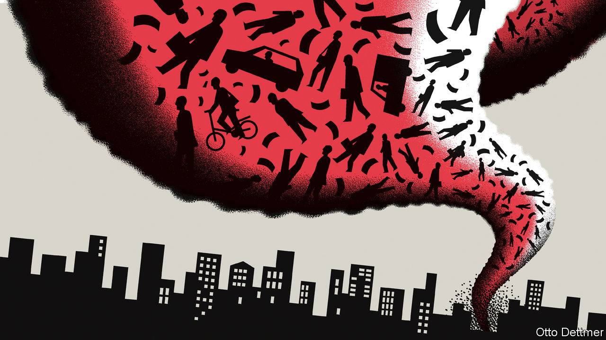

## Free exchange

# New research casts light on the pandemic’s effects on resource allocation

> Capital markets are signalling that lasting change is in the works

> Jun 18th 2020

AS COVID-19 SPREAD around the world, many governments prescribed the economic equivalent of a medically induced coma. Halting the transmission of the disease meant shutting down economic activity. But to restore economies to health quickly, connections between workers and firms needed to be maintained, so that activity could pick up from where it had left off. It seems increasingly clear, though, that not everything will return to normal once covid-19 is eventually beaten. As economies adjust, there is likely to be a substantial reallocation of people and resources.

Flexible economies that can nimbly reallocate resources ought to have an easier time weathering shocks and unlocking the productivity-boosting benefits of new technologies and business models. As the pandemic spread it induced a sudden, violent shock across the economy. While millions of workers and machines were idled, demand for some skills and products soared. Much of this is almost certain to prove temporary. The production of ventilators rose sharply in the first half of 2020, but might eventually fall back to, or below, pre-pandemic levels, as hospitals find they have more than they need in normal times. Other shifts are likely to persist. In March and April Amazon hired 175,000 workers to manage a surge in online shopping. Firms offering products to facilitate telemedicine and online learning also took on scores of new employees. Many of these will stay, just as many pandemic-linked lay-offs will become permanent.

In a paper published in May Jose Maria Barrero of the Instituto Tecnológico Autónomo de México, Nicholas Bloom of Stanford University and Steven Davis of the University of Chicago analysed a monthly survey of business uncertainty, which assesses firms’ expectations for sales, hiring and investment over the next year. The authors found a surge in expected job reallocation from January to April, and conclude that 42% of lay-offs linked to the pandemic are likely to prove permanent. Similarly, recent analysis produced by Adam Ozimek, the chief economist at Upwork, an online labour exchange, suggests that the shift to remote work prompted by covid-19 will leave a lasting impression. Of the hiring managers surveyed by Upwork, 62% say their workforce will be more remote than before the pandemic.

Capital markets, too, are signalling that lasting change is in the works. Messrs Barrero, Bloom and Davis analyse the dispersion of equity returns, surges in which are often treated as an indicator of a reallocation shock. The authors note that dispersion soared in March to levels last seen during the dotcom bust and the global financial crisis. In a recent paper Marco Pagano of the University of Naples Federico II and Christian Wagner and Josef Zechner of the Vienna University of Economics and Business compare the stock performance of businesses that are “pandemic-resilient” (eg, makers of computer-related products and pizza-delivery firms) with those of highly vulnerable ones (eg, mining firms). The former group outperformed the latter by 10% in February-March. Adjusting for risk and other factors only reinforces the point. The cumulative risk-adjusted returns of a high-resilience portfolio were roughly 25% higher than a low-resilience one in the same period. Differential movements in share prices provide a gauge of market sentiment about firms’ prospects. As a higher stock price makes it easier for companies to raise funds in order to expand, they also represent a mechanism by which capital flows from endangered firms to flourishing ones.

The authors extend their analysis back in time and come to the rather striking conclusion that the outperformance of less vulnerable firms predates the pandemic. They detect that returns began steadily diverging in 2014, before widening further in the second half of 2019, and then exploding early this year. This does not imply that markets foresaw the pandemic. It is owed, in part, to a boom in the price of technology stocks. Yet it helps illustrate why much of the reallocation now under way is very likely to stick—because it represents a continuation of trends that were long blessed by capital markets. Investors seem to have become steadily more cognisant of the risk of disasters. Options prices imply that over the next two years investors require a far higher expected return in order to accept exposure to vulnerable firms than to more disaster-resilient ones. The premium was rising before covid-19 but it has since rocketed, as the shock of the pandemic reinforced the tendency. In a similar way, the reallocation of resources now taking place in retail, health and education may in fact represent an acceleration of trends already established before the outbreak of the coronavirus.

If in fact covid-19 is engineering structural economic change, this complicates the already difficult decision of whether or not to keep struggling companies and jobs afloat. Compared with the rest of the rich world, America appears to have done less to freeze its economy in place. The number of corporate filings for bankruptcy in March and April was 22% above that in the same period in 2019; by contrast, bankruptcy filings in Germany were no higher. Unlike other rich countries, America has prioritised temporarily increasing the generosity of unemployment benefits (until the end of July) over using government support to help prevent job losses in the first place. Unemployment has consequently risen much more than it has in Europe.

The choice ahead is tricky. Messrs Barrero, Bloom and Davis warn that generous support could prove counterproductive, since it might discourage workers from seeking new jobs in expanding sectors. But withdraw stimulus too soon and the economy could remain mired in a slump, retarding the growth of frontier industries. Keep it going for just long enough, though, and the decision to allow the pandemic to destroy some jobs and companies, the better to let more robust and productive ones rise in their place, might one day be seen as remarkably fortuitous. ■

## URL

https://www.economist.com/finance-and-economics/2020/06/18/new-research-casts-light-on-the-pandemics-effects-on-resource-allocation
