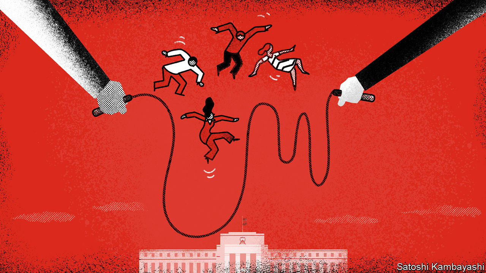
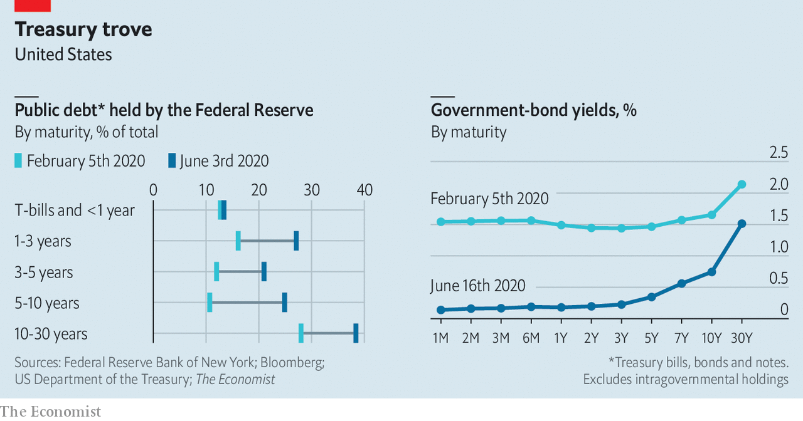

## From yields to maturity

# The Fed has been supporting markets. Now it must find ways to boost growth

> Economists expect it to begin yield-curve control in September

> Jun 18th 2020

IT SEEMS AS if there is nobody to whom the Federal Reserve will not lend. Since the covid-19 pandemic wrought havoc on financial markets in March, America’s central bank has promised to buy up to $750bn in corporate bonds and $500bn in state- and local-government debt. It has stood behind the market for commercial paper, behind money-market funds and behind foreign central banks in need of dollars (see [article](https://www.economist.com//finance-and-economics/2020/06/20/the-successes-of-the-feds-dollar-swap-lines)). On June 15th lenders were invited to register for its “Main Street Lending Programme”, which will purchase loans to small- and medium-sized businesses. The same day it announced that it would buy corporate bonds not only through exchange-traded funds, but directly, too. Such uninhibited use of its balance-sheet brings to mind the words of Walter Bagehot, the primogenitor of modern central banking, whose advice for times of stress was to lend “to merchants, to minor bankers, to ‘this man and that man,’ whenever the security is good”.

The security in this case is mostly a guarantee by America’s Treasury to absorb some of the Fed’s losses. And yet the biggest beneficiary of the monetary fire hose remains the government itself. Since early February the central bank has bought $1.7trn of federal debt, equivalent to 163% of the government’s entire net issuance in 2019. On June 10th it promised to keep buying at least $80bn in Treasuries per month. Many analysts expect that in September it will promise to buy as much as needed to keep shorter-term bond yields near zero—a policy known as “yield-curve control”.

In March the Fed’s bond-buying was intended to calm markets and arrest an alarming rise in Treasury yields. It still sees its purchases as preserving “smooth market functioning”. But as the memory of market stress recedes, its focus will shift to stimulating the real economy, about which the Fed is gloomy. Its median rate-setter expects the unemployment rate to be no lower than 6.5% at the end of 2021. On June 16th Jerome Powell, the Fed’s chairman, warned Congress about the potential scars that a long downturn might inflict.

The Fed made a similar transition from supporting markets to stimulating growth after the global financial crisis of 2007-09. It has not attempted yield-curve control, though, since 1951. The possible return to it marks a shift in the debate over market intervention—whether it is more effective to set the quantity you buy, or the price you pay. Choosing one means leaving the other to the whim of your counterparties. In the 2010s the Fed stuck to buying fixed quantities, fearing the unlimited commitment to buy that comes with pegging bond yields. In any case, economists wielded studies that found that bond purchases had a predictable impact on yields.

Yet the attitude of central bankers is evolving. That is partly because of recent experiments with yield-curve control. In 2016 Japan began fixing its ten-year bond yield around zero; in March this year the Reserve Bank of Australia (RBA) started pegging three-year yields around 0.25%. The evolution also reflects doubts about how quantitative easing (QE) works. Some economists, such as Gertjan Vlieghe, a rate-setter at the Bank of England, and Michael Woodford of Columbia University, argue that, when markets function normally, QE only brings down long-term yields on a sustained basis if it signals to traders that the short-term interest rate—the more humdrum instrument of monetary policy—will not rise for a long time.

Yield-curve control, then, might be a more transparent way of signalling the future path of the short-term rate. The RBA, for instance, pegged the three-year yield at 0.25% in order to underscore its expectation that the short-term rate will stay at that level for several years.

Moreover, yield-curve control can send the signal while reducing the need to purchase vast quantities of debt. As long as investors believe the central bank’s promise to target a certain variable, be it a bond yield, an exchange rate or inflation, they tend to bring about the outcome on their own. The Fed’s pledge to buy corporate bonds calmed the market in March, for instance, even though it did not start buying until May. So too with yield-curve control. In order to back its peg the RBA has bought only A$50bn ($34bn), less than 8% of Australia’s public-debt stock. Although some analysts regard the Bank of Japan’s yield-curve cap as an innovative form of stimulus, close observers see it as an excuse for the central bank to buy less. When it was introduced the Bank of Japan kept its existing target of buying ¥80trn ($748bn) of government debt a year—but then ignored it. Before the pandemic, it was buying bonds at less than a fifth of that pace.

Swapping purchases for pegs might eventually seem attractive to the Fed. It already owns over a fifth of all net government debt, and nearly twice that share of longer-dated bonds (see chart). It might also prevent seeming clashes between monetary and fiscal policy. So far the Treasury has financed America’s enormous fiscal stimulus almost entirely through short-term bills. It will probably refinance that borrowing at longer maturities. But doing so puts back into the market the longer-dated assets the Fed is buying up in order to keep yields low. In the 2010s refinancing led to allegations that the Treasury and Fed were “rowing in opposite directions”. Were the Fed pegging rates, it would offset the effect of any Treasury debt-maturity operations passively, and avert controversy.

Working out how best to manage bond purchases to boost growth is only a part of the daunting task that confronts the Fed. It will have to consider, as the economy emerges from lockdown, how to withdraw the vast support it has put in place for the private sector, and face losses on some of its loans. But getting monetary policy right is its most important responsibility—not just to lend to “this man and that man”, but to ensure that the economy is strong enough for each to prosper. ■

## URL

https://www.economist.com/finance-and-economics/2020/06/18/the-fed-has-been-supporting-markets-now-it-must-find-ways-to-boost-growth
