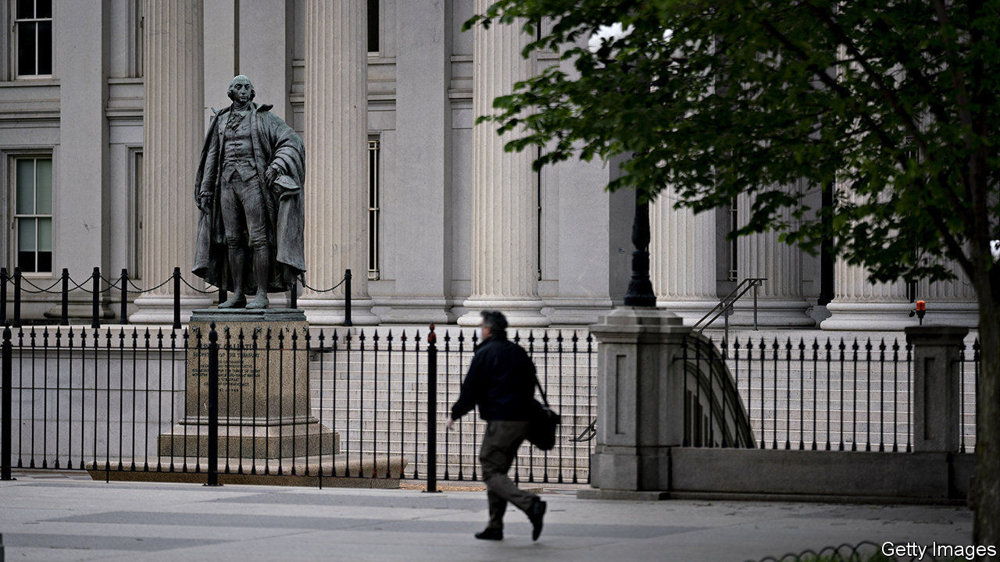

## Swapping panic for calm

# The successes of the Fed’s dollar-swap lines

> America’s central bank shines in a global role it resents

> Jun 18th 2020HONG KONG

THE FEDERAL RESERVE steadfastly refuses to view itself as the world’s central bank, which is a pity, because it is becoming quite good at the job. One sign of its success is the stabilisation of the world’s reserve currency. The dollar spiked by over 8% against a basket of six other widely traded currencies between March 9th and 20th, as covid-19 panicked investors. But now the greenback is roughly back to where it was at the beginning of the year.

Central banks usually concern themselves with their own country’s money supply, which is chiefly composed of depositors’ claims on the country’s banks. But the supply of dollars extends far beyond national boundaries. Last year, banks outside America’s jurisdiction had dollar liabilities worth over $10trn, reckon Iñaki Aldasoro and Torsten Ehlers of the Bank for International Settlements (BIS).

To fund themselves, these banks rely heavily on selling short-term dollar liabilities, including certificates of deposit and commercial paper, to investors. The traditional buyers of this paper are “prime” money-market funds (which are a little more adventurous than funds that stick to government bonds and the like). After the pandemic shattered global market confidence, investors began pulling their money out of these funds, and the funds, in turn, stopped buying the banks’ paper. That forced the banks to scramble for other sources of funding. Borrowing from each other became dearer (at the height of the panic, banks had to pay a risk premium of about 1.4 percentage points). And it became costlier to obtain dollars through foreign-exchange “swaps”, in which one party borrows dollars from another, while simultaneously lending them euros, say, or yen.

As the offshore market is not fenced off from America’s own markets, these stresses washed onshore. That gave the Fed an excuse to act. On March 15th it eased the terms of its swap lines with central banks in Britain, Canada, the euro area, Japan and Switzerland. Four days later it extended additional lines to nine others, including the central banks of four so-called “emerging markets” (Brazil, Mexico, Singapore and South Korea).

The Fed has always been uncomfortable making quasi-diplomatic decisions about swap lines. It knows that by picking some countries, it risks sowing doubt about others. Turkey, for example, has long coveted a swap line. India also sought one, according to the Indian Express, a newspaper. The swap-envy is telling. It shows that a Fed swap line is not a source of stigma in the way an IMF loan can be. (Indeed, the fund has tried to brand its new, condition-light loans for stronger countries as “swap-like”, in the hope of making them more popular.) Brazil, with its comfortable stock of reserves, has not even used its swap line. It values it more for the insurance it provides and the signal it sends, says Alberto Ramos of Goldman Sachs, a bank.

By the end of April ten central banks had drawn over $440bn between them. The biggest take-up was by the Bank of Japan. Its country’s banks need dollar funding for their heavy overseas lending. And Japan’s pension funds and life insurers also need to hedge their large holdings of dollar assets by, in effect, borrowing dollars, points out Brad Setser of the Council on Foreign Relations, a think-tank.

Favourable dollar funding meant financial institutions did not need to resort to a fire-sale of dollar assets, say Egemen Eren, Andreas Schrimpf and Vladyslav Sushko of the BIS in a recent paper. In the five countries first given swap lines, the cost of borrowing dollars fell sharply. Indeed, some banks in these countries were able to borrow more cheaply (via commercial paper or certificates of deposit) than their American peers, according to the authors. Moreover, banks in these countries sometimes lent their dollars to other banks elsewhere, helping to alleviate the dollar shortage globally. Perhaps, then, the Fed’s agonising over whom to favour with a swap line did not matter all that much. As long as it provided enough dollars to central banks somewhere, their banks could funnel any surplus dollars elsewhere.

One of the Fed’s innovations was to offer longer-term swaps lasting 84 days. The first of these matured on June 11th, reducing the amount of dollars outstanding by almost $92bn. If the foreign banks that had borrowed these dollars (through the Bank of England’s and the European Central Bank’s swap lines with the Fed) still needed them, they would have rolled them over. But they did not—suggesting that the swaps had eased much of the stress that motivated them. ■