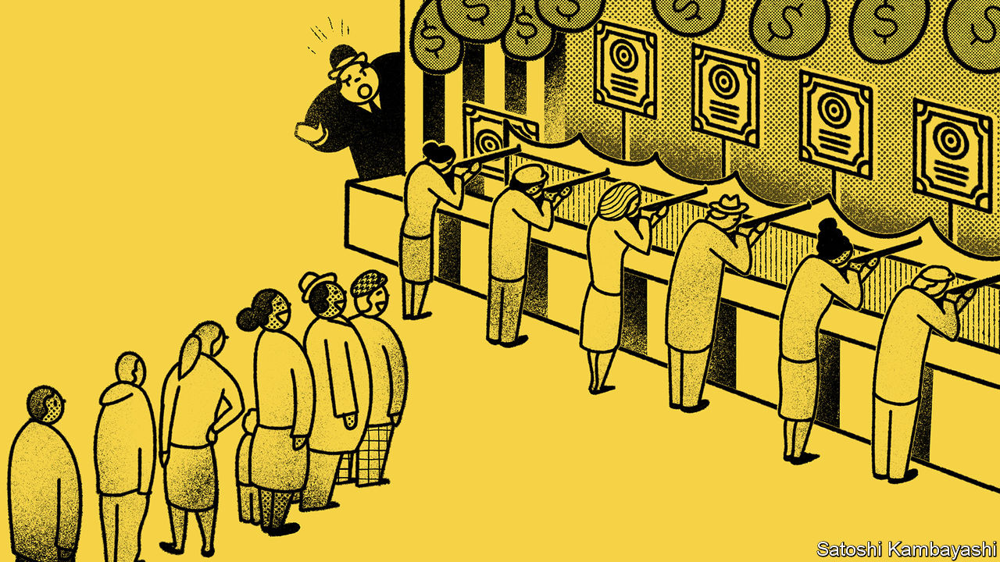

## Buttonwood

# To understand the new wave of small investors, look to China

> Speculation is as old as the hills, but you can count on some variations

> Jun 18th 2020

THERE IS NOTHING new on Wall Street. Speculation is as old as the hills. So says the protagonist of “Reminiscences of a Stock Operator”, published in 1923. Quite so—but you can count on some new variations. Take the case of Nikola Corporation, which makes trucks powered by green energy. On June 8th its stock price doubled. It was then worth more than Ford. Yet it has sold no vehicles. “Sympathetic magic”, explains a seasoned investor. Nikola is named after Nikola Tesla; as is Tesla, the leading electric-vehicles firm. That is enough of a buy signal.

Enough, that is, for a new army of retail speculators, which is blamed for a lot of strange moves in stock prices. Since March, no-cost brokerages that cater to small investors report a dramatic surge in new accounts and trading volumes. A noisy gaggle of social-media and chat-room pundits has emerged. David Portnoy, a sports-betting media-mogul reinvented as “Davey Day Trader” is perhaps the most prominent. The retail army has marched into America’s evergreen tech stocks. Less predictably they are also keen buyers of grounded airlines, of beached cruise liners and, strangest of all, of Hertz, a car-rental firm that has filed for bankruptcy.

Some of this recalls the era of Jesse Livermore, whose exploits are fictionalised in “Reminiscences”, with its bucket shops, tipsters and crazy buying of A.O.T. (Any Old Thing). There are strong parallels with the day traders and chat-room herds of America’s dotcom mania in the late 1990s. But you don’t have to go back even that far. A lot of the archetypes are found more recently in China.

There are striking resemblances between America in 2020 and China’s stockmarket fever of 2015. The economy was in a tough spot. The real returns on bank deposits were negative. There were plenty of liquid funds to lubricate trading. Brokers and shadow banks were lending freely to retail speculators. The retail wave in America differs in the sources of economic trouble and liquidity. Much of the money going into new trading accounts is from government transfers to workers idled by covid-19. With free time, free money and free trading—plus no sports—why not take a punt on the markets?

Rumour, connections (real or imagined) and tips have always played a big role in determining what stocks retail speculators buy. In Livermore’s day, every bucket-shop punter kept his ear open for a tip to get aboard Burlington or Northern Pacific. What has changed is the speed at which tips spread and so how synchronised retail buying has become. The result is a rapid succession of fads: first tech darlings; then bombed-out stocks; then something else. This rotation of investment themes is a recurring pattern in China’s market, says Adam Levinson of Graticule, a Singapore-based asset-manager.

As noisy as Mr Portnoy and his ilk are, they have been almost drowned out by the tut-tutting of jowly investors. The pros are shocked—shocked, they tell you—to find that there is gambling going on. Much of their ire is directed at the million-plus users of r/wallstreetbets, a Reddit forum where frat-boy argot is mixed with trading jargon. Its devotees are not the type to buy a stock based on a model of discounted cash flows. Instead they favour buying call options. A certain kind of call option—deeply out-of-the-money and close to expiry—is much like buying a lottery ticket or making a long-odds sports bet. They can pay off spectacularly for a relatively small outlay if the stock price suddenly surges. And, like bucket-shop bets, they are self-expiring.

Put aside the harrumphing for a moment. There is something to cheer in all this. Academics have puzzled over why more people do not participate in the stockmarket. The literature suggests peers have an influence. A paper in 2002 by Esther Duflo and Emmanuel Saez, for instance, finds that the pension choices of university librarians were swayed by their colleagues. That does not mean there is nothing to worry about. Outside of their pension plans, even experienced retail investors have a habit of over-trading—to the detriment of returns. The tendency to churn portfolios is higher in men than women. It is linked to over-confidence and thrill-seeking.

The Stock Operator knew the type. There is a higher grade of speculator, he said, who knows enough to avoid the trading mistakes beginners make. This kind loves to buy on stock declines and to quote wise-sounding aphorisms. The bucket shops and brokerages love him. For it is this sort of speculator, the “semi-sucker”, that keeps them in business.