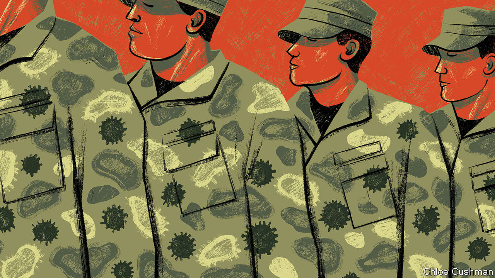
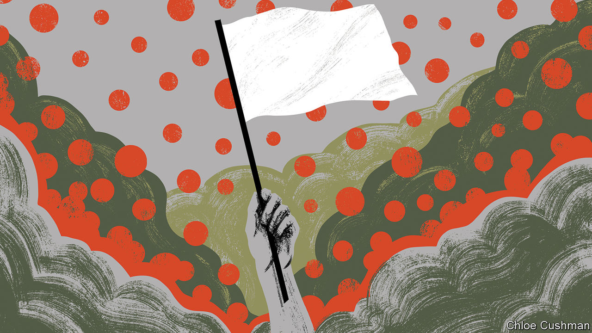
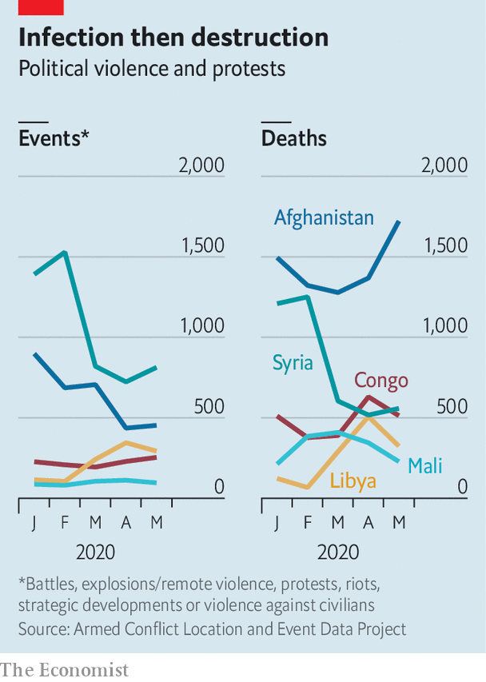
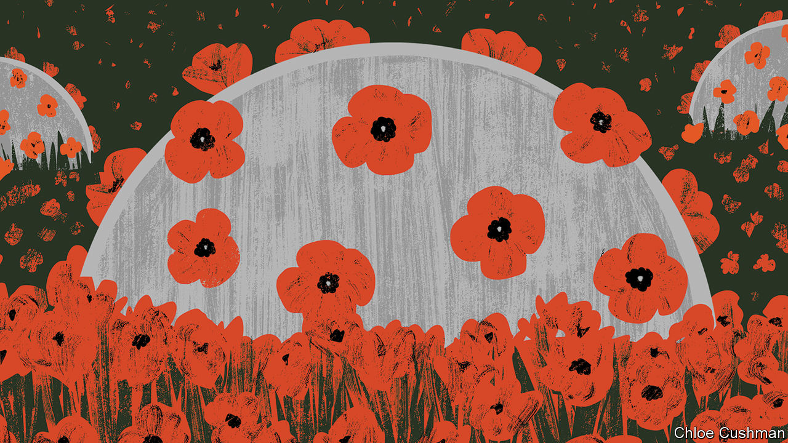

## Horsemen of the apocalypse

# Covid-19 raises the risks of violent conflict

> War and disease feed upon each other

> Jun 18th 2020BUNIA AND BOGOTÁ

BUNIA, A DUSTY city of perhaps 650,000 in Ituri, a province of eastern Congo, has long known war. Since the start of this year, rebels have burned dozens of villages to the ground and hacked hundreds of people to death with machetes. A rebel group made up of assailants from the seed-sowing Lendu tribe has launched a series of attacks on the pastoralist Hema. The government hospital in the city is overrun with patients. “We have people wounded with machetes, with gunshots, women with amputated limbs, people with fractures,” says John Katabuku, a doctor working there. “When the displaced arrive we look after them for free—they have lost everything. But it is difficult for the hospital. We really do not have the means.”

With war comes disease. Ituri is still recovering from an outbreak of Ebola which started in 2018 and killed 2,262 people in the region before subsiding. Now it has covid-19. Though there are just two recorded cases in the province, that is surely a woeful undercount. If the disease is spreading, it would not be easy to tell. Tests have to be sent 1,800km to the capital, Kinshasa. And few people can get tested. Some 22 clinics have been burned down. One man living in the nearby war-torn area of Djugu says that there is nowhere to go if you are sick—all the clinics are either ruined or occupied by rebels. The hospital in Bunia has no working ventilators and only enough space to isolate up to ten people, in the area that was previously being used for suspected Ebola patients. “We have to hospitalise two to three displaced children per bed, so you can see that we do not have infection prevention under control,” says Dr Katabuku.

Covid-19 has thus far taken its most serious toll on rich, peaceful countries. America, Britain, Italy, France and Spain, five of the six worst-affected, have collectively borne over half of recorded deaths from the virus worldwide. But the disease is now rippling through less stable places. What will happen as it does? There are reasons to fear not only that conflict will help the virus to spread, but also that its spread may worsen wars. The two could feed upon each other, creating a cycle of misery it is difficult to arrest.

At the outset of the Peloponnesian war with Sparta, which raged from 431BC to 404BC, Athens was ravaged by a plague that swept through the city for three years, killing thousands of soldiers and a third of its inhabitants. “Such was the nature of the calamity, and heavily did it weigh on the Athenians; death raging within the city and devastation without,” recalled Thucydides, a Greek historian and general. The Spanish flu of 1918, another world-shaping pandemic, festered in the trenches and barracks of the first world war and killed more people than the conflict itself. Over 36,000 American soldiers died before ever reaching France, with 12,000 dying on troop transports. In total, more American soldiers, sailors and Marines died of flu and pneumonia than bullets and bombs.

Some still hope that confronted with an indiscriminate killer, human beings on all sides of a conflict would put down their guns—at least briefly—and confront the shared enemy. In March António Guterres, secretary-general of the United Nations (UN), began urging a global ceasefire. Encouragingly, fighters in more than a dozen countries seemed to heed his call. The National Liberation Army (ELN) in Colombia, which has been trying to “liberate” the country for a half century, declared a ceasefire on March 30th. So did the New People’s Army (NPA) in the Philippines, a communist guerrilla group that has been in the field since 1969. Saudi Arabia has sought to draw down its forces in Yemen and declared a unilateral ceasefire. In Syria there were just 71 civilians killed in May, the lowest monthly toll since the start of the civil war in 2011, according to the Britain-based Syrian Observatory for Human Rights.

But in many places the tranquility has proven short-lived. By the end of April, both the ELN and the NPA announced that they were not extending their ceasefires and would return to violence. The Philippine government argued that the NPA had violated its ceasefire early on and that peace talks were pointless after the guerrillas killed two soldiers at the end of March. The Security Council, the UN’s cockpit of big powers, has been deadlocked by squabbling between America and China, including over weighty matters such as what to call the virus. Political violence has risen in 43 countries and remained steady in 45 since the start of the pandemic, according to data collected by the Armed Conflict Location & Event Data Project (ACLED). Some of the largest increases were in Libya, Yemen and Mali, each enmeshed in civil wars with a web of international links.

Battlegrounds are easy pickings for the virus. But they also help it spread. War displaces civilians, shifting disease from one place to another, while their immune systems are worn down by hunger, trauma and ill health. Trust in government tumbles, making it harder to enforce social distancing or deliver vaccinations. And those who normally provide succour are driven away. UN humanitarian agencies have already cut staff in places like Yemen and placed limits on where their staff can travel, notes Robert Malley, the president of the International Crisis Group, a research outfit.

In Congo, some 480,000 people have fled their homes since violence escalated in late March. This number accounts for 75% of the total number of people displaced worldwide during the pandemic. Near Bunia, over 27,000 displaced people live in rows of white tarpaulin tents in a camp. Twenty-nine-year-old Charlotte Tabu sleeps in a tent that she shares with nine others. She fled when rebels attacked her village. “The rebels burned my house while I was working in the fields,” she says. “We are suffering here. It is not easy to find food in the camp. We need this war to end. I had seven children, two were burned inside my house.”

Health workers worry about the spread of the virus through and among such wretched communities. In Cox’s Bazar in Bangladesh, for instance, 900,000 Rohingya Muslims, driven out of Myanmar, live in packed camps. In a survey conducted from April 11th to 17th, researchers at Yale found that 25% of respondents in camps had experienced at least one common covid-19 symptom. Most had attended a communal prayer in the previous week, a setting in which transmission is especially likely. Several refugees have already died.

Those with the guns—governments and rebel groups alike—are exploiting opportunities created by the virus and its shock to economic and social life. Since March Islamic State has switched its focus from intimidating civilians to attacking government and government-backed forces in Iraq and Syria. It killed more than 30 Syrians soldiers in two days of fighting in April and briefly seized a small town, Mubarak, in Diyala province north-east of Baghdad. In early May it launched its biggest attack in Iraq since the coalition declared its defeat in 2017, killing ten fighters from Hashad al-Shaabi, a mostly Shia militia.

In Colombia, the Simon Bolivar bridge on the border with Venezuela has closed. That means that many of the 35,000 Venezuelans who crossed on an average day are now being forced to use illegal crossing points controlled by armed groups. Authorities in Colombia fret that this flow of untested people might unleash a health disaster. It also gives rebels a fresh source of recruits among desperate Venezuelans.

That is one of many ways in which Colombia’s armed groups have consolidated their position. Many have jumped at the opportunity to expand their control and build something resembling legitimacy by imposing cordons sanitaires and lockdown. In parts of Nariño, in southwestern Colombia, the Oliver Sinisterra, a “dissident” group descended from FARC, a guerrilla organisation that is now a political party, threatened to “sanction”—in practice, attack—any shop found open or any pharmacy with too many customers inside. In Bolivar, in northern Colombia, the ELN has said only bakeries, food stores and pharmacies may open. In Arauca, on Colombia’s border with Venezuela, the ELN has even offered to educate the children of farmers, while schools are closed. Such indoctrination could breed another generation of rebels.

The crisis has also made it easier for the government to target insurgent groups and their illegal coca crop. Because road traffic has plummeted and the army has been put in charge of supplying towns and cities with food, illicit vehicles heading to rebel hideouts stick out like lines of powder cocaine on a mirror. That has enabled the armed forces to mount a string of attacks in Cauca, on the Pacific coast. The government is also eradicating coca in areas which they previously avoided, because farmers, who would otherwise offer vigorous resistance, are safely locked down.

Armies and navies are also fertile ground for contagion. Troops are packed into barracks; sailors, into cramped ships. Men in uniform gather in large numbers for drills and exercises. They cross oceans and borders. Marauding land armies are rarer than they once were, but many war zones pull in spooks, soldiers and insurgents across borders. In Iran, one of the worst-hit countries in the Middle East with nearly 9,000 deaths, Mahan Air, an airline affiliated with Iran’s Islamic Revolutionary Guard Corps (IRCG), continued to operate between China and Iran for weeks after other airlines had suspended flights. Several commanders contracted the virus. The movement of IRGC-financed Shia fighters between Iran, Iraq, Syria, Lebanon, Pakistan and Afghanistan also spread the disease. Syria’s first documented cases occurred in Saida Zeinab, a Shia shrine near Damascus under the control of IRGC-backed armed groups.

Rich countries’ armies are affected too—in ways that may have lasting consequences. In America over 8,000 military personnel have tested positive for covid-19, with three deaths (the case fatality rate for those with military ties is 0.3%, considerably lower than the rate for the broader public, perhaps because soldiers tend to be young and fit). Foreign governments have sharply cut ground forces and military trainers, including most of Iraq’s 29 coalition partners pursuing Islamic State (IS). In March America withdrew from six bases in Iraq and NATO suspended its training programme. Defender-20, a military exercise slated to be the largest movement of American troops to Europe since the cold war, was halted, not long after a Polish general involved in its planning was taken ill. At the same time, America’s armed forces, like many others, have been tied up on the home front, to support beleaguered civilian authorities with everything from logistics to testing.

The most dramatic impact, however, has been on navies, whose confined spaces are ripe for disease. “It is a Petri dish of virus,” says one former commander of an American carrier strike group. “There is no social distancing of 5,000 people on a vehicle that’s three football pitches long...and one football pitch wide.” America’s navy comprises a quarter of the country’s military personnel but a third of all cases among them. The USS Theodore Roosevelt, one of America’s largest carriers, was forced to halt operations in the Pacific and return to port in Guam in March after an outbreak of covid-19 that eventually infected 1,000 of its crew, out of 5,000 or so in total, including its captain. It limped back to sea only at the end of May. France’s sole aircraft-carrier, the more diminutive Charles de Gaulle, was also taken out by covid-19, with two-thirds of its crew infected (though only half were symptomatic).

Many countries are anxious that such self-evident disruption to their armed forces reeks of vulnerability. On May 6th the UN’s Mr Guterres warned that some “may see opportunities because the attention of governments and the international community is absorbed by the health crisis”. That is presumably why Thomas Modly, America’s then navy secretary, rashly sacked the Roosevelt’s captain, who had sounded the alarm about conditions on the ship. In a speech to the Roosevelt’s ailing crew, Mr Modly told them to “stand strong as warriors, not weak like victims”. The ship, he said, “has to demonstrate to the citizens back home that it has its act together, and that it is knocking down this virus, just as it would knock down the Chinese or the North Koreans or the Russians if any one of those nations were ever so stupid enough to mess with the Big Stick”. (Mr Modly himself was later forced to resign for his poor judgment.)

The urge to downplay weakness and project strength has resulted in a form of nervous muscle-flexing that Nick Childs of the International Institute for Strategic Studies, a think-tank, calls “pandemic deterrence”. In mid-April China steamed its own aircraft-carrier through the Miyako Strait between Taiwan and Japan, an “opportunistic” act “almost calculated to contrast with the plight” of the stricken Roosevelt, notes Mr Childs. On May 22nd America’s navy pointedly noted that it had seven out of eleven carriers at sea, though it is implausible that all are fighting fit. In mid-June three were sent to the Pacific for the first time in three years (see [article](https://www.economist.com//china/2020/06/17/chinas-next-move-in-the-south-china-sea)).

Covid-19 has not had the shattering effect on military power the Spanish Flu had a century ago. Modern health care is vastly better. Today’s pandemic, unlike the earlier one, largely spares the young adults who fill the ranks of armed forces. But as governments have been preoccupied at home and distracted abroad, the virus has deepened geopolitical tensions—between America and China, above all—and worsened what was already a febrile international mood. “Some leaders may...see covid-19 as cover to embark on destabilising foreign adventures, whether to deflect domestic discontent or because they sense they will face little pushback amid the global health crisis,” warns the ICG.

The line between pandemic deterrence and adventurism can be hard to draw. But some of the geopolitical manoeuvring has already taken a more violent turn. In early March, Indian troops in Ladakh, a Himalayan region abutting China, delayed their annual summer exercise after soldiers were infected by covid-19. China went ahead with its own matching drill. But the People’s Liberation Army (PLA) peeled away from exercises and dashed to several disputed areas on the mountainous border, where it dug in to strategic territory. India’s army stumbled upon them at the end of April, prompting it to rush forces to the disputed area.

The entanglement of virus and war was encapsulated in a series of videos and photographs showing PLA troops in the aftermath of a brawl in May, wearing masks as they leant over trussed and bloodied Indian captives, mindful of good respiratory hygiene even during a skirmish between nuclear-armed rivals. Another fight erupted on June 15th, resulting in serious casualties on both sides (see [article](https://www.economist.com//asia/2020/06/18/india-and-china-have-their-first-deadly-clashes-in-45-years)). “A section of the Chinese leadership believes that the…pandemic is a window of opportunity for China to expand its regional and global influence,” reflected Shyam Saran, India’s former top diplomat, in May. “China stabbed us in the back,” complained an Indian officer to News18, a television channel. “In the middle of a pandemic, this was not expected.” ■