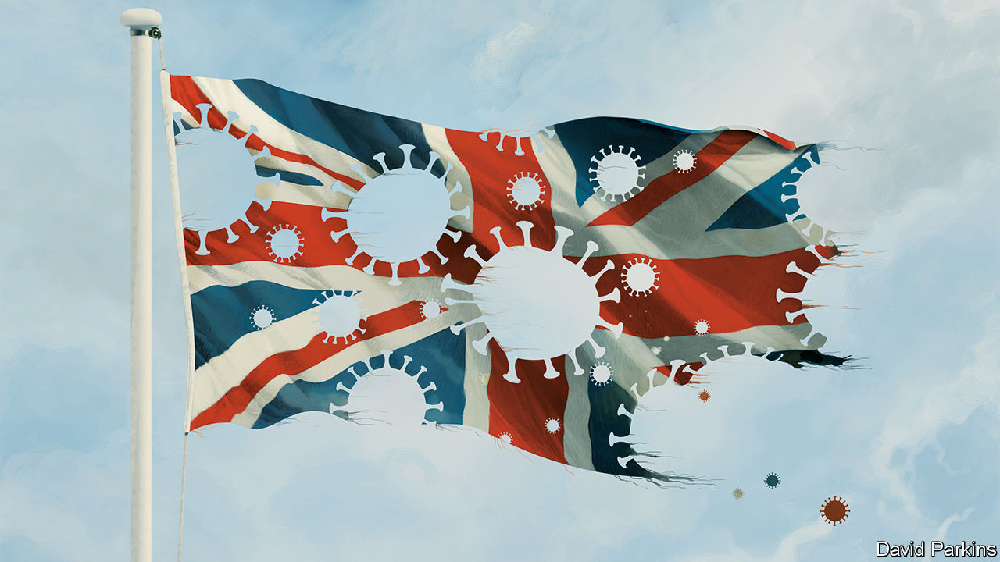

## Politics and the pandemic

# Britain has the wrong government for the covid crisis

> It has played a bad hand badly

> Jun 18th 2020

THERE WAS a lot going on in Britain in early March. London staged an England-Wales rugby match on March 7th, which the prime minister attended along with a crowd of 81,000; on March 11th Liverpool played Atletico Madrid, in front of a crowd of 52,000 fans, including 3,000 from Spain; 252,000 punters went to the Cheltenham Festival, one of the country’s poshest steeplechase meetings, which ended on March 13th.

As Britons were getting together to amuse themselves and infect each other, Europe was shutting down. Borders were closing, public gatherings being banned. Italy went into full lockdown on March 9th, Denmark on March 11th, Spain on March 14th and France on March 17th. Britain followed only on March 23rd.

Putting in place sweeping restrictions on everyday life was a difficult decision, fraught with uncertainty. Yet the delay is just one example of the government’s tardiness. Britain has been slow to increase testing, identify a contact-tracing app, stop visits to care homes, ban big public events, provide its health workers with personal protective equipment (PPE), and require people to wear face coverings on public transport. As this wave of the disease ebbs, Britons are wondering how they came to have the highest overall death rate of any country in the rich world, and why leaving lockdown is proving so difficult.

[The evidence so far](https://www.economist.com//britain/2020/06/19/the-british-state-shows-how-not-to-respond-to-a-pandemic) suggests that the British government played a bad hand badly. The country was always going to struggle. The virus took off in London, an international hub. Britain has a high proportion of ethnic-minority people, who are especially vulnerable to the disease. And Britons are somewhat overweight, which exacerbates the impact of the infection.

Britain has got some things right. Its researchers have been in the forefront of the race to find drugs and create vaccines against the disease. On June 16th a trial by Oxford University, the first to identify a life-saving medicine, showed that a cheap steroid can reduce mortality among the sickest patients by a third. A swift reorganisation of the National Health Service put paid to fears that it would be overwhelmed. But the government has wasted the most precious commodity in a crisis: time. In a federal system, like America’s, the central government’s failings can be mitigated by state and local authorities. In a centralised system, they cannot.

Hindsight is a fine thing, and offers a clarity that is absent in the blizzard of events. Yet it is now plain that Britain’s scientists initially argued for the wrong approach: accepting that the disease would spread through the population, while protecting the vulnerable and the health service. Neil Ferguson, an epidemiologist at Imperial College London, estimates that had Britain locked down a week earlier, at least half of the 50,000-or-so lives that have been lost would have been saved. This is more Britons than have died in any event since the second world war.

In retrospect, the government should have probed the scientists’ advice more deeply. Some of it was questionable. The received wisdom that people would tire of social distancing, and that shutting down early would mean loosening early too, was just a hunch. Even after the evidence changed, and it became clear the country was heading for catastrophe, the government was slow to impose the sort of lockdown seen across Europe.

Yet you do not need hindsight to identify other mistakes. Delays in fixing PPE supply chains, promoting face coverings and increasing testing capacity were clearly errors at the time. Despite the urging of the country’s scientists and the World Health Organisation, by the middle of April Britain was still carrying out just 12,000 tests a day, compared with 44,000 in Italy and 51,000 in Germany. Because most testing was reserved for hospitals, care homes struggled to find out which of their residents and staff were infected. Competition for PPE was fierce, so they also struggled to get the kit they needed to protect their workers.

The government is not solely to blame. The pandemic made new demands on the system. Some crucial bits of machinery did not work. The publicly owned company which supplies the health service with PPE failed. Public Health England, which was responsible for testing and tracing, failed. But there was a failure of leadership, too. When systems break it is the government’s job to mend them; when the evidence argues for drastic measures ministers need to take them.

Britain is still living with the consequences. The spread of the virus and the devastation it has wrought have made leaving lockdown difficult, as shown by the halting return of pupils to school. Only five year-groups have gone back, many parents are choosing to keep their children at home, and the government has abandoned an earlier ambition to get more in. The “world-beating” contact-tracing system still lacks its app, which is not due to arrive until winter. Slow progress at suppressing the virus will have grave economic consequences, too.

These shortcomings have claimed many victims. Among them is public trust. Britain went into this crisis with a powerful sense of unity and goodwill towards the government. Now Britons think worse of their government’s performance during the crisis than do the citizens of any of 22 countries polled by YouGov, aside from Mexico. That reflects the government’s mistakes and its hypocrisy, after the prime minister’s main adviser broke its own rules about when to travel—and kept his job. While the world waits for a vaccine this lack of trust will make managing the disease a lot harder.

The painful conclusion is that Britain has the wrong sort of government for a pandemic—and, in Boris Johnson, the wrong sort of prime minister. Elected in December with the slogan of “Get Brexit Done”, he did not pay covid-19 enough attention. Ministers were chosen on ideological grounds; talented candidates with the wrong views were left out in the cold. Mr Johnson got the top job because he is a brilliant campaigner and a charismatic entertainer with whom the Conservative Party fell in love. Beating the coronavirus calls for attention to detail, consistency and implementation, but they are not his forte.

The pandemic has many lessons for the government, which the inevitable public inquiry will surely clarify. Here is one for voters: when choosing a person or party to vote for, do not underestimate the importance of ordinary, decent competence. ■