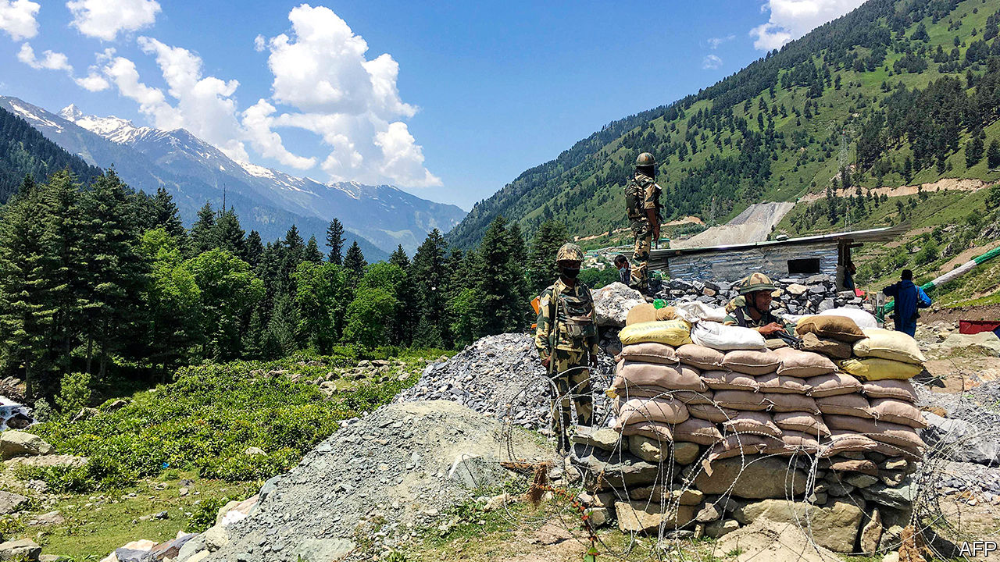

## Elephant v dragon

# How to end the perilous Indo-Chinese border spat

> To avoid escalation, both sides should agree on the “Line of Actual Control”

> Jun 18th 2020

IN THE ANCIENT Chinese game of Go, clever players ignore little battles in favour of strategic plays. Leaving local disputes unresolved means that later, when the game tightens and the enemy is off-guard, you can snatch prizes at lower cost. In the 69 years since China truly became India’s neighbour by grabbing Tibet, the world’s two most populous countries have played a similar game. Even as their leaders summited and trade thrived, the Asian giants left a mess of territorial disputes to fester.

Mostly these claims, over some 130,000 square kilometres on either side of their 3,488km-long border, have not mattered much. Despite a Chinese “lesson-teaching” invasion in 1962, rare armed skirmishes and less rare fisticuffs between patrols, the border zone has remained relatively calm. Much of it is too rugged and empty to fight over. So long as neither side shifts the status quo, what difference does it make if there are no proper markers on long stretches of border, but instead just a fuzzy “Line of Actual Control”?

A brutal clash on June 15th provided a loud and ugly answer (see [article](https://www.economist.com//asia/2020/06/18/india-and-china-have-their-first-deadly-clashes-in-45-years)). Details remain sketchy. At least 20 Indian soldiers died, many after tumbling into an icy river. India says the Chinese also suffered casualties. China says little (see [article](https://www.economist.com//china/2020/06/18/why-china-bullies)). The death toll is the worst in any clash between the two since 1967, and the first loss of life since 1975.

Even worse, the skirmish cannot be explained away as an isolated incident. This spring China deployed far heavier forces than usual. It has pushed them forward not at one point but at many, say Indian sources, in effect seizing as much as 60 square kilometres of land that India views as lying on its own side of the line. A particular concern is China’s westward extension along the Galwan river, threatening a strategic road that runs parallel to the border and forms the main link to India’s northernmost outposts. Not surprisingly, this is where the deadly clash erupted.

Why would China change the status quo, angering a big nuclear-armed trading partner? Because, say Indian cynics, India is distracted just now by a swelling pandemic and shrinking economy, and saddled with a government better at chest-thumping than at strengthening its army or building alliances. Nonsense, say India’s critics. It is India that has changed the status quo, quietly expanding infrastructure in contested regions even as, after stripping its part of Kashmir of statehood last August, its leaders boasted of soon “regaining” other parts, including a chunk that Pakistan gave to China in 1963.

China may also see an interest in teaching India that, should it continue to flirt with closer ties to America, it will pay a price. To their credit, officials on both sides have avoided whipping up popular anger, stressing instead the importance of implementing an earlier deal to pull forces back. Such gentlemen’s agreements have calmed tempers in previous clashes.

Yet whatever the efficacy of generals meeting in windblown tents, it is a reckless way to fix problems between two rising nuclear powers that are home to a third of humanity. India has previously suggested that, as a second-best to a formal agreement over where the border lies, the two sides should at least present maps showing their view of where the line of control runs in practice. China, perhaps thinking itself the more astute Go player, has always refused to do so. This allows it to claim that any Indian move is a violation of its own understanding.

It is time to stop playing games. China looks stronger just now but India, if pushed, will find ways to cause it pain. And the last thing the wider world needs is an escalating slugfest between a dragon and an elephant over a lofty patch of frozen earth.■