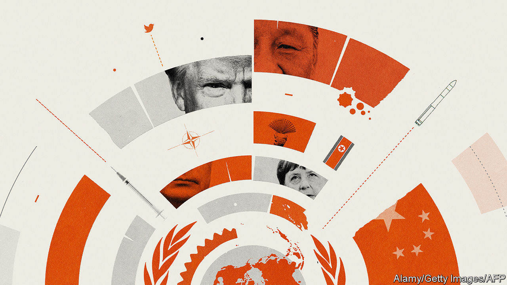

## Geopolitics

# The new world disorder

> If America pulls back from global institutions, other powers must step forward

> Jun 18th 2020

SEVENTY-FIVE years ago in San Francisco 50 countries signed the charter that created the United Nations—they left a blank space for Poland, which became the 51st founding member a few months later. In some ways the UN has exceeded expectations. Unlike the League of Nations, set up after the first world war, it has survived. Thanks largely to decolonisation, its membership has grown to 193. There has been no third world war.

And yet the UN is struggling, as are many of the structures, like the World Trade Organisation (WTO) and the Nuclear Non-Proliferation Treaty (NPT), designed to help create order out of chaos. This system, with the UN at its apex, is beset by internal problems, by the global struggle to cope with the rise of China, and most of all by the neglect—antipathy even—of the country that was its chief architect and sponsor, the United States.

The threat to the global order weighs on everyone, including America. But if the United States pulls back, then everyone must step forward, and none more so than the middling powers like Japan and Germany, and the rising ones like India and Indonesia, which have all become accustomed to America doing the heavy lifting. If they hesitate, they will risk a great unravelling—much like the nightmare in the 1920s and 1930s that first impelled the allies to create the UN and its siblings.

The UN is bureaucratic and infuriating. Its agencies fall prey to showboating and hypocrisy, as when despots on its Human Rights Council censure Israel yet again. The Security Council gives vetoes to Britain and France, much diminished powers since 1945, but no permanent membership to Japan, India, Brazil, Germany or any African country. Alas, it looks virtually unreformable.

Nonetheless, the global order is worth saving. As Dag Hammarskjold, a celebrated secretary-general, said, the UN “was not created to take mankind to heaven, but to save humanity from hell.” Our special report this week explains how the UN does that essential job, as do many other multilateral institutions. Its peacekeepers protect 125m people on a budget only a bit bigger than New York City Police Department’s. It says it is helping provide life-saving assistance to 103m. For all the Security Council’s flaws, it would be missed.

That is because, left to themselves, countries drift into antagonism. Witness the fatal clash of Indian and Chinese forces this week over a border dispute both sides are too proud to defuse (see [article](https://www.economist.com//leaders/2020/06/18/how-to-end-the-perilous-indo-chinese-border-spat)). Multilateral endeavours like the UN, NATO and the NPT cannot ensure peace, but they do make war less likely and more limited. France and its allies are helping contain the conflict spreading across the Sahel.

Without a multilateral effort, old problems are likely to deepen—even Syria, after nine bloody years, will one day be ready for the UN envoy’s plans for peace. Meanwhile new problems are more likely to go unsolved. The pandemic is an example. The virus not only calls for global solutions, like treatments and vaccines, but it also aggravates local insecurity (see [article](https://www.economist.com//international/2020/06/18/covid-19-raises-the-risks-of-violent-conflict)). It is the same with climate change and organised crime.

Protecting the system from the forces of disorder is easier said than done. One threat is antagonism between America and China, which could create gridlock in global bodies, exacerbated by competing parallel financial and security arrangements. Another is that America may continue its careless treatment of multilateral institutions—especially if President Donald Trump behaves as badly in a second term as a devastating new book by John Bolton, his former national security adviser, says he has in his first (see [article](https://www.economist.com//united-states/2020/06/18/details-from-john-boltons-book-are-damning-for-donald-trump)). Mr Trump has undermined the World Health Organisation and the WTO, and this month said that he would pull out a third of the American troops stationed in Germany, enfeebling NATO and limiting America’s scope to project power from Europe into Africa.

Happily, the world has not yet reached the point of no return. For decades the middling powers have depended on America for the system’s routine maintenance. Today they need to take on more of the work themselves. France and Germany have created an alliance for multilateralism, an initiative that is open to other countries. Another idea is for nine democracies, including Japan, Germany, Australia and Canada, which together generate a third of world GDP, to form a “committee to save the world order”.

Although America is dominant, other countries can still get things done—with or without help from the White House. Sometimes the aim is to bind in America. After a chemical-weapons attack on Sergei Skripal, a Russian ex-spy living in Britain, Western countries’ imposition of sanctions on the Kremlin swept up America, too. The Quad is an emerging coalition between India, Australia, Japan and America, which are all alarmed at Chinese expansion, including in the South China Sea (see [article](https://www.economist.com//china/2020/06/17/chinas-next-move-in-the-south-china-sea)).

Sometimes, however, the world must work without America even if that is second-best. After Mr Trump walked away from the Trans-Pacific Partnership, a huge trade deal, the other members went ahead on their own. Stymied at the WTO, countries are instead forming regional and bilateral trade arrangements, such as one between Japan and the European Union and another between 28 countries in Africa.

Defending the international order is necessary, too. China’s stature is growing along with its contributions—it now pays 12% of the UN budget compared with 1% in 2000. Its diplomats head four of the UN’s 15 specialised agencies, and America just one. If other countries do not act, the system will come to reflect China’s expansive views of national sovereignty and resistance to intervention, even in the face of gross human-rights violations.

Some think the job of middling powers is triage, to keep the system going until America returns to the party under a different president. It is more than that. Although polls suggest that most Americans would like to play a bigger global role, there is no going back to the “unipolar moment” after the Soviet collapse, when America ran the show single-handed. Not only did that provoke a backlash abroad, exploited by Russia and China, but it also stirred up resentment at home.

At the time, President Barack Obama responded by asking like-minded countries to help America make the world safe. They shrugged. They must not make the same mistake again. ■