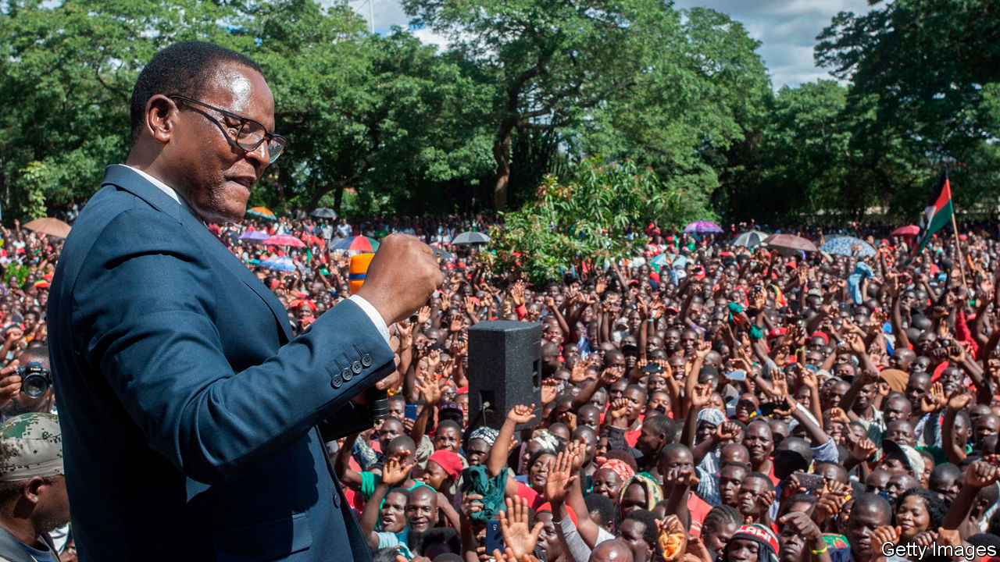

## Wigged men v Big Man

# A court in Malawi tries to guarantee a fair election

> After a rigged vote was annulled, President Peter Mutharika is trying to cling to power

> Jun 18th 2020LILONGWE

GARTON KAMCHEDZERA is a man of reason. The professor of law at the University of Malawi teaches contracts, trusts and constitutions. But over the past year, as President Peter Mutharika has repeatedly been foiled in his efforts to distort the electoral process, Mr Kamchedzera has wondered whether there might be a higher power at work: God, perhaps, or “some kind of deus ex machina”.

It must feel that way for many in the southern African country of 18m people. A general election in May 2019, which Mr Mutharika was at first declared to have won, involved the liberal use of Tipp-Ex, a correction fluid, to adjust voting tallies. It seemed that credible allegations of rigging were not going to change the outcome. Observers from the European Union noted an “unlevel playing field”, but said the vote was “well managed, inclusive, transparent and competitive”.

Malawians, however, did not accept such whitewashing. Protesters took to the streets. The two largest opposition parties, the Malawi Congress Party (MCP) and the United Transformation Movement (UTM), went to the constitutional court. Its judges refused parcels of cash that were allegedly offered by a businessman linked to the president. On February 3rd the court cancelled the presidential portion of the election and ordered a re-run.

It was only the second time in African history that judges have nullified a vote. A fresh election is scheduled for June 23rd. Yet Malawi is far from out of trouble. Much depends on what happens in the next few weeks. If Malawi, one of the world’s poorest countries, can have a fair election, it will not just be good for Malawians. It will also undermine the argument, used by autocrats everywhere, that covid-19 means democracy ought to wait.

Mr Mutharika has tried to hobble the process. He appealed to the Supreme Court. He delayed appointing a new electoral commission until June 7th. He dithered over the date for the election. And earlier this month his government tried to force the chief justice to retire early.

But the president has been thwarted at every turn. Lawyers rallied around the chief justice. The Supreme Court rejected the appeal. Opposition parties got the election date onto the statute book, in part by defying covid-related restrictions so they could pack the chamber with their MPs.

The opposition’s determination makes sense. Mr Mutharika, who took office in 2014, is the fourth president since Hastings Banda’s long authoritarian rule ended in 1994. The current government has faced myriad allegations of corruption. Fully 85% of Malawians feel the country is heading in the wrong direction, according to a recent poll by the Institute of Public Opinion and Research (IPOR).

The survey suggests that the candidate of the opposition alliance, Lazarus Chakwera of the MCP, will win the re-run. Roughly half of respondents supported him, compared with about a third for Mr Mutharika; the rest were undecided or refused to say. Mr Chakwera, a pastor turned politician, bonded with his running-mate, Saulos Chilima (of the UTM), as they sat together for months in the constitutional court. Their support bases are complementary, says Boniface Dulani, a political scientist at the University of Malawi, Chancellor College. The MCP is strong in rural areas, especially in the middle of the country; UTM does best among young urbanites.

But the duo are far from home and dry. There is still a dash to organise the vote. Ballot papers are being printed in Dubai and are not expected to arrive until June 19th. The timetable is tight. If there are procedural hiccups, Mr Mutharika may use them as an excuse to get his supporters onto the streets and to ask the courts for another nullification.

But that may not work. If the margin of victory is wide, the court will probably forgive a snafu or two. The judges have not only upheld the constitution in the past year. They have also reflected the mood of the people: 80% of Malawians wanted a re-run, says IPOR.

Brave judges ensured that Malawi has a chance of a fair election. But they can do only so much. “Malawians will need to stay vigilant,” says Mr Kamchedzera. ■

## URL

https://www.economist.com/middle-east-and-africa/2020/06/18/a-court-in-malawi-tries-to-guarantee-a-fair-election
