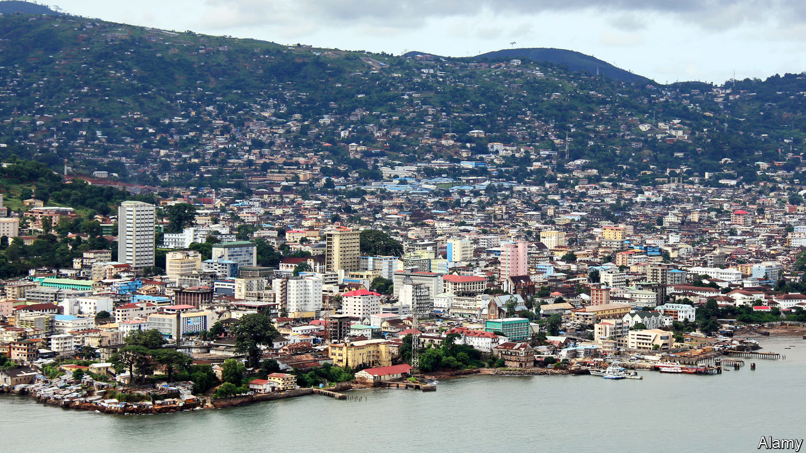

## A tax on all your houses

# A mayor is reforming Sierra Leone’s rotten property tax

> Other African cities should follow suit

> Jun 18th 2020FREETOWN AND KAMPALA

WHEN ASKED why she wanted to be mayor of Sierra Leone’s capital, Freetown, Yvonne Aki-Sawyerr answers without hesitation: “My heart was breaking at what the city was becoming.” In her two years a lot has improved. Gutters have been dug in flood-prone districts. Dustbins have proliferated throughout the city. Grass is sprouting from a roundabout once strewn with litter. But there is still much to do. Electricity flickers. Taps run dry. Rubbish heaps bigger than football fields still fester.

Last year the cash-strapped city council got around 70% of its budget from foreign donors. The mayor is revamping property taxes, which she hopes will bring in five times more revenue this year. Not only does she want the rich to cough up more, she also wants payments to go directly into the bank, rather than be paid in cash. These are big reforms on a continent where property taxes bring in less than 0.4% of GDP, compared with about 2% in the rich world.

Taxing property should reap big benefits, but it is hard to value buildings when you’re not even sure if they exist. Many African cities will triple in size by 2050. But taxmen tend to live in the past: officials in Kenya’s capital, Nairobi, use a property register dating back to 1982. Freetown’s register, until Ms Aki-Sawyerr came along, was a bundle of papers covered in ink scrawls.

It has since been digitised with the help of the International Growth Centre and International Centre for Tax and Development (ICTD). Researchers used satellite photos to count properties and sent staff traipsing around the city with smartphones, plugging in data such as the size of the roof and whether a house was made of brick or tin. A points-based system lets them value properties consistently. Under the old method “they were cheating us,” says Victor Obofor-Smith, who owns a tin shack but has been paying the same in tax as his neighbour in a three-storey brick edifice. In Kampala, Uganda’s capital, the city council is also revaluing property.

Systems can be too simple. For instance, some cities in Congo, Eritrea and Burundi tax a wooden hut at the same rate as a brick one with similar dimensions. Freetown’s new system has found a “sweet spot”, says the ICTD’s Wilson Prichard, as it is simple to administer, efficient and fair. Still, citizens need convincing that they should pay taxes in cities with crummy services. Counting houses is only half the battle. ■