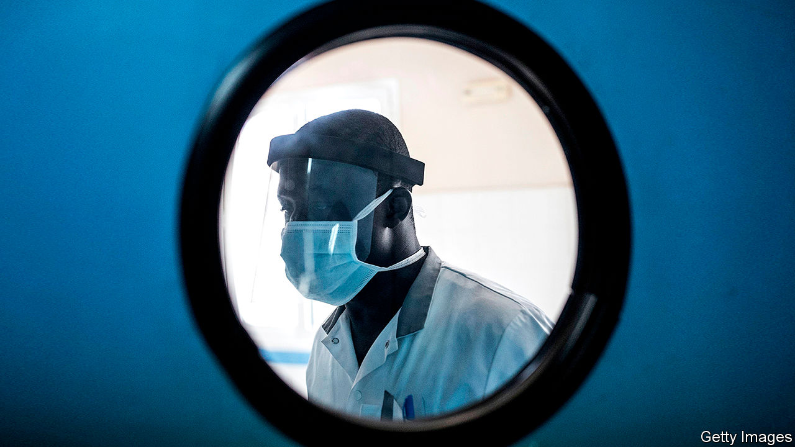
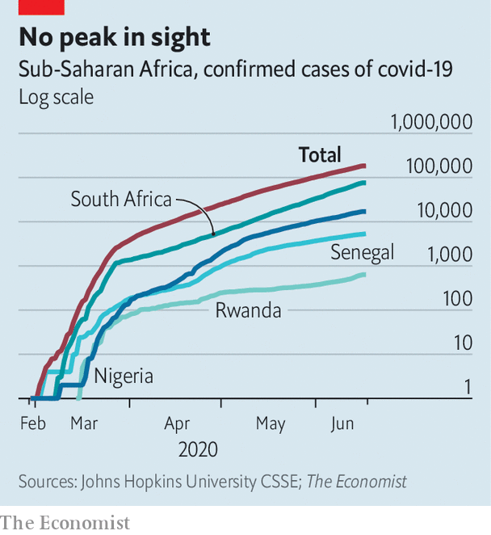

## Testing times

# African countries are struggling to keep track of covid-19

> Not enough tests are being done to contain the virus

> Jun 18th 2020JOHANNESBURG

SOUTH AFRICA had a plan for slowing the spread of covid-19. As outlined by Salim Abdool Karim, chair of the medical committee advising President Cyril Ramaphosa, on April 13th, the country would draw on its earlier experience using community health workers to deal with HIV and tuberculosis. It would screen millions of people in poorer areas. Those with symptoms would be tested and then treated and quarantined if necessary.

Yet a sound strategy has been undermined by, among other things, testing failures. State-run laboratories suggested they could do 36,000 tests per day by the end of April. Since April 5th they have managed to do just one-fifth of that. Results have also taken too long. As of June 6th the average turnaround time was 12 days.

Such delays mean the HIV-inspired strategy is “totally futile”, argues Marc Mendelson, an infectious-disease specialist at Groote Schuur Hospital in Cape Town. Waiting 12 days for an HIV test is agonising, but the patient will probably not infect anyone during that time. In the case of covid-19, by the time a result arrives, a patient may have infected scores of others.

Delays put more pressure on hospitals. In the wider Western Cape province, which has 0.5% of Africa’s population and 17% of its known coronavirus cases, intensive-care units are filling up. Others in South Africa may soon follow suit. The country had the 11th highest five-day moving average of confirmed new cases as of June 16th—and the rate of growth is accelerating.

If South Africa—which with Ghana accounts for about half of all tests in sub-Saharan Africa—is not testing enough, then nor are most other countries in the region. At the start of June African countries had tested, on average, fewer than 1,700 people per 1m, a fraction of the number in rich countries (America had done 26 times more per million people). “Testing is our Achilles heel,” says John Nkengasong of Africa CDC, a pan-African health institution. It is also symbolic of broader weaknesses in African health systems that mean the continent is less able to cope with mass outbreaks than rich parts of the world.

The challenge of testing has long been recognised. In February the World Health Organisation (WHO) overhauled African labs. Today 43 of the 47 countries in its Africa region can do molecular testing for covid-19, up from just two at the start of the year. Nevertheless, most countries still lack resources. Nigeria has the capacity to do at least 10,000 tests per day, but has averaged fewer than 900 since announcing its first case on February 27th. Some countries have had to wait more than two months for orders of test kits to be delivered.

The problem is that African countries are competing in the market for testing materials with rich countries, many of which are regular customers of the manufacturers and often buy in bulk. Some small African countries have placed orders for fewer than 10,000 kits, as many as Germany uses in a few hours.

Philanthropy has helped. In most African countries most of the testing kits used are those donated by the charitable foundation of Jack Ma, Alibaba’s founder. He has given at least 20,000 kits to every country in Africa. Yet this is far short of what is required. On June 3rd Dr Nkengasong said Africa needed at least 20m new test kits within 100 days.

To try to meet that goal, countries are pooling their resources and placing large joint orders. Africa CDC has agreed with manufacturers that 90m kits will be bought over the next six months. A bulk purchase establishes trust, argues Fatoumata Ba, a Senegalese venture capitalist and one of several African executives lending their expertise to the Partnership to Accelerate Covid-19 Testing (PACT) scheme.

PACT is a step forward, but problems remain. The first kits bought under the agreement are due to arrive only by the end of the month. And having kits does not obviate the need for technicians; South Africa laboured to keep pace even when it had enough materials.

The struggle to increase testing augurs ill for the broader response. The number of confirmed cases in Africa has been rising by about 30% a week over the past month. But that glosses over trouble spots, such as South Africa or Guinea-Bissau, where almost one-tenth of health workers have been infected. And it means that the absolute number of cases is mounting: it took 98 days for Africa to go from 1 to 100,000 cases, but only 18 days to reach 200,000.

The overall numbers matter, because African health systems will tend to be overwhelmed at an earlier point than those in Asia or Europe. Such weaknesses are the main reason why a study published by the Centre for Global Development, a think-tank, projected that death rates in Africa could be many times higher than predicted by other models that do not account for scant staff and cash-strapped hospitals. Already countries such as Kenya and Nigeria are planning ways to care for people in their homes rather than in hospitals.

Others are trying new ways of gauging the disease’s progress. Just four African countries keep high-quality records showing causes of deaths, according to the UN. In many places most deaths are not recorded, let alone their cause. That makes it hard to calculate whether death rates are higher than average, a useful measure of the disease’s effects. In the absence of excess-mortality data, countries such as Rwanda and Senegal are doing “verbal autopsies”, where next of kin are interviewed.

South Africa does have mortality data going back years. In the three weeks to June 9th deaths from natural causes were unusually high in Cape Town, and on the rise elsewhere, too. At this point more testing would help, says Dr Mendelson, but the focus must be on reducing deaths. With that in mind the Western Cape is rationing public testing to those over the age of 55 and opening field hospitals. “We cannot test our way out of the crisis,” he says. ■

Editor’s note: Some of our covid-19 coverage is free for readers of The Economist Today, our daily [newsletter](https://www.economist.com/https://my.economist.com/user#newsletter). For more stories and our pandemic tracker, see our [coronavirus hub](https://www.economist.com//news/2020/03/11/the-economists-coverage-of-the-coronavirus)