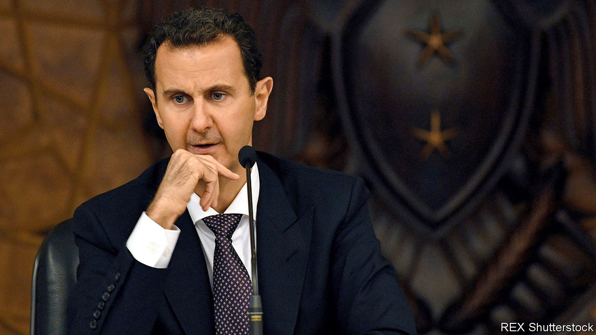
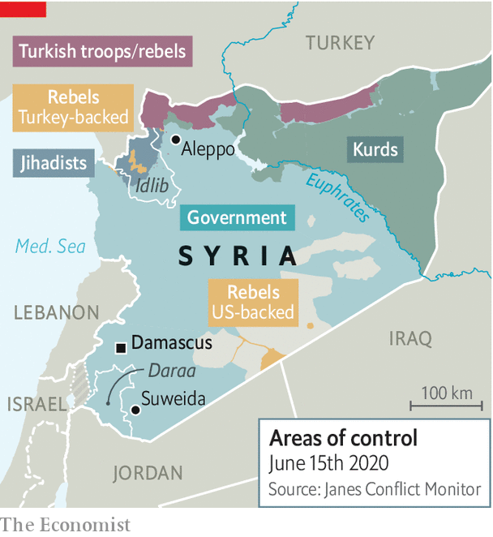

## From bad to worse

# Bashar al-Assad has no solutions to Syria’s crisis

> Even former loyalists are turning on the dictator. But he will not go easily

> Jun 18th 2020

THOUGH IT HAS suffered through nine years of civil war, leaving hundreds of thousands dead, in some ways Syria is back where it started. Protesters in the south-east have been chanting anti-regime slogans, the same ones that triggered the fighting. “God, the nation and freedom,” they cry, dropping Syria’s dictator, Bashar al-Assad (pictured), from the official trinity. A reporter on state television, covering a sparsely attended counter-rally, struggled to find bystanders willing to praise Mr Assad. Most Syrians still complain of poverty, corruption and social inequality. “The grievances that sparked the uprising are even more pronounced today,” says a university lecturer in Damascus.

With help from Iran and Russia, and by bombing and gassing his own people, Mr Assad has all but won the war. Idlib is the last big rebel stronghold in Syria (see map). But the regime now faces new challenges that cannot be resolved with force. A collapsing currency is pushing ever more Syrians into poverty. A new raft of American sanctions will make matters worse. Opposition has cropped up even within Mr Assad’s own ranks. He offers no solutions to the growing crisis.

When Mr Assad inherited the presidency from his father two decades ago, Syria was a middle-income country. Now over 80% of its people are poor. Last year GDP was thought to be about a third of what it was before the war. This year it will be even lower. A covid-19 lockdown is partly to blame. Then there is the situation in neighbouring Lebanon. Syria’s biggest foreign market and main supplier of dollars is mired in a financial crisis. With dollars scarce in both countries, the value of the Syrian pound has fallen to record lows. The currency traded at about 50 to the dollar before the war. Today a greenback fetches about 3,000 pounds on the black market. The rebels in Idlib recently adopted the Turkish lira to replace the pound.

The value of government salaries is also sinking, as prices rise. The upshot, says the UN, is that many people can no longer afford food. Even a local football hero posted a picture of himself on the street with his belongings. Pharmacies have run out of medicines because producers don’t have enough money to pay for ingredients from abroad. Shops and cafés which reopened after the lockdown was lifted have quickly closed again for want of custom. In an effort to prop up its reserves of hard cash, the government has made things worse. Banks have been told to stop lending. They have switched off their cash machines and limited withdrawals. People wait outside in queues, hoping to recover what savings they can before the currency drops again.

Short on answers, as well as cash, Mr Assad has begun fleecing his own wealthy supporters. Many have acquiesced—but not Rami Makhlouf, Syria’s wealthiest tycoon and Mr Assad’s cousin. In May he began posting videos on social media in which he complained about the regime’s heavy-handedness and its confiscation of his assets. Earlier this month Mr Assad seized Syriatel, the country’s biggest mobile-network provider, from Mr Makhlouf.

Other former supporters are also turning their backs on the regime. Hundreds of members of the Alawite sect, an offshoot of Shia Islam from which Mr Assad hails, have protested along the coast. The Druze, followers of a small esoteric religion, have taken to the streets of Suweida. “The regime’s problem is with its loyalists, not with the opposition,” says Ibrahim Hamidi, a Syrian journalist. But violence is also flaring in places such as Daraa, where the uprising began—and which the regime thought it had pacified.

On June 11th Mr Assad dismissed his prime minister, Imad Khamis. The president now relies on a diminishing circle of cronies. But his problems are growing. On June 17th America implemented tough new sanctions on Syria, under what is known as the Caesar Act (named after a former Syrian military photographer who smuggled pictures of torture out of the country). They target any person, company or institution—Syrian or foreign—that does business with or provides support to the regime. The legislation’s net has been cast so wide that it is expected to deter investors and firms which hoped to participate in Syria’s reconstruction.

Mr Assad is undoubtedly weak. Still, he is probably not going anywhere. His people are worn out; millions depend on him to allow the delivery of UN food aid. Four decades of sanctions have taught the regime how to cope with pressure and redirect blame. It says the West is waging an economic war on Syria, after failing to unseat Mr Assad by arming the rebels. It castigates America for handing the territory containing Syria’s oilfields and its bread basket to the Kurds. It is falling back on old smuggling routes, mostly through Lebanon, and creating new ones. Most importantly, Russia and Iran continue to prop up the dictator. They are still hoping for a return on their investment. ■

## URL

https://www.economist.com/middle-east-and-africa/2020/06/18/bashar-al-assad-has-no-solutions-to-syrias-crisis
