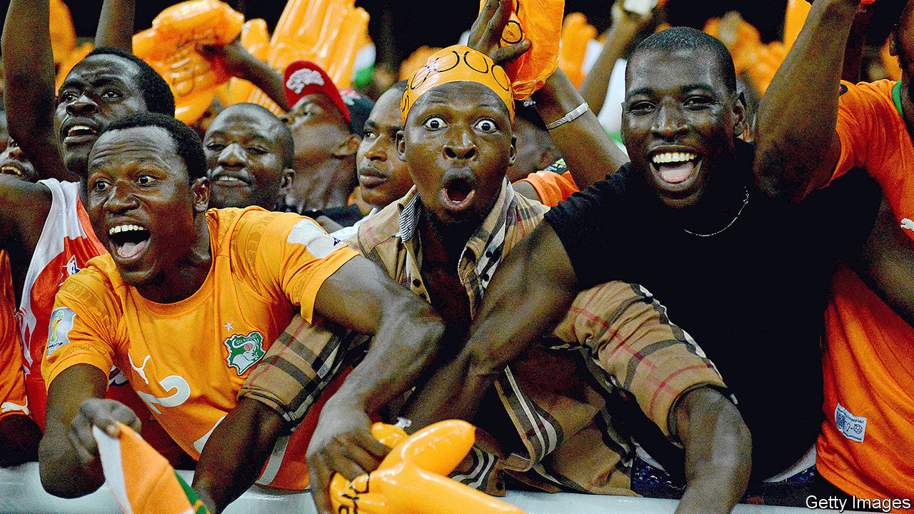

## More than a game

# How winning big football matches promotes peace

> A study finds that when African national teams are victorious, ethnic tensions wane

> Jun 18th 2020

DID A MISSED penalty kick help bring peace to Ivory Coast? In 2005 its national football team was on the brink of qualifying for the World Cup for the first time. Having won its final qualifying match, it just needed Cameroon to lose or draw the match it was playing against Egypt. The awarding of a late penalty set the Cameroonians up for a win. But Pierre Womé hit the post. The ball flew wide. Ivory Coast was in.

Listening on the radio, the Ivorian players erupted. Then they pleaded for peace in their war-torn country. “We proved today that all Ivorians can coexist and play together,” said Didier Drogba, the captain. The team knelt. “We beg you on our knees...please lay down your weapons and hold elections,” said Mr Drogba. The clip was played again and again on Ivorian television. In the months that followed the warring parties began talking and, eventually, agreed to a ceasefire. In 2007 they agreed to peace.

There were, of course, factors in play other than Ivory Coast’s win, Mr Womé’s missed shot and Mr Drogba’s impassioned plea. But, according to a new study, the outcomes of important football matches can have a dramatic effect on national unity and, thus, civil wars.

The study’s authors, led by Emilio Depetris-Chauvin of the Pontifical Catholic University of Chile, looked at how Africans identified themselves and how much they said they trusted each other in the days after important national-team matches. They found that people surveyed after their national squad had won were 37% less likely to identify primarily with their ethnic group, and 30% more likely to trust other ethnicities, than those interviewed just before. “This is entirely driven by national-team victories, whereas defeats have no discernible impact on that self-identification,” say the authors.

The bigger the match, the bigger the boost to national solidarity and trust. This does not merely reflect a general post-victory euphoria, say the authors. Incumbent politicians and ruling parties got no bounce in approval from a win. Nor was there any impact on respondents’ optimism about the economy.

Victories also lead to less violence. The authors compared countries that narrowly qualified for the African Cup of Nations in recent years with those that narrowly missed out. The countries that squeaked in experienced almost 10% less conflict in the next six months than those that did not. The make-up of the squad probably matters, too. Mr Drogba noted that his team hailed “from the north, south, centre and west” of Ivory Coast. “The effect of victories is stronger the more diverse the ethnic composition of the national team,” say the authors.

So could more football reduce conflict in Africa? Perhaps, but the positive results only hold for high-stakes matches, not friendlies (matches unrelated to a competition). And the bonhomie can be fleeting. A second civil war broke out in Ivory Coast in 2010. Calm returned in 2011, after Mr Drogba and many others again appealed for peace.

## URL

https://www.economist.com/middle-east-and-africa/2020/06/18/how-winning-big-football-matches-promotes-peace
