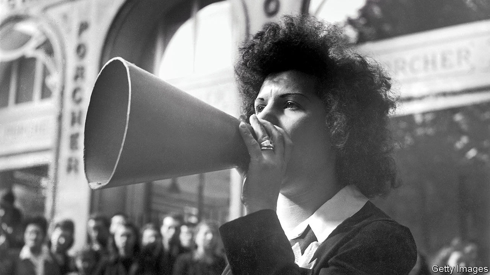

## The lark of metro Barbès

# Lily Lian died on May 24th

> The last singer of popular songs on the streets of Paris was 103

> Jun 18th 2020

THE FIRST OF May had a special place on Lily Lian’s calendar. It was her birthday, to begin with. It was also May Day, the workers’ holiday, when she would sing revolutionary songs at the Communards’ Wall, the Mur des Fédérés, in Père Lachaise cemetery. Her father, a fighter in the Resistance, was buried close to it with other communist heroes. She felt proud to salute him, even if her view of him was scarred by bitter rows. And May Day was the fête du muguet, when strolling vendors sold lilies-of-the-valley to passers-by. These sprang up in the woods, and so had she, a love-child conceived in some mossy corner near Versailles. She and the flower-sellers often found themselves together by the Wall.

The Mur des Fédérés was a fine place to sing, though she had others. La Madeleine drew wedding crowds and glowing-after-mass congregations. Railway stations were good, especially if they had arcades for shelter when it rained, though a rainy day was a washout, generally. Her favourite pitch was the Barbès-Rochechouart metro station, by the grilles where passengers changed from the surface to the underground line. There she would stand with her group—two or three musicians, with a friend to hawk the scores—and sing through her tin megaphone the people’s favourites. These hardly varied over the years: “Le chant des Partisans”, “Le petit vin blanc”, “On boit l’café au lait au lit”, time and again to the crowd until they all joined in.

It was not a grand living, but it was decent. She was not begging, which was important, since begging was not allowed. The trade was strictly regulated by the préfecture de police, with a permit needed to sing, and by the groups themselves, who drew numbers out of a hat each week to allocate their pitches. When she first put a toe on the streets, in the mid-1930s, there were 30 others. It was a competitive business, but she could not cut her prices; at 20 francs a go, she needed to sell 100 scores at each performance just to pay the rent. Luckily she was healthy and her voice strong, since she stayed out for 12 hours a day and in most weathers—even in temperatures of ten degrees below, when people would run out of cafés with mulled wine to warm her up. War interrupted things, but after that great Liberation day in August 1944, when she belted out “La Marseillaise” as de Gaulle appeared on the Champs-Elysées and found the crowd joining her, she knew she had arrived.

Her timing seemed strange to some, just as her metier was fading. But singing made her feel free; and what she was doing was important. She was continuing a long tradition of popular songs in the street, one first organised in the revolution of 1789 to stir up citizen spirit and raise morale. She thought of herself as a teacher, promoting songs (a few new ones, like “La Mer”, mixed in with the old), getting the people to learn them, and selling them scores so that they could practise at home. It was a truly communal enterprise. Another favourite pitch was outside the giant Renault factory in the suburbs, where at midday when the siren sounded a wave of workers in blue overalls would stream out and, with luck, cluster round her, chewing their casse-croûte as they listened. She was closer to her audiences than any film star; she could feel them press round her, watch how they reacted, notice the women with their prams or the passing cyclists pausing to listen, see new lovers leaning on each other as they sang from a score. Spreading love in songs was another job she was doing.

Street singing combined the two essentials in her life. One was Paris, specifically on or near the place de la Nation and the rue de Buzenval, where she was born and where she lived for her last 70 years. Her popular name was “Lily Panam”, argot for “Paris Lily”. As a child she had been dragged to le Nord for a while, to a farmhouse half-drowned in mud; she pined for the sparkling city she had seen from her parents’ tiny mansard flat. She needed pavements. And she needed to sing, so ardently that nothing could stop her. As she ran errands or peeled vegetables, she sang. As her parents split up, with their new partners variously abusing her, she cried a bit, shouted back, but sang. At 18, having definitively run away with five francs in her pocket, she was posing for naked tableaux in Pigalle. During the German Occupation she hid in a cousin’s hotel to escape forced labour. Between times she did shop-work, and sang.

The street was her escape. Yet she could not help dreaming of stardom, too. It was possible. In 1935 she had encountered Edith Piaf, a little scrap of a woman in a shabby black dress, performing on the street illegally. She agreed to watch out for the police on Sundays, and for a spell Piaf coached her in how to sing as she did, from the heart and guts. But soon she was discovered, and their ways parted. When Piaf invited her to come and see her at Gerny’s, an ultra-chic cabaret, she felt too shy to go.

Street singing was dying fast, though. By the beginning of the 1950s those 30 groups were fast disappearing. Soon she was the last. And more glittering worlds beckoned: cabaret, variety, film, television. She had tried film once, for Marcel Carné in “Les Portes de la Nuit”, but had been fired for saying that she couldn’t imagine singing the film’s main number in the street. For three years, despite being married (marriage never got in her way), she kept company with Vincent Scotto, an old, grey, high-living songwriter, in hopes he might make a star of her. But he tried to take her over, changing her name, her hair and her clothes. Especially, he stopped her singing in the street; so she marched out.

There were recordings later, and regular appearances on a TV show compèred by Pascal Sevran, whom she had helped when he started out in 1963. No breakthrough came, though. Occasionally in the 1970s she would do a little turn on the Paris streets, ringing out the old songs while the station queues looked on, largely uncomprehending. The city had changed. Most people ran now; they had no time to stop and listen any more. Fraternité and gaiety had gone, with the songs. But every bit that was left seemed to gather round her at the local bistro near her flat in rue de Buzenval where she still lived in proud independence, raising a song and a glass to her on her 100th birthday in 2017, on the first of May. ■

## URL

https://www.economist.com/obituary/2020/06/18/lily-lian-died-on-may-24th
