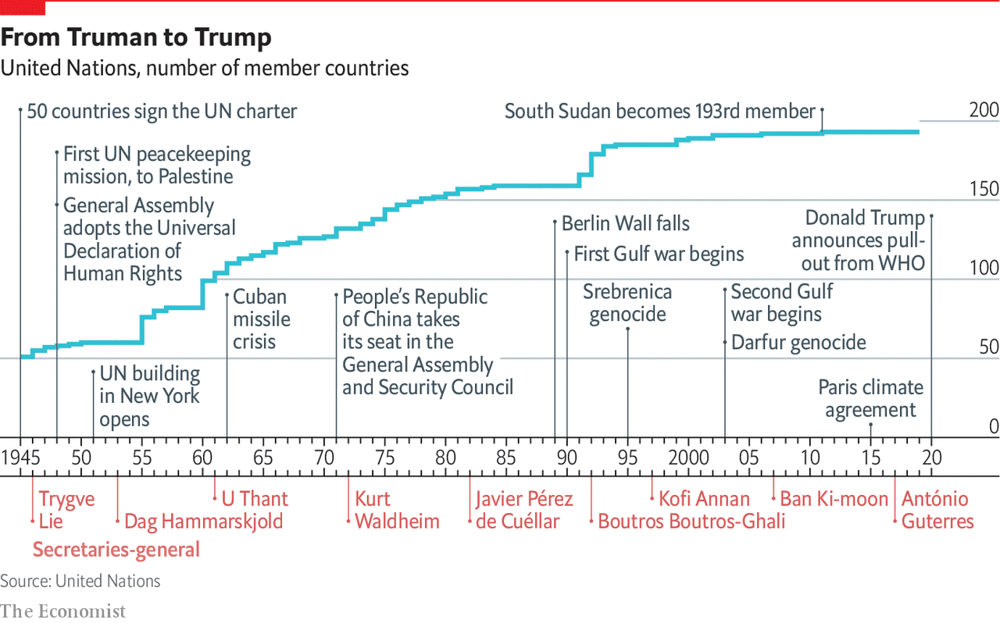
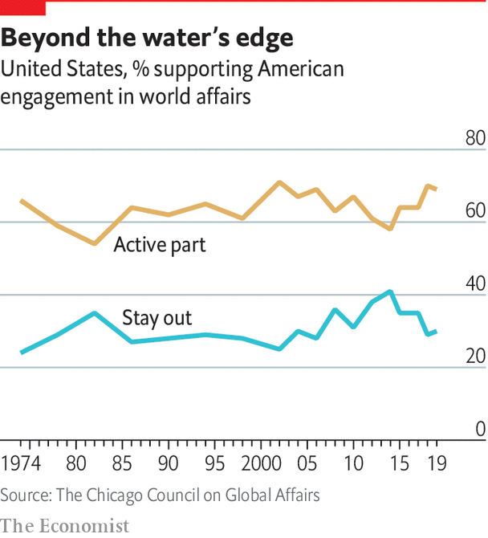

## The new world disorder

# Global leadership is missing in action

> Seventy-five years ago the world’s leaders designed the peace even as they fought the war. Today’s leaders need to do something similar, says Daniel Franklin

> Jun 18th 2020

A FEW WEEKS after Japan’s attack on Pearl Harbour, Winston Churchill was a guest at the White House. President Franklin Roosevelt was so eager to tell him he had come up with a name for what would become a new world security organisation that, the story goes, he hurried into Churchill’s bedroom, to find the prime minister naked save for a bathrobe. What is striking about the origins of the “United Nations”, Roosevelt’s choice, is not this unorthodox manner of communication (a modern American president might have tweeted his idea) but that, in the midst of war, statesmen were already planning for the peace.

On the economic front, this led to the creation, in 1944 at Bretton Woods in New Hampshire, of the World Bank and the International Monetary Fund (IMF). On the security side, plans for the UN were fleshed out at Dumbarton Oaks in Washington, DC, agreed to in outline by Churchill, Roosevelt and Stalin at Yalta in the Crimea and finalised at a conference in San Francisco after Roosevelt’s death. “Oh what a great day this can be in history,” proclaimed President Harry Truman at the concluding session on June 26th 1945, when the founding charter was signed. Countries had put aside their differences “in one unshakable unity of determination—to find a way to end wars.”

Euphoria soon gave way to frustration as the cold war set in. Yet, as the new organisation’s second secretary-general, Dag Hammarskjold, observed, the UN “was not created to take mankind to heaven but to save humanity from hell”. For 75 years there have been no world wars (though too many smaller ones). Unlike its precursor, the League of Nations, the UN has proved resilient. Its membership has grown from 51 countries to 193, through decolonisation and the break-up of the Soviet empire. It sits at the centre of a rules-based world order, and its activities and those of its specialised agencies span almost every aspect of life.

Yet no international order lasts for ever. Over time the balance of power shifts, systems fail to adapt and the rot sets in. The peace after the Congress of Vienna in 1815 eroded slowly; that after the Treaty of Versailles in 1919 collapsed fast. A change from one dominant power to another has usually meant war (the shift from Britain to America over a century ago being a rare exception).

Covid-19 is a new challenge. A vacuum exists where the world would normally look for American leadership. Instead it sees President Donald Trump making a fool of himself, suggesting wacky cures. Mr Trump has been more interested in blaming China for the pandemic than rallying an international response, his most prominent move being to suspend funding to the World Health Organisation (WHO) and threaten to leave it. In March G7 foreign ministers could not even issue a statement because Mike Pompeo, America’s secretary of state, insisted it refer to the “Wuhan virus”.

China’s initial response to the virus was a bungled cover-up, but since its harsh lockdown brought covid-19 under control, it has touted its successes around the world and supplied protective kit to thankful countries. The Europeans, meanwhile, closed borders, including in their supposedly frontier-free Schengen area. A divided UN Security Council has been missing in action.

The world order was already looking wobbly. The global financial crisis of 2007-09 fed populism and a wariness of international institutions. These often reflect the realities of decades ago, not today (the Security Council’s five veto-holding permanent members are the victorious powers of 1945), yet they resist reform. The rules remain, but the big powers increasingly feel free to ignore them. Russia has brazenly grabbed a piece of Ukraine. China has occupied disputed territories in the South China Sea.

America has long complained about the cost of propping up the multilateral system and fretted about “Gulliverisation”, being tied down by punier powers. Along with Britain it invaded Iraq in 2003 without a mandate from the Security Council. President Barack Obama, prioritising “nation-building at home”, began a semi-retreat from the burdens of global leadership. But the principal architect of the system now has a president who seems to delight in taking a wrecking ball to it.

Mr Trump has withdrawn from the Paris agreement on climate change and the nuclear deal with Iran. He has cast doubt on America’s commitment to NATO (though he has strengthened its forces in many parts of Europe). He has continued to undermine the World Trade Organisation (WTO) by blocking the appointment of new judges to its appellate body. He has called the European Union a “foe”. His love of sanctions causes further friction, prompting complaints that America is abusing the “exorbitant privilege” of having the world’s reserve currency and stimulating interest (among allies and rivals alike) in reducing the dollar’s dominance.

At the UN, America’s allies complain that Mr Trump “cherry-picks”. What is new is not pulling out of an agency or two (Mr Trump has pulled out of the Paris-based education and cultural agency, UNESCO, and the Geneva-based Human Rights Council, complaining of anti-Israel bias), but the lack of commitment to the system. His America First rhetoric echoes the language of Henry Cabot Lodge, an isolationist senator who successfully fought against joining the League of Nations in the 1920s. It is a stark contrast with the internationalism of Roosevelt and Truman. “The future does not belong to globalists,” Mr Trump told the UN General Assembly last September. “The future belongs to patriots.” All this means that, far from looking forward to a happy birthday, the UN approaches its 75th anniversary in a state of high anxiety.

Its secretary-general, António Guterres, a jovial former prime minister of Portugal, divides the UN’s history into three periods. The first was “bipolar”, characterised by cold-war rivalry between America and the Soviet Union. Although the Security Council was largely frozen, there was a certain predictability in the stand-off, and the UN was inventive enough to expand into areas such as peacekeeping, which is not even mentioned in its charter.

After the collapse of communism came a brief “unipolar” period, when America’s dominance was barely contested. The Security Council was able to function as its founders envisaged, launching a flurry of peace missions as well as authorising the American-led liberation of Kuwait in 1991. George Bush senior hailed a “new world order”. The UN developed the principle of a “responsibility to protect” populations against mass atrocities.

But, bogged down in the Middle East and Afghanistan, America has grown weary and inward-looking. In the wider world, wariness about the West imposing its values, especially by force, has increased. A revanchist Russia and a soaring China increasingly challenge America’s supremacy. The Security Council is once again stuck, reflecting renewed great-power rivalry. This third period, as Mr Guterres sees it, is still unsettled. “The world is not yet multipolar, it’s essentially chaotic,” he says.

A degree of chaos is not surprising, given the dramatic shifts that are starting to divide the world into competing spheres of influence. Take the economy. Since 2000 China’s share of global GDP at market rates has gone from less than 4% to nearly 16%. Its technology giants, such as Alibaba, Tencent and Huawei, are spreading Chinese digital infrastructure abroad, especially in emerging markets. China is the world’s largest exporter, and although a relative newcomer (having joined the club only in 2001) now presents itself as chief defender of a WTO under assault from America.

In finance, though the dollar still dominates, the yuan is poised to gain ground. At the IMF, China remains underrepresented, with a quota and voting share of only 6%. But as the fund strives to support a stricken global economy, China will be a core consideration, whether in the design of debt relief (China is reckoned to have lent more than $140bn to African governments and state-owned enterprises since 2000) or in increasing quotas.

These upheavals spill over into the diplomatic and security dimensions that are the focus of this special report. Are the UN, and the collaborative global governance it embodies, doomed to be less relevant in a world of great-power competition? It is surely too soon to give up on them. But to retain its clout and character the liberal order needs restored leadership and difficult reforms.

The multilateral system has important strengths. One is that it is patently needed. The biggest problems cry out for international co-operation—as the pandemic powerfully illustrates. The world needs to work together on vaccines, on economic recovery and to support the most vulnerable countries. The head of the World Food Programme, David Beasley, a former Republican governor of South Carolina, has said speedy action is necessary to prevent “multiple famines of biblical proportions”. Concerted efforts are also needed on climate change, another challenge no country can tackle on its own. The risk of nuclear proliferation is growing.

A second advantage is that the UN is popular. It has made shameful mistakes. It failed to prevent genocide in Rwanda and Srebrenica. UN peacekeepers are blamed for bringing cholera to Haiti and sexual abuse to many of the places they were meant to protect. The UN’s oil-for-food programme with Iraq led to a $1.8bn scam. Yet it is more trusted than many governments, according to the 2020 Edelman Trust Barometer. Across 32 countries surveyed by Pew last year, a median of 61% had a favourable opinion of the UN, against 26% with an unfavourable view. A comfortable majority of Americans think well of it, though there is a growing partisan divide: 77% of Democrats approve, but only 36% of Republicans.

In another survey last year, by the Chicago Council on Global Affairs, seven out of ten Americans said it would be best if the country took an active part in world affairs, close to the highest on record. That points to a final force that should not be underestimated: the potential for American re-engagement. America remains a more powerful economy with greater reach in hard and soft power than any rivals. It could again be the standard-bearer for a liberal world order.

It would be naive to expect sudden enthusiasm for multilateralism from Mr Trump—and even beyond him. American suspicion of foreign entanglements is as old as the republic. Frustration with the WTO, NATO and the rest was mounting before Mr Trump tapped into it. The divisions at home that have deepened under his presidency make leadership abroad harder. Still, victory for Joe Biden in the presidential election in November would be, if not exactly a game-changer, at least a game-restarter. “We will be back,” Mr Biden promised last year’s Munich Security Conference.

The UN wants to use its 75th anniversary for a grand consultation on the future of multilateralism. Covid-19 has hijacked the global agenda. But it also creates an opportunity. Rather than destroying the system, the upheaval could spur countries into strengthening it. That will require planning for the future while tackling the crisis of the present. Today’s leaders need to emulate what their predecessors achieved so magnificently in 1945.■

## URL

https://www.economist.com/special-report/2020/06/18/global-leadership-is-missing-in-action
