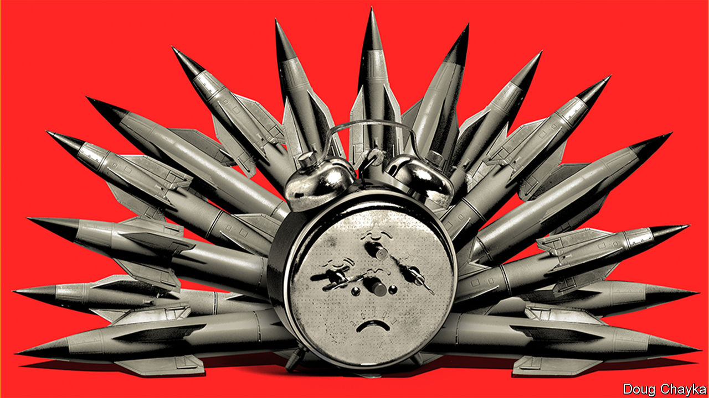
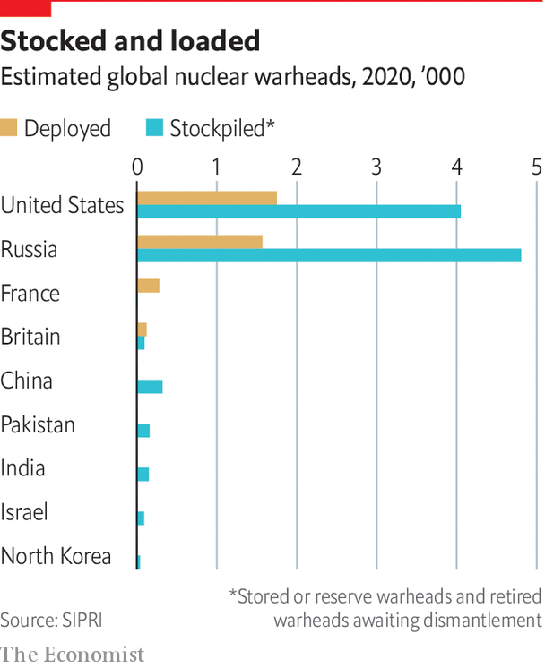

## New START’s end?

# The clock is ticking for nuclear arms control

> Avoidable Armageddon

> Jun 18th 2020

TIME IS RUNNING out for the last remaining nuclear arms-control treaty between America and Russia. New START limits their arsenals of long-range nukes and allows intrusive mutual inspections. Without agreement to extend it, the treaty will expire on February 5th 2021.

That is not the only reason why the five-yearly review of the 50-year-old Nuclear Non-Proliferation Treaty, scheduled this spring but postponed because of covid-19, promises to be bitter. Nuclear have-nots complain that the P5 countries permitted to have nukes are not keeping their side of the bargain, to work in good faith towards giving them up. Nuclear fears are rising. Whether through miscalculation or otherwise, the risk of a nuclear detonation is at its “highest since the peak of the cold war”, warns Nakamitsu Izumi, the UN’s undersecretary-general for disarmament.

Donald Trump has pulled out of the nuclear deal with Iran. His nuclear summitry with North Korea has stalled. If constraints are seen to be failing, more countries may feel tempted to go nuclear. Turkey’s Recep Tayyip Erdogan has mused aloud about it. Seeking to occupy the moral and legal high ground, more than 80 countries have signed a Treaty on the Prohibition of Nuclear Weapons, which will come into force once 50 have ratified it. The nuclear haves will ignore it.

Even during the cold war America and Russia managed to reach nuclear deals. They signed their first such treaty, SALT I, in 1972. But recently accords have been falling apart. The Intermediate-range Nuclear Forces Treaty collapsed last August, because of Russian cheating. New START’s demise would open the way for a new nuclear arms race, amid worries about emerging threats from hypersonic weapons. This comes on top of growing concerns about future conventional systems controlled by artificial intelligence. 

Russia says it wants to extend New START, but Mr Trump dislikes the treaty, partly because it was signed in 2010 by his predecessor, Barack Obama, and more reasonably because it does not restrain China, which has a smaller nuclear arsenal but one that is getting larger and fancier. Mr Trump favours a bigger treaty, including China. His arms-control envoy, Marshall Billingslea, has said that, if Russia wants an extension, it must bring China to the table. But China shows no interest in letting itself be tied down. Some suspect that Mr Trump’s insistence on three-way talks is a poison pill, allowing America to engage in a nuclear race that hawks think it would win.

New START can be extended for five years by mutual agreement (with no need to ask Congress). Arms-control advocates say this would buy time for a wider future deal involving China, and perhaps including all types of nukes. Russia might insist that the smaller British and French arsenals be counted in any such negotiations, if limits on the numbers of weapons were reduced much further. There is plenty here for the P5 to work on, if they could only get round to it.

## URL

https://www.economist.com/special-report/2020/06/18/the-clock-is-ticking-for-nuclear-arms-control
