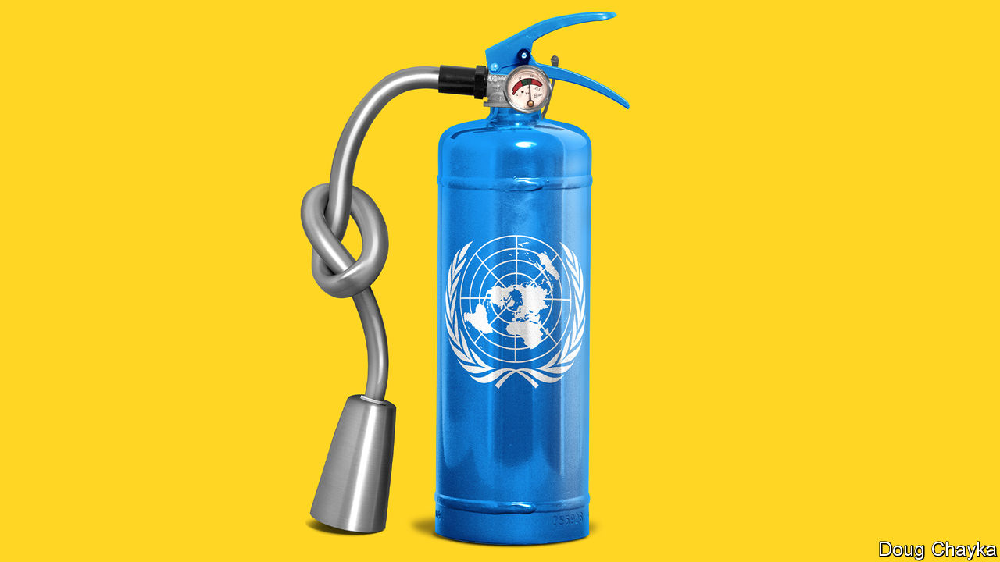
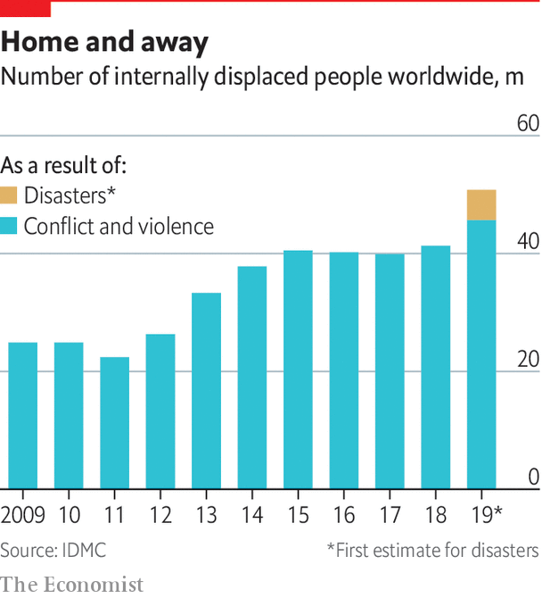

## Global firefighting

# The UN has too much on its plate

> Missions impossible

> Jun 18th 2020

MANKEUR NDIAYE, a former foreign minister of Senegal who heads the UN’s peacekeeping mission in the Central African Republic (CAR), is a tall man with a tall task. The peace agreement between the CAR and 14 armed groups signed in February 2019 is the eighth since 2013, when French intervention narrowly averted a genocide. The situation remains fragile in a country that is rich in diamonds and gold but poor in other respects. Elections loom in December. With a budget of $1bn, twice that of the national government, the UN mission’s 12,000-odd soldiers and 2,000 police operate across a territory the size of France and Belgium combined. In some areas the state has no effective presence. The CAR has porous borders with other troubled places, such as the Democratic Republic of Congo, Sudan and South Sudan. The hope is that peacekeepers plus international aid give the brittle state a chance.

The idea of a non-violent, international military operation was invented to clear up the Suez mess in 1956, with a lot of imagination and improvisation (the first “blue helmets” were created by spraying the liners of American army helmets readily available in Europe). Today, peacekeeping is one area where the Security Council operates well. Some 100,000 people from 120 countries serve in 13 missions, which range from ceasefire monitoring in Cyprus and Lebanon to large, complex operations such as those in the CAR, Congo and Mali. The UN claims to protect about 125m vulnerable people around the world on a budget not much bigger than that of New York City’s police department.

The peacekeepers’ role has expanded into supporting fragile states and protecting civilians. At its best, this is admirable. In 2013 the UN opened its military compounds in South Sudan to tens of thousands of people fleeing slaughter. “No decision taken since 1945—at any level in the UN—ever resulted in the direct saving of more lives than that one,” believes Andrew Gilmour, until last December the UN’s assistant secretary-general for human rights.

But the peace business is getting harder. The blue helmets’ job used to be to preserve stability after a settlement. “Now you have peacekeeping forces in areas where there is no peace at all to keep,” says Mr Guterres. In Congo, for example, rebels hiding in the forests close to the north-eastern city of Beni frequently abduct people and hack them to death with machetes. Protests against MONUSCO, the UN peacekeeping mission, are common. “The rebels are killing us, if you cannot kill them, then go home,” says Kizito bin Hangi, a civil-society leader in Beni. When eight people were killed less than 2km from MONUSCO’s offices last November, a protest the next day got out of hand. Furious civilians tossed in Molotov cocktails, setting the place on fire and sending staff fleeing. Today, the former offices consist of some blackened bricks, strewn around a grassy field.

The changing nature of conflict doesn’t help. Wars between states, which the UN was set up to stop, have become rare. Most fights are now within countries, often involving many parties. The humanitarian consequences are disastrous. The number of internally displaced people has more than doubled in a decade to a record 51m, according to the Norwegian Refugee Council. Of those, 46m have been displaced within their own countries by conflict and violence. Civil wars are especially difficult to stop through negotiation, since laying down arms can seem too risky.

Many organisations are crowding in to help. The art of peace is increasingly the art of partnerships, with the likes of the African Union, the World Bank and the European Union. Private diplomacy is also on the rise, as groups such as the Centre for Humanitarian Dialogue (HD) in Geneva or the Berlin-based Berghof Foundation try to build bridges where official channels are missing or mistrusted. Both the UN and private outfits are striving to get more women involved, to make peace work more inclusive.

In spite of these efforts (and sometimes because of them, as the many actors trip over one another), frustration abounds. Conflicts are still starting, but big new peace agreements have become rarer: only seven or eight in the past decade, says David Harland of HD, compared with 30 or so in the 20 years after the fall of the Berlin Wall. In the Middle East since 2011 a succession of UN envoys—three in Yemen, four in Syria and six in Libya—have tried to resolve civil wars, without success. Well-intentioned mediation can end up favouring one side over others. In Syria, for example, local ceasefires gave President Bashar al-Assad a chance to regroup.

Mr Guterres has tried to leverage the pandemic for peace. On March 23rd he called for a global ceasefire, to fight the virus. A surprising number of armed groups seemed interested in an excuse to give talks a chance. In Yemen the Saudi-led coalition announced and then extended a unilateral ceasefire. In Afghanistan, for the first time in years, the UN convened a digital meeting of the Afghan government and six neighbours plus America and Russia (a “six plus two” formula that also brought Iran and America around the same table). But war persists in Afghanistan, and ceasefires in Colombia and the Philippines were broken. And, as America and China squabbled over the wording of a resolution, the Security Council failed to throw its weight behind the initiative.

If ending conflicts has become tougher, what about tackling their causes and consequences? That opens vast vistas for helping humanity. Perhaps too vast.

The short-term task is humanitarian relief, whether from man-made or natural disasters. That job—feeding the hungry, housing refugees, protecting health—is huge. Last year about $18bn in humanitarian funding, some 70% of the world’s total, was channelled through the UN, estimates Mark Lowcock, the UN’s emergency-relief co-ordinator, helping more than 100m people. Roughly 60% of the money comes from America, Germany, Britain and the EU. China provides very little.

Early this year extra troubles loomed, with the assault on Idlib in Syria as well as locusts swarming across Africa. Now covid-19 threatens to multiply the misery. Mr Lowcock suggests that humanitarian relief this year may need to rise by 20% or so; and perhaps $60bn in cheap finance from international financial institutions should be targeted at social protection. He believes this could largely protect 700m people across several dozen of the world’s poorest and most vulnerable countries. It could also help to prevent a one-year problem from becoming a ten-year one.

Acting early makes sense, and not just over covid-19. Rigidities in funding (much of which is tied to specific programmes) restrict Mr Lowcock’s room for manoeuvre, but he is keen to get ahead of crises through risk pooling and smart use of data. He reckons that some 10% of global emergencies, including hurricanes and droughts, are insurable. And a further 10-15% are to some extent predictable. More effort on “anticipatory action” would mean achieving cheaper, faster responses with less suffering.

In Bangladesh, for example, giving money to people early to get out of the way of floods has proved to be efficient. Some scientists think they can predict outbreaks of cholera in Africa before a single case is recorded, once a threshold is reached in trigger metrics; early action could greatly reduce the damage. Mr Lowcock would like to experiment with a commitment to release money against pre-agreed problems that lend themselves to this approach. “You can be wrong on a lot,” he says, “and it can still make sense.”

In the medium term, attention turns to the Sustainable Development Goals (SDGs), a set of aspirations in 17 broad categories (with 169 targets) agreed upon by the UN General Assembly in 2015 and meant to be achieved by 2030. They make a comprehensive list of human development, covering everything from ending poverty and hunger to fighting inequality and pollution. If all the goals were achieved, humanity would be happy. But in many areas they are badly behind schedule, and covid-19 will set them back further. This year, for the first time this century, the proportion of people in extreme poverty is expected to grow, wiping out almost all the gains of the past five years, if not more. The SDGs are anyway more of a call to action than a realistic plan. In that vein, the UN is campaigning for a “Decade of Action” to honour these promises.

Mr Guterres started as secretary-general by emphasising crisis prevention, but this has proved heavy going, given the divisions among the big powers and the growing complexity of conflicts. The climate crisis has since come to the fore, both because of its intrinsic, long-term importance and because it seems to offer the UN a way to resonate with young people. In New York last September Mr Guterres organised a climate-action summit. Greta Thunberg, a teenage Swedish activist, warned leaders that “young people are starting to understand your betrayal”.

The pandemic has meant the postponement of the COP26 climate summit in Glasgow (as well as a biodiversity summit in Kunming and an ocean conference in Lisbon), to which countries were meant to bring bolder national commitments to cut carbon emissions. But the delay has a green lining. Mr Guterres has tried to link the twin crises, arguing for policies that ensure that the recovery from covid-19 helps to save the planet.

On Earth Day, April 22nd, he proposed a six-point framework to that effect. His suggestions are extremely broad—tie business rescues to creating green jobs, for example, end fossil-fuel subsidies and, unsurprisingly, “work together as an international community”—but they are a taste of a campaign to come. Advocacy of drastic climate action has become something of a rallying cry for the UN. As Richard Gowan, UN director at the International Crisis Group (ICG), an NGO, points out: “UN optimists are mostly people with the bleakest view on climate, because they imagine it’s what draws the UN back together.”

Has Mr Guterres got his priorities right? The criticism that stings most is personal. It is that the secretary-general puts politics over core principles and pulls his punches in an area that is neither short-, medium- nor long-term but timeless: human rights. Mr Guterres is accused of failing to defend the charter (which commits the UN to promote “universal respect for, and observance of, human rights”) by speaking out against abuses by powerful governments, including China’s detention of Uighurs and Saudi Arabia’s murder of Jamal Khashoggi, a critic of the regime. Some predecessors, such as Kofi Annan, were more forceful. Even the often invisible Ban Ki-moon launched Human Rights up Front, a campaign to insert the issue across the UN’s work. Zeid Ra’ad al-Hussein, a former UN human-rights commissioner, has condemned Mr Guterres’s “weakness”. Kenneth Roth, head of Human Rights Watch, an NGO, has warned that his term was becoming “defined by his silence on human rights”.

Mr Guterres’s defenders say such attacks are unfair. He has picked his moments to speak up in public, whether on Uighurs in China or Rohingyas in Myanmar, and has championed women’s rights, within the UN and beyond. Yes, he avoids confrontations that would be counter-productive (he never criticises Donald Trump by name, for example). But this gives him the ability to deliver a strong message behind the scenes. What powder he has must be kept dry. “At the UN there is practically no power at all,” he says. “When you’re in government you have some power. Here it’s basically a bluff, or an illusion.”

A second, broader, criticism of the UN is that it simply does too much. It is, in effect, trying to save the world several times over. Its many aims may be wonderful, and interconnected, but it lacks the capacity to pursue them all effectively. It has taken on more than it was designed for. And the design itself needs a fresh look.■

## URL

https://www.economist.com/special-report/2020/06/18/the-un-has-too-much-on-its-plate
