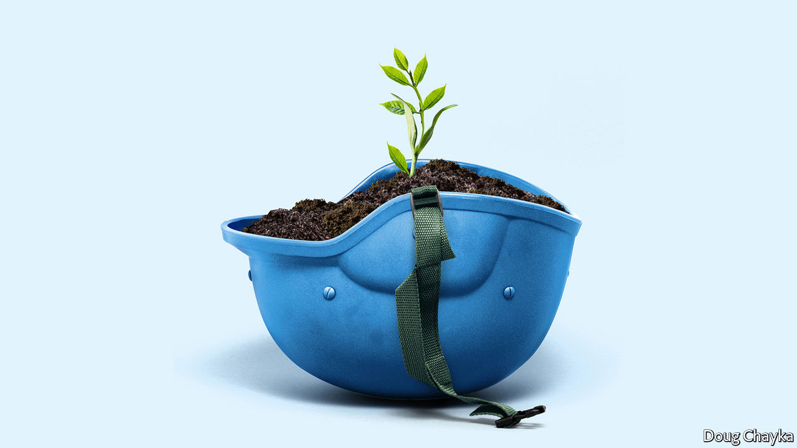

## Reflections at 75

# The UN is mobilising for the next quarter-century

> The wisdom of youth

> Jun 18th 2020

LUCKILY, GIVEN the pandemic, the UN did not plan a boastful birthday. Instead, it decided to ask what the world thinks. It has launched an effort to to gather views from everywhere, in the spirit of the opening words of its charter, “We the peoples”.

With the help of a mass online survey, in-depth polling across 50 countries, hundreds of live “dialogues” and a trawl of research, the plan is to find out what people would like to see 25 years from now, when the UN reaches 100. The views of young people are a special focus. Half the world’s population is under 30, points out Jayathma Wickramanayake, the secretary-general’s youth envoy, yet they have little say in how it is run.

The aim of UN75 is “to give a vitamin shot to what at times feels like quite a fatigued enterprise and come up with new ideas,” says Fabrizio Hochschild, the official in charge. The results will be presented to the General Assembly in September. Preliminary findings released in April suggest the world thinks pretty much what the UN was hoping. The priorities were environmental protection, human rights, less conflict, equal access to basic services and zero discrimination. Fully 95% of survey respondents thought international co-operation was “essential” or “very important” (the number ticked up as covid-19 took hold). As for how co-operation might work better, ideas included a more bottom-up approach, more effective partnerships and more involvement of women, young people and the vulnerable.

All this aligns nicely with themes the UN hopes to use to breathe life into the “inclusive” multilateralism that Mr Guterres espouses. On climate change, it wants business, finance, NGOs, youth movements and others to pile pressure on governments to make more ambitious carbon-cutting pledges at the COP26 climate summit in Glasgow next year. Beyond that, the green theme will run and run. The covid-19 crisis will pass, but the climate one will remain a priority for years to come.

Gender equality is a second test. The UN is trying to lead by example. Half the 180 senior leaders in its secretariat were women at the start of this year, up from a third three years ago. Achieving parity out in the field is harder. In peacekeeping operations the aim is for at least a quarter of military observers and staff officers to be women by 2028, compared with 15% last year. Overcoming resistance from governments is harder still, so the UN is trying to build alliances with businesses, NGOs and local authorities, to achieve change from the bottom up.

A third area that lends itself to innovative efforts is digital. The pace of change is such that regulation struggles to keep up. If governments take years to negotiate agreements and even more to ratify them, by the time rules are ready the real world (and even more the virtual one) has moved on. The UN favours a nimbler way, involving not just governments but companies, research centres and NGOs in a form of soft regulation to exchange best practices and set boundaries for new technologies such as artificial intelligence. Mr Guterres set up a high-level panel, co-chaired by Jack Ma and Melinda Gates (philanthropists of, respectively, Alibaba and Microsoft fame), to draw up a report on digital interdependence. Working groups on digital human rights and digital public goods have picked up its recommendations. In this “new multilateralism”, says Mr Guterres, what was once done only by governments is now done through “permanent platforms of co-operation, with a multi-stakeholder approach”.

Inclusive multilateralism has other attractions. The UN, which has the convening power to bring parties together, sees a chance to play a leading role. Wider participation could deepen trust, and give more opportunities to hold governments to account. Flexible approaches could also help tackle other frontier issues that are likely to grow in importance, such as the interface between Earth systems and the international system (the recent clash over the Amazon between the Brazilian and French presidents may be a foretaste) and the governance of everything from genetic engineering and new weaponry to the ocean and space.

Multi-stakeholder initiatives are not new. Various sorts have proliferated in recent years, whether to chivvy particular sectors (the Extractive Industries Transparency Initiative or the Roundtable on Sustainable Palm Oil), run the internet (ICANN) or improve government (Open Government Partnership). But inclusiveness is not a panacea. It raises accountability issues of its own. A bigger role for businesses and NGOs sounds good, but they don’t answer to voters. Some initiatives find it easier to issue broad pleas for good behaviour (like the Paris Call for Trust and Security in Cyberspace) than to produce rules, let alone ensure compliance. In authoritarian countries it is not easy to include voices from civil society; one tactic in China’s efforts to influence international organisations, according to the CNAS study, is the creation of “government-organised non-government organisations”, or GONGOs.

And for all the good intentions of the secretary-general’s panel on digital interdependence, the biggest development is the stand-off between America and China over technology, amid arguments over who will dominate the next generation of telecoms infrastructure and fears that a “splinternet” of rival digital spheres is in the making. The covid-19 crisis has reinforced the power of states, from massive intervention in economies to monitoring people’s movement. Opening up the multilateral system to more voices is welcome, but as the UN looks ahead to life at 100, it is governments—especially the big beasts among them—that will still shape the future world order.■