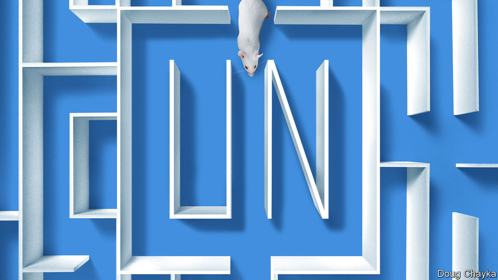
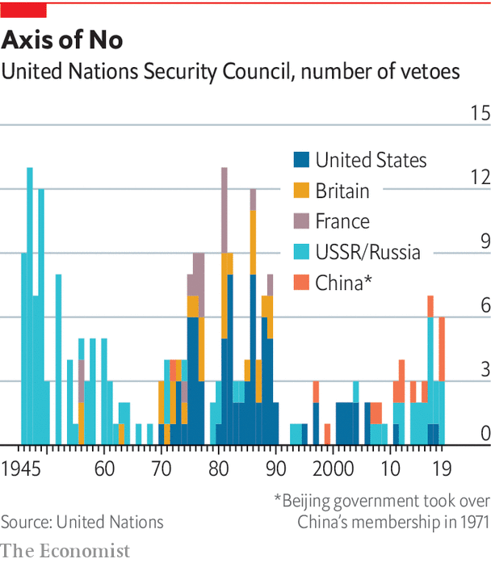
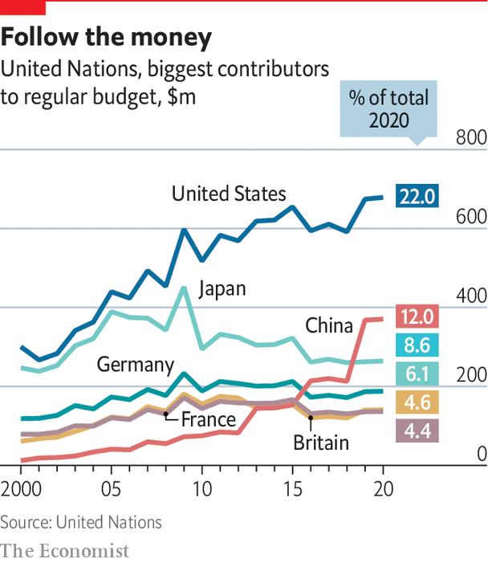

## Reform

# The UN’s structures built in 1945 are not fit for 2020, let alone beyond it

> Grand redesigns

> Jun 18th 2020

“IF YOU DIDN’T have the UN you really would have to reinvent it,” says Stephen Schlesinger, author of a history of its founding. Maybe, but nobody in their right mind would design it as it exists today. Insiders complain of a tangle of overlapping agencies, senseless silos and barricaded budgets. “If you locked a team of evil geniuses in a laboratory, they could not design a bureaucracy so maddeningly complex,” one departing official despaired. Outsiders face a forbidding confusion of agencies with acronyms. Many do great work (WFP and UNHCR), others have a mixed record (WHO and FAO), a few are useless (UNIDO). And at the top the structure reflects the world of 1945, as if little had changed since.

This was not what the founders envisaged. Hailing the charter, Truman said it had “not been poured into a fixed mould”, but would be adjusted in line with changing conditions. In fact the only changes have been minor ones, to take account of the growth of UN membership. In 1965 the Security Council expanded from 11 members to 15. But whereas it included 22% of General Assembly members in 1945, it now has just 8%. Its veto-wielding P5 remain the victorious powers of 75 years ago, with no representation from Latin America, Africa or South Asia. Without change, the legitimacy gap will only grow.

This might matter less if the council were working effectively, but it is not. There have been worse periods. In 1959 the council passed just one resolution, to appoint a committee to report on Laos. “By historical standards, this is still a reasonably active institution,” says Mr Gowan of the ICG. But it is increasingly crippled by great-power rivalry. The relationship between the three biggest powers, America, China and Russia, “has never been as dysfunctional as it is today,” says Mr Guterres.

Veto use has risen. In the past five years Russia has wielded 14 vetoes, China five and America two (Britain and France have refrained from using theirs since 1989). In response to the Ebola crisis in west Africa in 2014 the Security Council passed a resolution calling the outbreak “a threat to international peace and security”. Over covid-19 it dithered for weeks and then struggled to agree to a resolution calling for a 90-day pause in hostilities in conflict-ridden countries, as China and America quarrelled over whether to refer to the WHO (China said yes, knowing America would say no). Instead of putting momentum behind the secretary-general’s ceasefire appeal, the council stayed paralysed.

Its credibility is slipping. The arms embargo on Libya is ignored. Russia’s behaviour is a big worry. “The existential problem is that countries respect the decisions of the Security Council less and less,” says Karen Pierce, until recently Britain’s ambassador at the UN, now its ambassador in Washington. Normally the P5 is there to uphold the rules, says Ms Pierce, but, referring to Russia’s support for Syria, “for a P5 member to think it’s OK to condone the use of chemical weapons is quite a major shift.”

Could reform help? To ensure that the council remains representative, suggests Stewart Patrick of the Council on Foreign Relations, an American think-tank, “ideally you’d have something like the Premier League, with relegation and promotion.” But try agreeing on a formula. For over a decade, an intergovernmental group at the UN has grappled with how the council might take in more countries. Which ones? Should they be permanent with a veto, or non-permanent without one? Or perhaps something in-between, with longer non-permanent terms?

A group of four (G4) countries with the strongest claims to the top table—Brazil, Germany, India and Japan—are keen to get a move on. Africans see it as a historical injustice that they did not get a permanent seat at the outset, but their own rivalries stop them specifying which countries they would pick, so they stick with an overall demand for two permanent seats plus an expansion of non-permanent ones. Another group of a dozen countries wary of the G4, including Argentina, Italy, Pakistan and South Korea, argue against expansion of permanent members and instead want more non-permanent ones. One approach could be to look at non-permanent ones first, and come back to the permanent ones later. But the G4 resist this as a recipe for denying their claims.

In this process, you get “some of the most creative, passionate, articulate speeches that I see permanent representatives give,” says Lana Nusseibeh, the United Arab Emirates’ ambassador to the UN, who co-chairs the intergovernmental group, “because this issue speaks to their core national interests.” And even if new permanent members were agreed to, a bigger Security Council might not be more effective. Any change needs an amendment of the charter, which requires the votes of two-thirds of the General Assembly and the approval of the current P5. In short, many stars would have to align. In the meantime, lesser changes could help. For example, many would like the Security Council to become more transparent in its work.

In the UN secretariat itself, reform is also a hard slog. Power rests in the member countries, which limit freedom of manoeuvre, not least over the budget. The regular budget of about $3bn (there is a separate one for peacekeeping) relies on national contributions, assessed through a formula based largely on economic size. America’s share, at 22%, remains the biggest, though China’s has risen fast, overtaking Japan’s. Once the budget is set, countries are supposed to pay up within 30 days. But roughly 30% of the money comes in the final two months of the year, creating the risk of a cash crunch in September, just when the UN hosts its General Assembly. It has a reserve of only about $350m and is not allowed to borrow. Last year escalators were switched off for a while at the New York headquarters to conserve cash. Earlier this year payments for peacekeepers were delayed.

Worse still is the budget’s rigidity. Bosses cannot use savings in one area to spend in another. Decisions have to go laboriously through the bureaucracy, with scrutiny from something called the Fifth Committee and a fun-sounding Advisory Committee on Administrative and Budgetary Questions. Even moving a mid-level post requires the unanimous approval of all 193 countries. “It’s crazy that the secretary-general doesn’t have more flexibility,” says one Western diplomat on the Fifth Committee.

Mr Guterres has sought to break down silos and improve co-ordination. But the pandemic has shown the need for a stronger form of governance, he believes. “Today we have a multilateralism that has no teeth,” he says, “and wherever there are teeth, as in the Security Council, there is no appetite to bite.” Multilateralism needs to evolve in two ways, he argues: it must become more “networked” and more “inclusive”. By networked he means working closely with other organisations, to achieve joined-up action on interconnected issues affecting a specific region or problem.

Take the Sahel. No single organisation can tackle its intertwined security, development and political troubles. Collaboration is needed with the African Union, the African Development Bank, the World Bank and other institutions. The UN’s co-operation with the AU is “fantastic in all areas”, Mr Guterres says, and that with the World Bank and IMF deeper than ever. So he reckons this side of things is already on track. But inclusivity is not. National governments that control multilateral institutions resist letting businesses, trade unions, NGOs, cities and regional administrations have any voice. Mr Guterres is using the 75th anniversary as an excuse for a campaign to open up global governance.■