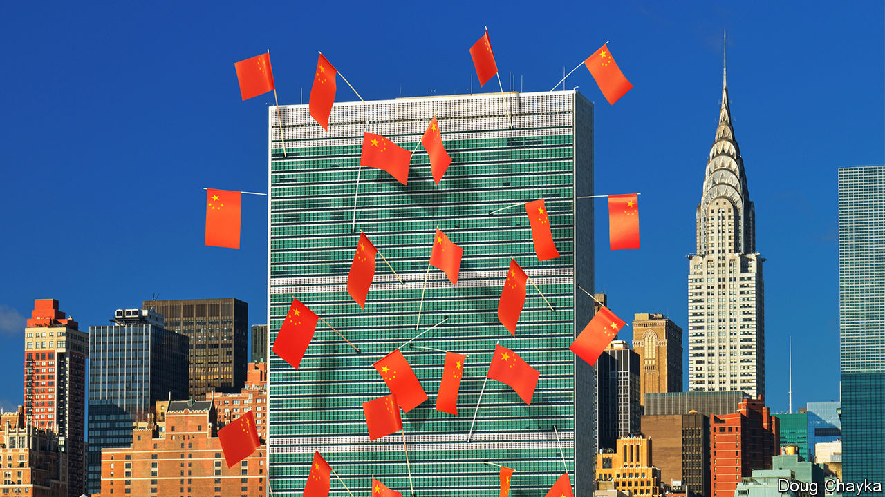

## Power plays

# Who runs the world?

> As America gets tired, China gets busy

> Jun 18th 2020

CRISES CAN bring clarity. In the financial crisis of 2008-09, the G20 club of big economies came into its own, reflecting how economic power had spread beyond the rich world’s G7. One thing the covid-19 pandemic has laid bare is an absence of global leadership. This time the G20 has done little beyond a rhetorical pledge to “do whatever it takes” and supporting debt-repayment suspension for poor countries. America, which led global campaigns to defeat HIV/AIDS and Ebola, has been absorbed in its internal arguments. And the UN Security Council has confirmed its dysfunctionality.

The council’s five permanent members (P5) are split between the Western three and Russia and China; some suspect the authoritarian duo of having a formal pact. Russia wields its veto often, sometimes alongside China. Instead of leaping into action over covid-19, the council mustered its first discussion of the crisis only in April. France and Russia have both been keen for the leaders of the P5 to get together in the UN’s anniversary year, but have found this hard to arrange.

The pandemic hit when competition between America and China, the world’s dominant and emerging superpowers, was already intense, stretching from trade and technology to finance and regional dominance in Asia. In America there is a bipartisan perception of China as a rival that steals intellectual property, takes advantage of America’s openness and is intent on chipping away at America’s lead. For its part, China is increasingly brazen in pushing back against America (or any country that resists it).

The covid-19 crisis is proving a telling case study of this rivalry, as America blames China for causing the pandemic and China positions itself as the country most capable of dealing with it. Any retreat by America from global leadership is an opportunity for China to gain ground. Whereas America has suspended funding to the WHO, China has promised $2bn to fight the pandemic.

President Xi Jinping portrays China as a champion of multilateralism and talks of taking “an active part in leading the reform of the global governance system”. China has been building channels of influence outside the institutions that America designed. It set up the Asian Infrastructure Investment Bank, encroaching on the World Bank’s territory. It has championed the BRICS (bringing it together with Brazil, Russia, India and South Africa) and the Shanghai Co-operation Organisation, an eight-member group that includes Russia and Central Asian countries as well as India and Pakistan. And then there is Mr Xi’s Belt and Road Initiative (BRI), an all-embracing infrastructure and development campaign.

China has also been methodically increasing its influence in existing institutions, not least the UN. It has raised its financial support even as America became stingier, becoming the second-biggest contributor to both the general and the peacekeeping budgets. It has grown more assertive. “Ten years ago, China was pretty discreet, pretending to be just an emerging country,” says one European diplomat at the UN. “Now I can tell you they are totally uninhibited, they want to run the system.”

China has been patiently placing high-fliers to work their way up through the ranks. Chinese nationals now head four of the UN’s 15 specialised agencies, including the Food and Agriculture Organisation in Rome and the International Telecommunication Union in Geneva. Americans lead only one. Chinese officials toil away at inserting into documents favourable references to the BRI and language friendly to their interpretation of human rights, stressing national sovereignty and development (“mutual respect and win-win co-operation”). Behind the scenes China twists arms to avoid criticism of its repression in Xinjiang or Tibet.

Small victories for China have mounted up, often in obscure documents and little-noticed forums, but occasionally raising eyebrows. In the 15-member Security Council, for example, the West and its friends can normally count on the requisite nine votes to get their way on procedural matters. But in March 2018 an American-backed proposal for the UN high commissioner for human rights to brief a formal session on abuses in Syria was defeated when, after Chinese pressure, Ivory Coast switched sides at the last minute.

The aim may not be to replace America as a superpower that bears burdens all around the world. More likely, China simply wants an unencumbered path for further development. “People’s Republic of the United Nations”, a report last year from the Centre for a New American Security (CNAS), a think-tank, concluded that China was “making the world safe for autocracy”. For a long time America paid little attention, but it is now pushing back. In January the State Department appointed a senior diplomat, Mark Lambert, to counter the “malign influence” of China and others at the UN. In March these efforts succeeded in thwarting China’s bid for the top job at a fifth UN agency, the World Intellectual Property Organisation in Geneva.

At least such moves reflect a recognition by the American administration that multilateral institutions matter. Just as Mr Trump no longer calls NATO “obsolete”, as he did before coming to power, he may yet find more use in the UN. He would not be the first American president to come to believe that, annoying as international forums are, they are better than a constant free-for-all, and they can take some of the load off a superpower. But his transactional approach has unnerved allies, and badly dented their trust in American leadership.

As a result, “middle powers” have been searching for other ways to defend the liberal order. A white paper presented last year by Norway’s foreign ministry to its parliament identified preventing the erosion of international law and multilateral systems as a “primary foreign-policy interest”. In New York, France and Germany launched an Alliance for Multilateralism, with the aim of forging varied coalitions to take the initiative on issues ranging from fake news and responsible use of cyberspace to gender equality and strengthening international institutions.

Coalitions of like-minded countries have proliferated. After Mr Trump abandoned the Trans-Pacific Partnership, a free-trade deal, Australia, Japan and nine other countries pressed ahead on their own. The EU and Japan completed a trade agreement covering a third of the world’s GDP. On defence, President Emmanuel Macron of France has gathered 13 other countries into a European Intervention Initiative and is ever keener on “strategic autonomy” for Europe. Asian countries worried about growing Chinese assertiveness, and unsure of America’s commitment, are deepening ties.

In such “minilateralist” or “plurilateralist” ventures, national governments are not the only actors. Regional states, non-governmental organisations (NGOs) and business leaders are on stage too. In the response to covid-19, the Bill & Melinda Gates Foundation, a philanthropic giant, is taking a more prominent part than many governments. Several American states have been busy since Mr Trump withdrew from the Paris agreement. California’s governor, Jerry Brown, hosted a Global Climate Action Summit in 2018. Totting up actions at subnational levels that collectively would amount to the world’s second-biggest economy, one estimate suggests they could reduce America’s greenhouse-gas emissions by 2030 by as much as 37% from 2005 levels.

Whether these scattered mid-level moves can amount to more than the sum of their parts is unclear. Michael Fullilove of the Lowy Institute, an Australian think-tank, suggests that like-minded countries should form a “coalition of the responsible”. Since some middle powers, such as Taiwan and South Korea, have distinguished themselves by their response to the pandemic, he also proposes “coalitions of the competent”. Further bungling by the big powers over covid-19 could make a concert of middle powers more urgent. But do not bank on this being a middle-power moment, says Kori Schake of the American Enterprise Institute, another think-tank. Without a dominant power to set an agenda, force momentum and provide a chunk of funding, it is very hard for co-operation among lesser countries “to reach escape velocity”. At best it may slow rather than stop the erosion of the liberal order.

If middle powers are active, so are smaller ones. By clubbing together, even minnows can have influence. Under its charter the UN is “based on the principle of the sovereign equality of all its members”, so each of the 193 countries in the General Assembly has one vote. India (1.4bn people) counts the same as Tuvalu (12,000).

The Group of 77, formed in 1964 and now embracing 134 members, pushes the interests of developing countries. It is less homogenous than it was but it can have influence (eg, over the choice of secretary-general) and get attention (picking Palestine to serve as its chair last year). The Alliance of Small Island States helped put the climate-change issue on the map. Samantha Power, America’s UN ambassador during Barack Obama’s second term, made a point of visiting her counterparts from every member country at their New York missions: she managed all except North Korea’s.

With just six embassies around the world, the diplomatic footprint of the Caribbean state of St Vincent and the Grenadines (population: 111,000) is tiny, but a good example of small-country influence. One of its embassies is in Taipei: it is among a handful of states that officially recognise Taiwan. Its mission in New York has been expanding, since St Vincent currently has one of the ten non-permanent seats on the 15-member Security Council. “The bedrock principle that all small states advocate for is adherence to international law,” says Inga Rhonda King, St Vincent’s ambassador. They’re “very hard core” over sovereign equality, non-interference and non-intervention, she adds. The Security Council seat gives her a chance to press core concerns (especially climate security and relations with Africa) and, hers being a small country, to do so nimbly. Ms King would like to see similar nimbleness in the council’s response to covid-19, drawing attention to Africa as the pandemic’s likely next frontier.■

## URL

https://www.economist.com/special-report/2020/06/18/who-runs-the-world
