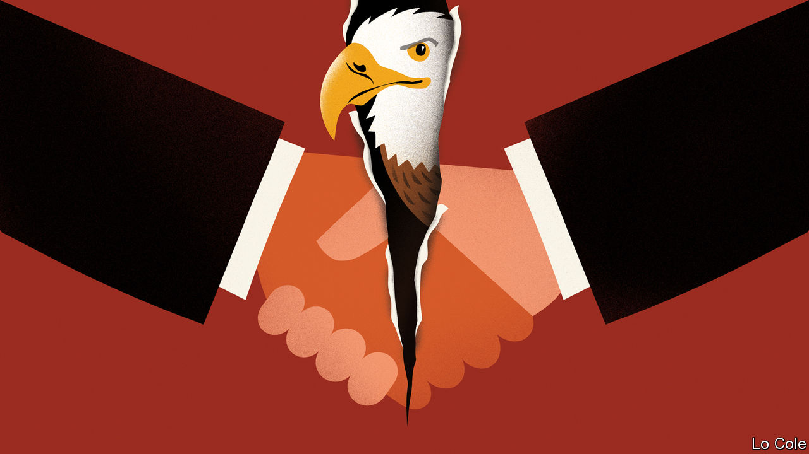

## Bello

# A gringo takeover bid for the Inter-American Development Bank

> The United States breaks a gentlemen’s agreement

> Jun 18th 2020

SINCE IT was founded in 1959, the Inter-American Development Bank (IDB) has had just four presidents: a Chilean, a Mexican, a Uruguayan and, since 2005, Luis Alberto Moreno, a Colombian. Under the gentlemen’s agreement by which it was founded, Latin America has the presidency and a small majority of the capital while the United States has the number-two job and some informal vetoes over how the bank is run. The IDB has not been free of the faults of such institutions, such as bureaucracy and a degree of cronyism, but it has played an important role in the region. It lends around $12bn a year for infrastructure, health, education and so on, does some useful research and advises governments. It has also been a channel of communication between the two halves of the Americas.

Donald Trump doesn’t believe in gentlemen’s agreements, and his administration this week broke this one. The Treasury Department named Mauricio Claver-Carone, the top official for Latin America at the National Security Council (NSC), as its candidate to replace Mr Moreno, who is due to step down in September. Mr Claver-Carone, a Cuban-American, is technically qualified for the post. He has been an adviser to the Treasury and a representative to the IMF, and was involved in the Trump administration’s initiatives on development finance. He has told interlocutors that he would serve only one term at the IDB, would bring fresh ideas and would be better placed than a Latin American to get the Treasury’s crucial support for a capital increase that would give the bank resources to mitigate the covid-19 slump in the region. These are things that many in Latin America might welcome.

But Mr Claver-Carone is a controversial choice, and not just because his nomination breaks with tradition. At the NSC he has been the chief architect of Mr Trump’s Venezuela policy, which has failed in its aim of getting rid of the dictatorship of Nicolás Maduro. “He’s a guy who comes with very Miami-type baggage, adversarial to Cuba and Venezuela and representing a conservative alliance,” says a Latin American diplomat. “He would bring ideology directly into the bank.” Mr Claver-Carone walked out of the inauguration of Argentina’s president, Alberto Fernández, in December because of the presence of a Venezuelan minister. Many who have dealt with him describe him as arrogant and confrontational.

Given the Trump administration’s cold war against China, Mr Claver-Carone’s appointment as head of the IDB might force Latin America to choose between the two countries, which the region is reluctant to do. Although China is granting fewer loans to Latin America than it did recently, it remains one of the region’s most important trade partners. The Trump administration was furious with Mr Moreno for agreeing to hold the bank’s annual meeting in China in 2019 (though in the event it was delayed and moved to Ecuador because of a row over who represented Venezuela). Mr Claver-Carone has his own animus against Mr Moreno, who vetoed his appointment as the bank’s vice-president.

For Latin America the loss of the IDB presidency would be a big diplomatic defeat, reflecting the region’s weakness and ideological division. Its leaders are a generally unimpressive bunch. They have failed to unite behind a candidate of their own. Diplomats expected the job to go either to Brazil or to Argentina. Jair Bolsonaro’s government in Brazil informally canvassed support for Rodrigo Xavier, an experienced banker. Argentina’s putative candidate, Gustavo Béliz, is a competent former IDB official, but its centre-left government has few allies in the region. Brazil looks likely to back Mr Claver-Carone, mainly because Mr Bolsonaro has aligned himself closely with Mr Trump. Other smaller countries may, too, because they are desperate for money.

The new president must secure a double majority, of countries representing 50% of the IDB’s shares (the United States has 30% and Brazil 11%) and separately of the 28 members in the Americas. That may yet be a problem for Mr Claver-Carone.

The biggest reason to oppose his nomination is that he represents a polarising administration that may well lose an election in November, making him “the earliest lame duck in history”, as a South American official puts it. The sensible course would be to extend Mr Moreno’s term until next year, both to give time for other candidates to emerge and to see whether Mr Claver-Carone really represents the United States.

Editor’s note: Some of our covid-19 coverage is free for readers of The Economist Today, our daily [newsletter](https://www.economist.com/https://my.economist.com/user#newsletter). For more stories and our pandemic tracker, see our [coronavirus hub](https://www.economist.com//news/2020/03/11/the-economists-coverage-of-the-coronavirus)

## URL

https://www.economist.com/the-americas/2020/06/18/a-gringo-takeover-bid-for-the-inter-american-development-bank
