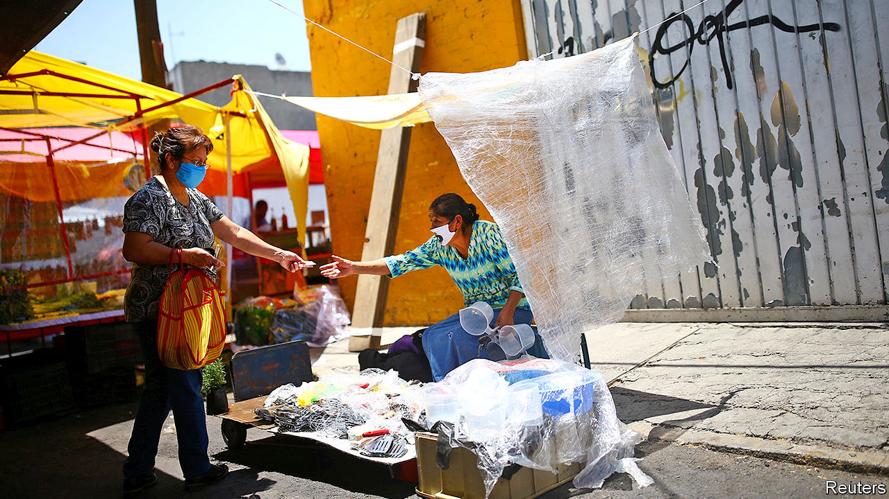
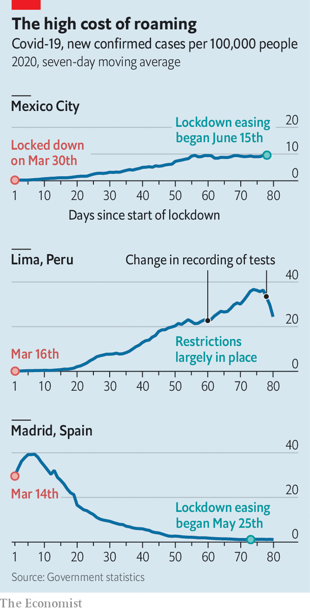

## Leaving lockdowns

# Latin America opens up before it’s ready

> Mexico’s failure to contain covid-19 shows why the region is now the centre of the pandemic

> Jun 20th 2020MEXICO CITY

ON A SPRING afternoon in Mexicali, in northern Mexico, Erick Mercado pondered what was coming. The private Hispanic American Hospital, where he runs the accident-and-emergency service, had cancelled all elective surgery and made plans to seal off the second floor. In half an hour, he explained, the governor of Baja California would confirm the state’s first coronavirus cases. People with flu-like symptoms, Dr Mercado predicted, would “go into a panic” and rush to hospitals for testing. Sure enough, a queue appeared in the car park by nightfall.

Three months later, Dr Mercado and his hospital are at breaking point. For every covid-19 patient to whom he can offer a bed, he must turn away five. More than 90% of the city’s hospital beds are taken, and the number of registered deaths nearly tripled to 660 in the first half of June. Dr Mercado’s days are filled with suffering patients, exhausted staff and visitors who cannot approach loved ones. Most distressing of all is knowing that “people who do not comply” with government orders to stay at home, wear masks and keep social distance have made the pandemic worse.

His frustration is provoked by the messiness of Mexico’s response to covid-19. The government shut down the formal part of the economy on March 30th, when fewer than 1,000 cases had been registered. But—unlike in richer countries—its lockdown order failed to contain the outbreak (see chart). Mexico has 159,793 confirmed cases and 19,080 deaths. The number of new cases is rising, both nationally and in 27 of the 32 states. Yet with covid-19 on the rampage, the country is easing its controls.

The rest of Latin America shares its plight. The region is reporting more cases each day than Europe did during its covid-19 peak in April. By some measures it is the world’s most urbanised region, which may help explain the virus’s spread. Governments’ responses have varied greatly. Brazil’s President Jair Bolsonaro has been cavalier, dismissing covid-19 as “sniffles” and breaching his own health ministry’s social-distancing advice. Nicaragua’s Daniel Ortega imposed no lockdown. Governments in Peru, Argentina and elsewhere acted early and sternly, using the police to enforce quarantine orders. Yet with few exceptions (see [article](https://www.economist.com//the-americas/2020/06/18/how-uruguay-has-coped-with-covid-19)), the spread of the virus has been swift.

Even where the rules are strict, many people have not obeyed. The rich have adhered to lockdowns more than the poor. Many informal workers—street vendors, cleaners and the like—must work to eat. Few Latin American countries have European-style safety nets. Many have nonetheless provided emergency aid. In Brazil, El Salvador and elsewhere beneficiaries flocked to cashpoints, potentially spreading the virus. In a region where trust in government is low, citizens are detached from the state “not just legally, but emotionally and cognitively”, says Hugo Ñopo, a Peruvian economist. That makes them less inclined to listen to pandemic pleas from officialdom. The resignation, firing or arrest of six Latin American health ministers since March is unlikely to have bolstered citizens’ confidence in governments.

Despite the region’s leaky lockdowns, its economy will shrink by 7.2% this year, more than anywhere else, predicts the World Bank. Small wonder that governments besides Mexico’s are contemplating ending lockdowns before they have tamed the disease. They are taking a gamble.

A quasi-quarantine is better than none. Andrés Manuel López Obrador, Mexico’s president, has said in private meetings that his priority is to avoid the apocalypse that struck Guayaquil, Ecuador’s largest city, where corpses lay in the streets in April. Mexico’s quarantine achieved that, buying time for the government to find extra beds, doctors and ventilators, educate citizens and review research about how to halt the virus. It was loose by design, avoiding “authoritarian” restrictions on movement and allowing workers in informal jobs to continue to practise their trades. Nonetheless, the government expects up to 10m people to fall below its poverty line this year.

In Iztapalapa, a suburb of Mexico City that has the country’s highest confirmed infection rate, both the lockdown and the government that ordered it seem distant. On Callejon 57, a tiny colourful street, life carries on as normal. Although Mexican media dubbed it “Covid Alley” after it saw 45 deaths in three months, many residents downplay the threat. One man says the powers that be want to kill off pensioners. Another, whose uncle died recently (“not from covid-19”), thinks the government is exaggerating to keep the poor under its thumb. Others doubt the virus is real. Yet most residents make some effort to protect themselves and others. “When the deaths started the masks came out,” says Miguel Contreras from behind a sheet of plastic at his hole-in-the-wall convenience store.

Joaquín Reyes recalls that when his 90-year-old grandmother died, he could say farewell only by phone, through a doctor. The doctor said covid-19 “probably” killed her, though the death certificate does not mention it. Mr Reyes, who wears a mask as he flattens chicken breasts at the stall outside his house on Callejon 57, is unsure. His till, a margarine tub packed with coins, is filled with water to ward off germs. This reassures customers, he explains. As ever, he is working long hours and resting only on Sundays. “If I had money, I would stay in my house all day,” he says.

Covid-19’s devastation is greater than the government admits. Among the 25 countries with most cases, none tests fewer people than Mexico as a share of population. Two in five tests are positive, a sign that the outbreak is being badly undercounted. An analysis of death certificates shows that between April 1st and June 7th Mexico City had 17,000 more deaths than it normally does over that period. This suggests a toll nearly four times the government’s count. The capital’s excess deaths are nearing New York’s 25,000, even though its people are on average younger.

Despite this, Mexico’s government is desperate to end lockdown. It expects the pandemic to peak this month. The government has introduced a traffic-light system, which encourages states that are taming the virus ease lockdowns. Just one state qualified for any colour other than red. But the government tweaked its criteria so that 16 could begin to reopen on June 15th. Mexico City, which remains red, is starting to reopen anyway.

Other countries that left lockdowns prematurely have suffered. Guatemala and Venezuela have tried alternating between tough and loose regimes, only to find that cases rise after streets fill up during lax phases. Panama City and Santiago, Chile’s capital, have reinforced lockdowns after authorities declared victory too early. Chile now has the highest confirmed infection rate of any non-tiny country.

Even so, many countries, suffering lockdown fatigue along with economic pain, are moving towards gradual easing. Bolivia, Colombia and Honduras, whose president, Juan Orlando Hernández, was hospitalised after testing positive for the virus, plan to phase out their lockdowns this month. Governments hope thereby to support their economies. They run the risk of boosting the virus, too.■

Clarification: a previous version of this article stated that the number of cases in Mexico had fallen shortly before publication. We have changed the text to reflect that the seven-day rolling average of new cases was still rising.

Editor’s note: Some of our covid-19 coverage is free for readers of The Economist Today, our daily [newsletter](https://www.economist.com/https://my.economist.com/user#newsletter). For more stories and our pandemic tracker, see our [coronavirus hub](https://www.economist.com//news/2020/03/11/the-economists-coverage-of-the-coronavirus)

## URL

https://www.economist.com/the-americas/2020/06/20/latin-america-opens-up-before-its-ready
