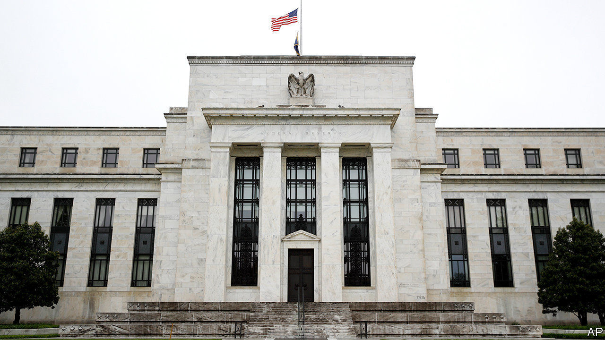
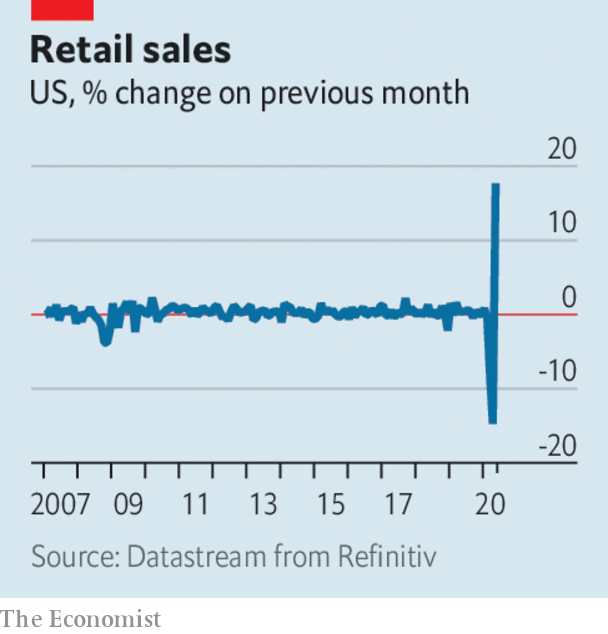

# Business this week

> Jun 18th 2020

The Federal Reserve clarified its new bond-buying strategy, announcing that it would acquire individual corporate bonds on the secondary market. This comes on top of its purchases in exchange-traded funds, which include some junk-rated funds that track debt. But the central bank’s latest move comes almost three months after it first announced emergency measures to shore up markets. Questions have been raised about the length of time it has taken to roll out some of its programmes. See [article](https://www.economist.com//finance-and-economics/2020/06/18/the-fed-has-been-supporting-markets-now-it-must-find-ways-to-boost-growth).

Stockmarkets rallied in response to the news from the Fed, making up for some of the heavy losses they racked up in the week ending June 12th, which was the worst for the S&P 500 and Dow Jones Industrial Average since mid-March.

The Trump administration said it would let American tech firms work with Huawei on creating international standards for 5G. The decision represents a long-expected easing of the sanctions placed on the Chinese provider of telecoms networks and equipment over national-security concerns. America did not have much choice. Huawei’s size and expertise makes it one of the companies integral to setting the rules on international networks.

America’s Justice Department put forward proposals that roll back the immunity of social-media firms for content posted on their platforms. Donald Trump signed an executive order recently rescinding the protections after he got into a spat with Twitter, but it is unlikely to be upheld once it is challenged in court. 

Robert Lighthizer, the US trade representative, confirmed that America had pulled out of talks with the EU that had sought to find common ground on taxing tech companies. America argues that such levies will disproportionately hit its global giants, such as Apple and Google, and has threatened to retaliate with sanctions if European countries impose their own digital tax.

Facebook launched a payment service on its WhatsApp platform in Brazil. Brazilians can link their credit or debit cards to WhatsApp Pay to send money to each other or buy goods from small firms. Facebook had hoped India would be the first country to use the facility nationwide, but became bogged down in regulatory objections there.

Retail sales in America surged last month by 17.7% over April, more than double the amount that had been expected. That followed a 14.7% decline in April. Sales were still down by 6.1% compared with May last year. It is thought that the government’s stimulus measures to households helped fuel the shopping spree, and that consumers might not spend so much when the money runs out.

In America’s biggest IPO so far this year, Royalty Pharma raised $2.2bn when it listed on the Nasdaq exchange. The company invests in the rights to royalties on future drug sales across the life sciences, combining scientific expertise with capital investment for the industry. Royalty’s share price leapt by more than half on the first day of trading.

Acknowledging that demand for energy will remain weak in the aftermath of covid-19 and that governments “will accelerate the pace of transition to a lower carbon economy”, BP said it would write down the value of its oil and gas assets in the second quarter by between $13bn and $17.5bn. To buttress its balance-sheet the energy giant reportedly raised $12bn through a sale of hybrid bonds.

In its first forecast for 2021, the International Energy Agency said that demand for oil would increase by 5.7m barrels a day next year to 97.4m. That is still below the average for 2019, mostly because the aviation industry will still struggle in 2021. However, China’s “strong exit from lockdown” saw its demand for oil in April rebound back almost to the level it was at a year ago.

In a rare admission of corporate wrongdoing on homicide-related charges, PG&E pleaded guilty to 84 counts of involuntary manslaughter in relation to the Camp Fire disaster in California two years ago. The electric utility’s faulty equipment sparked the inferno. Its chief executive (who was not in charge at the time of the fire) pled guilty to each one of the deaths of the 84 victims of the fire as their names were read out alphabetically. The company is soon to exit bankruptcy protection.

Hertz postponed a sale of new shares after the Securities and Exchange Commission raised objections. A judge had earlier allowed the sale to proceed, an unprecedented ruling for a company that has filed for bankruptcy protection. The car-hire company had warned potential buyers of the stock that they stand to lose their shirts unless there is a significant and “currently unanticipated improvement” in its business, which has been hammered by the pandemic.

## URL

https://www.economist.com/the-world-this-week/2020/06/18/business-this-week
