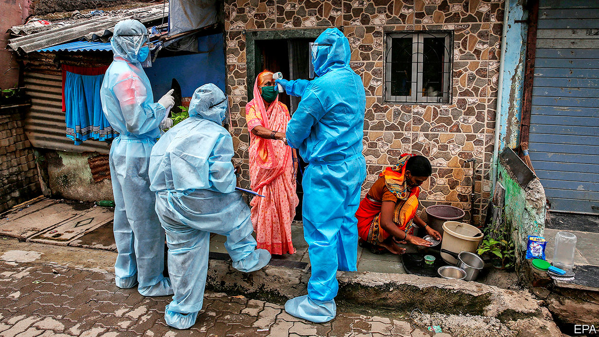
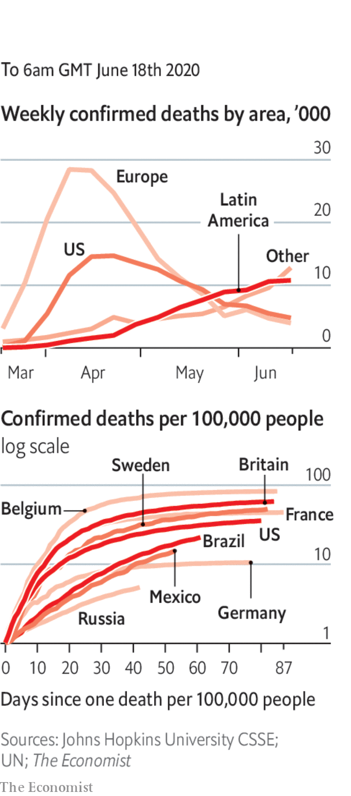

# Politics this week

> Jun 18th 2020

Brazil reported a record 35,000 new cases of covid-19 in a day. Even that grim figure is widely regarded as an undercount. India is now recording tens of thousands of new infections each week. In America, Florida, Texas and Arizona set daily records for new cases. Although many places are easing lockdowns, Anthony Fauci, the leading adviser to the White House on infectious diseases, warned that the pandemic is far from over: “The numbers speak for themselves.” See [article](https://www.economist.com//the-americas/2020/06/20/latin-america-opens-up-before-its-ready).

Beijing went into “wartime mode” to battle an outbreak of covid-19, the first in the Chinese capital after eight weeks with no cases reported of local transmission. Many of the cases are linked to a wholesale food market. See [article](https://www.economist.com//china/2020/06/20/an-outbreak-in-beijing-of-covid-19-is-causing-alarm).

A court in China sentenced the country’s former insurance regulator, Xiang Junbo, to 11 years in prison for accepting 18m yuan ($2.5m) in bribes. Mr Xiang had also served as deputy governor of the central bank.

At least 20 Indian troops were killed in a fight with Chinese soldiers in the Galwan valley, the first combat deaths on the disputed Sino-Indian border in 45 years. China did not say how many of its soldiers died. The brawl involved nail-studded clubs and stones rather than guns. Tensions have increased since April, when the Chinese army encroached on Indian-claimed territory. See [article](https://www.economist.com//leaders/2020/06/18/how-to-end-the-perilous-indo-chinese-border-spat).

North Korea blew up the building used for meetings between its officials and those from South Korea. It said the explosion was retaliation for unflattering leaflets about its supreme leader, sent over the border via balloons by defectors, whom North Korea called “rubbish-like mongrel dogs”. See [article](https://www.economist.com//asia/2020/06/18/north-korea-blows-up-the-souths-de-facto-embassy).

A court in the Philippines found Maria Ressa guilty of libel for alleging links between a businessman and a judge. Ms Ressa is the boss of Rappler, a news website that is critical of the country’s strongman president, Rodrigo Duterte. Her lawyer said the message to other journalists was “Keep quiet, or you’ll be next.”

Steven Mnuchin, America’s treasury secretary, said his government will nominate Mauricio Claver-Carone, a staff member of Donald Trump’s National Security Council, to lead the Inter-American Development Bank. All the bank’s four presidents since its founding in 1959 have been from Latin America. The US has 30% of the bank’s shares, the largest stake of any country. See [article](https://www.economist.com//the-americas/2020/06/18/a-gringo-takeover-bid-for-the-inter-american-development-bank).

Venezuela’s Supreme Court removed the leaders of two opposition parties, Justice First and Democratic Action. It replaced them with men whom the parties had previously expelled for being stooges of Nicolás Maduro, the country’s dictator.

America’s Supreme Court ruled that the 1964 Civil Rights Act makes it illegal to fire workers for being gay or transgender. More than half the states allowed such discrimination. The 6-3 majority decision was written by Neil Gorsuch, a Trump appointee. See [article](https://www.economist.com//united-states/2020/06/18/americas-supreme-court-protects-lgbt-workers-against-discrimination).

The White House tried to stop publication of a book by John Bolton, a former national security adviser, claiming that it contained classified information. The book says that Donald Trump tried to persuade Xi Jinping, China’s president, to buy American farm goods to help his re-election campaign. It also alleges that in a meeting with Mr Xi, Mr Trump said he approved of China’s policy of putting Uighur Muslims in internment camps. On June 17th Mr Trump signed a bill that imposes sanctions on Chinese officials who were responsible for the Uighurs’ internment. See [article](https://www.economist.com//united-states/2020/06/18/details-from-john-boltons-book-are-damning-for-donald-trump).

A white policeman in Atlanta who shot dead a black man when he took the officer’s Taser weapon was charged with murder. Republicans in the Senate unveiled their own set of police reforms. These are less radical than those put forward by Democrats but support the creation of a database to track police officers with a record of misconduct.

Boris Johnson, Britain’s prime minister, announced that Britain’s Department for International Development would be folded back into the Foreign Office. British aid will now focus less on ending poverty and more on advancing British foreign-policy goals. See [article](https://www.economist.com//britain/2020/06/19/british-diplomats-and-donors-are-told-to-merge).

Yousef al-Otaiba, a diplomat from the United Arab Emirates, wrote in an Israeli newspaper that any unilateral annexation of West Bank territory would harm Israel’s relations with Arab countries. It is thought to be the first-ever opinion piece written by an official from the Gulf for an Israeli newspaper.

America imposed new sanctions on Syria that target any person, company or institution—Syrian or foreign—that does business with or provides support to the regime of President Bashar al-Assad. See [article](https://www.economist.com//middle-east-and-africa/2020/06/18/bashar-al-assad-has-no-solutions-to-syrias-crisis).

There were more demonstrations in Lebanon. The government began injecting more American dollars into the market in an effort to support the local currency. Early talks with the IMF over a bail-out package have been shaken by concerns that the government is not serious about reform.

A judge overseeing a corruption trial in the Democratic Republic of Congo was murdered. Police initially said that the judge had had a heart attack, but an autopsy showed he had died from brain injuries after being stabbed in the head.

A randomised trial conducted by scientists at Oxford found that dexamethasone, a cheap steroid drug found in many countries, reduced the death rates for patients on ventilators by 35% and by 20% for those needing oxygen. See [article](https://www.economist.com//britain/2020/06/18/dexamethasone-cuts-covid-19-deaths).

The president of Honduras, Juan Orlando Hernández, said he and his wife have covid-19.

The remaining lockdown restrictions were lifted in France, enabling bars and restaurants to reopen fully. In England all shops were allowed to open their doors to customers again.

Next year’s Oscars ceremony was postponed by two months until April 25th. It is not yet clear whether the event will be held in a theatre or virtually.

The English Premier League resumed its season, three months after it was suspended. The football matches are being played behind closed doors.

## URL

https://www.economist.com/the-world-this-week/2020/06/18/politics-this-week
