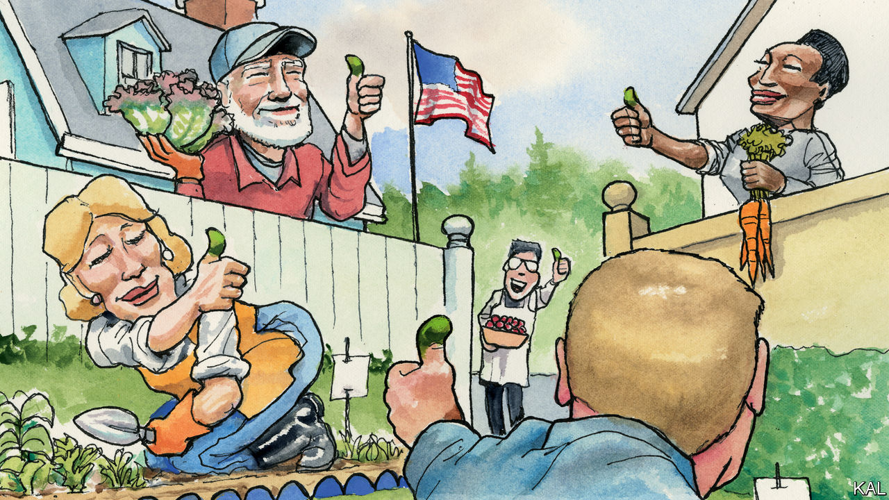

## Growing your own food

# America rediscovers the joys of vegetable-growing

> A shovel-ready project

> Jun 18th 2020

FROM A SELFISH perspective, this hot, quarrelsome month has brought two great joys to your columnist. It gave him his first opportunity to take part in American democracy, in the form of a local election for which his foreign citizenship was no bar. (The contest was also fiery, of which more shortly.) And it was the first June in which he has overseen a vegetable garden ripening at New World pace. Zucchini seedlings planted in late May provided their first sleek squashes to Lexington’s table this week. Tomato seedlings that went in at the same time are now heavy with green fruit. This is nothing like gardening in cloudy England.

Your columnist is not alone in growing more veg this year. The coronavirus lockdown has inspired a surge in gardening not seen since the second world war. Seed firms have struggled to keep up. Even the 144-year-old Burpee company, a fabled name in American horticulture, briefly stopped taking individual orders. On Memorial Day, a traditional marker for planting tomatoes along the east coast, many garden centres had no seedlings available. “In 40 years in this business, I’ve never seen anything like it,” marvelled Ian Baldwin, a Sacramento-based expert (who kindly shared a picture of his enviable potato bed).

European countries have seen a similar surge, presumably for much the same pandemic-related reasons: anxiety about food security, combined with an aversion to going shopping and a glut of enforced time at home. Yet America’s enthusiasm is more remarkable for coming off a lower base. Around a third of British households grew at least some of their own food before the pandemic. Even after a significant increase over the past decade, only a quarter of American ones did. And they have nothing like Britain’s national gardening culture, including popular TV shows and celebrity growers, to encourage them. Michelle Obama’s valiant effort to relaunch the White House’s kitchen garden was chiefly remarkable for its novelty. This contrast points to a few broader American peculiarities—which may now be diminishing.

Like so much in popular culture, America’s rejection of gardening has its roots in the long post-war boom. Where frugal Britons retained some of their wartime allotments, America’s Victory Gardens were abandoned with the gusto of a country remaking the future in a way that left no place for composting and hoeing peas.

In the country’s vast new suburbs, a pristine lawn, visible through a picket fence, was a statement of middle-class belonging. Zoning laws often permitted no deviation from it—so that verdant but sterile suburban yards, drenched in chemicals, soon covered America. Refrigerators and frozen food meanwhile revolutionised the way Americans fed themselves. Between 1945 and 1949 they bought 20m fridges—and filled them with precooked meals, such as the TV Dinners that Ronald and Nancy Reagan loved.

To this day vegetable patches, clotheslines and other non-lawn deviances are often forbidden in the suburbs. Yet America is vast and contradictory. The 1950s also saw J.I. Rodale’s pioneering experiments in organic farming. The 1970s brought a revival of community gardens in many cities. America’s continental scale (it has 13 growing zones to Britain’s four) kept regional horticultural traditions alive. And over the past decade these tendrils have become interwoven in the many gardening blogs, chat-rooms and YouTube stars that have blossomed online. If America still lacks a national gardening culture, it has a diverse and organic one.

This regrowth began during the recession of 2007-09, when millions turned to veg-growing to save money. Those most scarred by that crisis—millennials, who are now less likely to own any sort of property than their parents—have tended to stick with it. Plummeting trust in the food industry and rising interest in organic food have supported this change. So too, industry surveys suggest, has rising interest in growing marijuana.

The trend has almost inevitably been politicised. Egged on by the food industry, the right lambasted Mrs Obama’s garden as elitist and anti-business. In an attack on the former first lady’s appearance, Rush Limbaugh also accused her of hypocrisy: “If we are supposed to eat roots, berries and tree bark, show us how.”

In Donald Trump, who so disdains greens that the White House physician resorted to smuggling cauliflower into his mashed potatoes, the reactionaries have found a champion. His administration has reversed the few gains made by the campaign for better nutrition that Mrs Obama’s garden was meant to spearhead. The township election that Lexington has just voted in also featured a jumbled echo of this politics. It pitted left-wing environmentalists, eager to curb the use of garden chemicals, against a more businesslike group, concerned about the effect of such nannying greenery on local property prices.

To a European transplant, the notion of vegetable gardening having any kind of partisan hue is nuts. Yet Lexington’s experience suggests that such politicking will not stop its resurgence. He expanded his vegetable plot—to the sunny front of his house—not because of the pandemic but after he finally mustered the courage to risk his neighbours’ wrath. Far from objecting, however, several have constructed raised beds of their own. One neighbour, a distinguished law professor, even followed your columnist into the local dumpsters in search of the necessary planks.

This has led to an intense neighbourly exchange of seedlings, observations and advice. (And commiseration, after the rapacious chipmunks strike.) Great as it is to eat a home-grown squash, cultivating vegetables in a modern economy is fundamentally about such things, not producing calories. It is a useful activity, a blissful therapy, an adjunct to community. It is liberating and equalising. No wonder Thomas Jefferson ranked his best horticultural innovations alongside the Declaration of Independence. In returning to veg-growing, America is rediscovering its better self.■