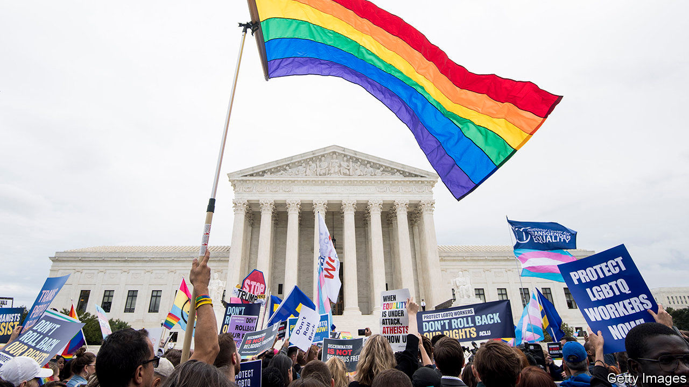

## LGBT rights

# America’s Supreme Court protects LGBT workers against discrimination

> A momentous 6-3 ruling

> Jun 18th 2020NEW YORK

WHEN ANTHONY KENNEDY retired in 2018, gay-rights supporters fretted over the loss of a justice who had anchored four expansions of gay and lesbian rights. With his replacement by the more conservative Brett Kavanaugh, and President Donald Trump’s appointment of Neil Gorsuch 18 months earlier, LGBT activists worried the progress would come to a halt. On June 15th the Supreme Court allayed those fears with a momentous decision that protects gay and transgender people against discrimination in the workplace.

By a 6-3 margin, the court ruled that Title VII of the Civil Rights Act of 1964—a provision that bars discrimination “because of” a number of characteristics including “sex”—prohibits firing or disfavouring workers on the basis of their sexual orientation or gender identity. The majority view was penned by Justice Gorsuch.

Roughly half of America’s states have laws of their own protecting gay and trans workers; the rest do not. So until the latest decision, known as Bostock v Clayton County, an employee in much of America could legally marry a member of the same sex over the weekend and be legally sacked for being gay when returning to work. Now some 8.1m LGBT workers across America will enjoy federal protection from discrimination when they clock in.

At the oral arguments last October, Justice Gorsuch leaned towards the LGBT plaintiffs’ view. But he feared that a win for them might herald “massive social upheaval”. Now, as author of the majority opinion (attracting the votes of Chief Justice John Roberts and the four more liberal justices), his worries seem to have vanished. “Sex plays a necessary and undisguisable role” in an employer’s decision to fire a worker for being gay or transgender, he wrote, and that is “exactly what Title VII forbids”.

The matter was simple, he contended, involving “the straightforward application of legal terms with plain and settled meanings”. A host of Supreme Court precedents stand for the same principle. These include discrimination against mothers, sexual harassment against men and other types of workplace bias Congress may not have contemplated in 1964. No one might have imagined back then that Title VII would prohibit a boss from firing gay or trans workers because of their identity, but “major initiatives” like a civil-rights law often have “unexpected consequences”.

Justice Kavanaugh wrote a dissent admonishing the majority for legislating from the bench. “[W]e are judges,” he wrote, “not members of Congress.” For the more vituperative Justice Samuel Alito (joined in dissent by Justice Clarence Thomas), the “radical” result in Bostock is based on “preposterous” reasoning. Although the majority invokes the late Justice Antonin Scalia’s teaching that judges should pay heed only to the words of a statute, Justice Alito wrote, “no one should be fooled” by the ruling. Justice Gorsuch’s opinion is “like a pirate ship” sailing “under a textualist flag” but silently “updat[ing] old statutes so that they better reflect the current values of society”.

What are the broader implications of the ruling for LGBT rights? It depends whom you ask. Justice Gorsuch left open whether employers with religious objections to the gender identity or sexuality of their workers may one day claim an exemption from anti-discrimination laws. But his erstwhile concern about social upheaval is nowhere to be found in the majority opinion. Bostock is just about workplace rights, he wrote, not “sex-segregated bathrooms, locker rooms and dress codes”. The court does not “prejudge” these questions.

Justice Alito’s 54-page jeremiad berated the majority for failing to grapple with the potential implications. Many federal laws bar sex discrimination, and the majority’s “brusque refusal” to contemplate how they will be altered by the Bostock ruling is “irresponsible”. What about transgender employees challenging health plans that “do not cover costly sex-reassignment surgery”? Or women who have suffered sexual assault, for whom viewing “the anatomy of a male in a confined and sensitive location such as a bathroom or locker room can cause serious psychological harm”? Or a transgender person’s desire to compete in a sporting “competition previously reserved for members of one biological sex”?

Religious conservatives who helped elect Mr Trump and were cheered by his Supreme Court picks are shocked by Justice Gorsuch’s defection from the cause. Their dismay may do little to soften evangelicals’ support for Mr Trump in November, but the decision to stand up for gay and trans rights may undermine several of his administration’s policies targeting LGBT people. A recently announced regulatory change allowing doctors to deny health care to trans people under the Affordable Care Act is now under a cloud, as are moves to allow adoption agencies to shut out same-sex couples and let school districts discriminate against trans students.

For now, Bostock seems bound to serve conservatives with an example of two justices playing against type to burnish the image of the Supreme Court as a fair-minded tribunal. Chief Justice Roberts is particularly keen to rescue justices from the charge that they are merely politicians in robes. In 1989 Scalia joined the liberal side of the court to strike down a law banning flag-burning. That was his exhibit A of how his jurisprudence was rooted in law, not personal ideology. Justice Gorsuch, Scalia’s successor, now has a similar landmark. ■

## URL

https://www.economist.com/united-states/2020/06/18/americas-supreme-court-protects-lgbt-workers-against-discrimination
