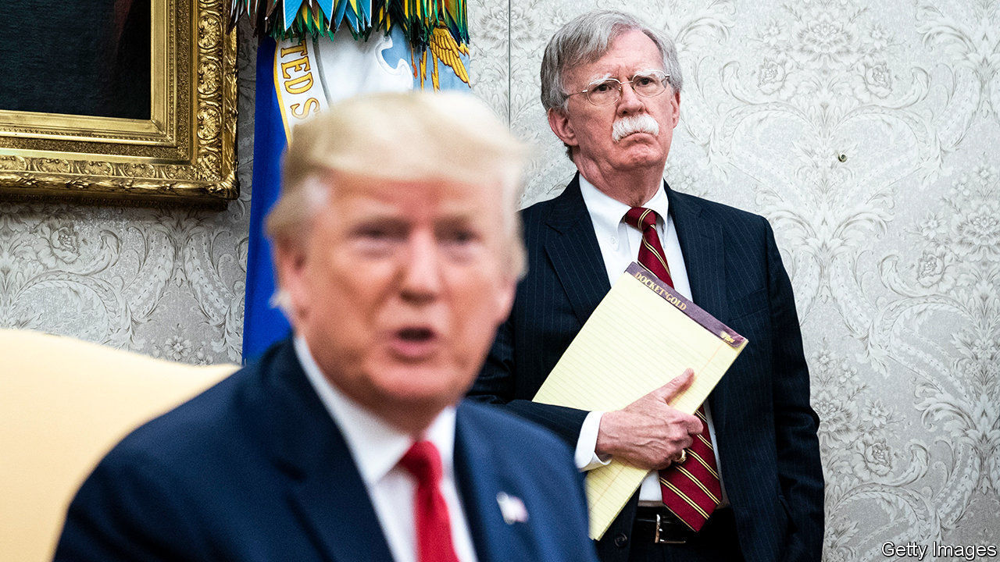

## National security chastiser

# Details from John Bolton’s book are damning for Donald Trump

> The former national security adviser accuses the president of asking China for help to win a second term and kowtowing to authoritarians

> Jun 18th 2020

TO JUDGE BY the way he slams his former top officials, President Donald Trump clearly needs to review his hiring policies. Earlier this month he called his first defence secretary, Jim Mattis, “the world’s most overrated general”, after Mr Mattis criticised the use of force to remove protesters from Lafayette Square near the White House. This week it is the turn of John Bolton, his former national security adviser, to come in for attack: Mr Trump called him “a washed-up guy” and “a liar” whom everyone in the White House hated. Mr Bolton has infuriated his ex-boss by writing a book full of damning details from his year-and-a-half in the Trump administration.

The book, “The Room Where It Happened”, was originally scheduled for publication in March, but the administration delayed it for a review of classified information, and it is now due for release on June 23rd. Although last-ditch legal efforts to block it (and to take away Mr Bolton’s earnings from it) continue, details of the juiciest bits from its 592 pages have been emerging in the press from advance copies, and the author has started to give interviews about it. Three main embarrassments for Mr Trump stand out.

The first is on the probity of his policy. The heart of the allegation that led the House of Representatives to impeach the president was that he sought to put pressure on Ukraine not in America’s national interest but in order to boost his own re-election chances, by trying to extract dirt on his Democratic opponent, Joe Biden. Mr Bolton portrays this as part of a pattern. In particular, he says, Mr Trump asked China’s president, Xi Jinping, to help him win a second term. When the two presidents met on the sidelines of a G20 summit in Tokyo a year ago, Mr Trump “stressed the importance of farmers, and increased Chinese purchases of soybeans and wheat in the electoral outcome.”

Humouring authoritarian leaders (Mr Xi, Vladimir Putin of Russia, Turkey’s Recep Tayyip Erdogan) is also a pattern for Mr Trump, according to his former national security adviser. At the same meeting in Tokyo Mr Xi defended his mass detention of Uighurs in Xinjiang. Mr Bolton recounts that Mr Trump told Mr Xi that he thought it was “exactly the right thing to do” and he should go ahead with building the camps.

The second embarrassment for Mr Trump comes from anecdotes about his ignorance. The president is described as “stunningly uninformed” on how to run the government. He asks if Finland is part of Russia. At one point, in a meeting in May 2018 with Britain’s then prime minister, Theresa May, he seemed unaware that Britain was a nuclear power.

Third, Mr Bolton’s book adds colourful details to previous accounts of back-stabbing within the administration and criticism of the president by senior officials. Mr Bolton describes one incident during the summit in Singapore with North Korea’s leader, Kim Jong Un, when Mr Trump said he would seek Senate approval of any nuclear deal. Mike Pompeo, the secretary of state, passed Mr Bolton a note saying that he (meaning Mr Trump) “is so full of shit”.

Mr Bolton is clearly no stylist, but he was a prodigious note-taker, which lends credibility to his account. Democrats will remain angry that he has chosen to spill these beans in a memoir rather than to Congress: he refused to testify in the House impeachment hearings. Would it have made a difference to the outcome had he done so? Mr Bolton thinks not (though he accuses House Democrats of “impeachment malpractice”, in failing to pursue the broader pattern of abuse of presidential power). He is probably right, given the near-unanimous backing for Mr Trump among Senate Republicans that ensured the president’s acquittal.

The bigger question now is whether Mr Bolton’s book will make a difference in November. That is the real reason Mr Trump is furious. Unlike Mr Mattis, Mr Bolton, once a Fox News pundit, has been a darling of the right. And, as he writes, “I am hard pressed to identify any significant Trump decision during my tenure that wasn’t driven by re-election calculations.” ■

Dig deeper:

## URL

https://www.economist.com/united-states/2020/06/18/details-from-john-boltons-book-are-damning-for-donald-trump
