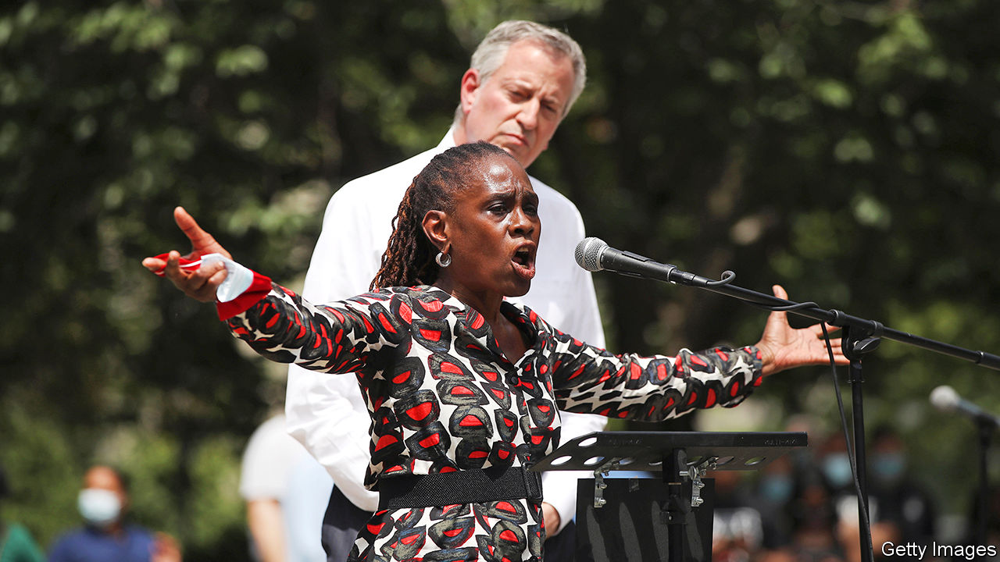

## How’s he doin’?

# New Yorkers turn their backs on Bill de Blasio

> The Big Apple’s mayor is underperforming badly

> Jun 18th 2020NEW YORK

ED KOCH, New York City’s mayor in the 1970s and 1980s, used to ask New Yorkers, “How’m I doin’?” to cheers and jeers. Bill de Blasio, the city’s mayor since 2014, does not ask the question. At the recent memorial service in Brooklyn for George Floyd, the unarmed man who died under the knee of a Minneapolis police officer, Mr de Blasio heard loud and clear what many New Yorkers think of his unwavering support for the police. People there booed and turned their backs on the mayor during his short address. Some chanted “Resign!” Those booing had been his base, the very people who got him elected in 2013.

His mixed-race family attracted black and white New Yorkers alike. His son Dante, then 15 and sporting an impressive Afro, was the star of his campaign advertisements. Borrowing from Dickens’s “A Tale of Two Cities”, a book about the French revolution, to describe the gap between the Big Apple’s rich and poor, Mr de Blasio touched on something that his predecessor, Mike Bloomberg, an otherwise successful manager, had neglected.

The message resonated. His promise to reform the New York Police Department (NYPD), ending stop-and-frisk, a policy that disproportionately targeted black and brown people, was applauded. But, six years on, mothers still fear for their black sons and the gap between the two New Yorks has not narrowed.

When videos recently surfaced of aggressive police behaviour towards peaceful protesters, the mayor still defended the cops. Police appeared to use batons liberally and a police SUV drove into a crowd. Mr de Blasio did little to quell tensions.

This is a 180-degree turn from the reformer who once spoke with emotion about his worries for his black son at the hands of police. Two events might explain this shift. In 2014 Eric Garner, an unarmed man, was killed by a police officer using a banned chokehold. Protests erupted when a grand jury refused to bring charges against the officer. A few weeks later two officers were fatally ambushed by a deranged man seeking revenge for Mr Garner’s death. The rank and file felt besieged. Many turned their backs on the mayor at the funeral of one of the murdered officers. Then he was booed at a police graduation. After that, he grew closer to the NYPD’s leadership. It took nearly five years to dismiss the officer who killed Mr Garner.

His tone-deaf support of over-aggressive police action appalled his staff and former advisers. More than 1,000 of them signed an open letter calling on Mr de Blasio to reform the NYPD and divert $1bn from its budget towards social services. Hundreds of former and current staff marched from City Hall in protest against his handling of the unrest. A city councillor intends to call for a vote of no confidence.

At times, the mayor’s focus has seemed to be elsewhere. He tried to launch a national progressive movement in 2015 and ran for president last year. This national barnstorming distracted from his work at City Hall. He is chronically late to events and meetings.

His handling of the covid-19 crisis has not helped him. Some think he should have shut down the city sooner. More than 20,000 New Yorkers have died. Nor has he prepared the city for a recession. Jonas Shaende of the Fiscal Policy Institute, a local think-tank, says he should have established a rainy-day fund. The economy’s contraction has blown a $9.7bn hole in the budget. Deep cuts are inevitable. Dan Doctoroff, Mr Bloomberg’s former deputy mayor, believes New York will have to maintain quality of life to avoid going into a “vicious cycle of decline like we had in the ’70s”. That won’t be easy.

Mr de Blasio has had successes. The mayor’s roll-out of universal nursery schooling has been copied all over the country. He has kept total crime down. He passed paid sick leave. He introduced an ID card for the city’s many undocumented immigrants. Now he is belatedly shifting NYPD funding to youth programmes. And the NYPD has disbanded plainclothes units involved in many shootings. But his handling of the protests and the pandemic will taint his legacy. ■

Editor’s note: Some of our covid-19 coverage is free for readers of The Economist Today, our daily [newsletter](https://www.economist.com/https://my.economist.com/user#newsletter). For more stories and our pandemic tracker, see our [coronavirus hub](https://www.economist.com//news/2020/03/11/the-economists-coverage-of-the-coronavirus)

## URL

https://www.economist.com/united-states/2020/06/18/new-yorkers-turn-their-backs-on-bill-de-blasio
