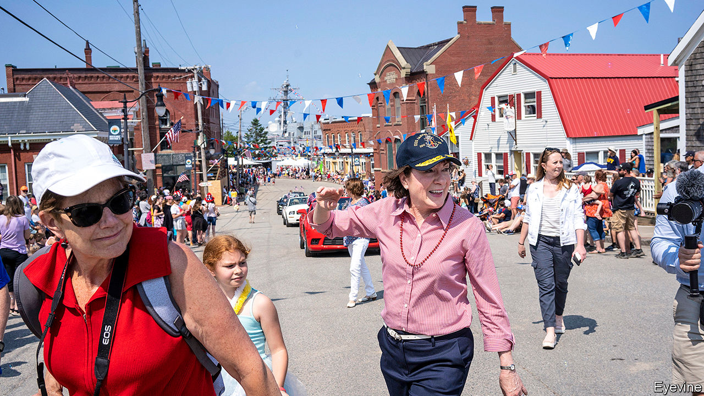

## The Maine Senate race

# The bid to unseat the last New England Republican in Congress

> The race of the long driveways

> Jun 20th 2020

WHEN CONGRESS convened in January 2001, 11 of the 35 senators and representatives from New England were Republicans. That was not unusual: just as the South is ancestrally Democratic, much of New England is ancestrally Republican. Vermont has only ever elected one Democratic senator, Patrick Leahy, and between 1850 and 2007 elected just two Democratic representatives, who both served only one term (Bernie Sanders caucuses with Democrats but is an independent). The first African-American to win popular election to the Senate was Edward Brooke, a Republican from Massachusetts. The first woman to serve in both houses of Congress was Margaret Smith, a Republican from Maine.

Today, New England Republicans in Congress are rarer than white southern Democrats. Just one remains: Susan Collins, Maine’s senior senator. Up for re-election in November, she trails her presumptive opponent, Sara Gideon, speaker of the Maine House of Representatives, by nine points, according to a poll last month. Democrats need to flip five seats—assuming Doug Jones, a Democrat from Alabama, loses—to take control of the Senate. Many see Ms Collins as among the most vulnerable incumbents. They are in for a fight.

First, reasons for Democratic optimism. Ms Gideon is telegenic and a prodigious fundraiser, raking in more this cycle than Ms Collins. Politicos praise her for the same set of qualities Ms Collins possesses: toughness, preparation and work ethic. ActBlue, a liberal fundraising platform, amassed a $4m war chest for Ms Gideon, much of it before she declared herself a candidate, from donors angry at Ms Collins’s support for Brett Kavanaugh’s nomination to the Supreme Court. Although Ms Gideon has yet to clinch the nomination officially, the Democrats’ Senate campaign arm has endorsed her (her progressive opponent, Betsy Sweet, calls herself an “intuitive healer”, and has worked as a medium, connecting the living to the dead).

At the same time, Ms Collins’s independent reputation has been dented. “She speaks earnestly and slowly, and makes you feel like she’s weighing both sides,” says Carolyn May, a longtime resident of Waldo County who has previously voted for Ms Collins. “But if you watch her votes, it’s been more and more following the party line...she’s not the person that Maine needs.” Indeed, her voting record aligns more closely with Donald Trump’s preferences than with those of any other president during her time in office. That has not helped her approval ratings.

Democrats feel they have the wind at their backs. Mr Trump trails Joe Biden in state polls, and in 2018 Democrats flipped both the swing second congressional district, with Jared Golden, and the governor’s mansion, with Janet Mills. Ms Mills did well with the same sort of “long-driveway Democrats” that Ms Gideon will need to win—meaning often independent-minded, well-off voters in the wealthy southern coastal towns near Portland, Maine’s biggest city. Ms Mills ran up sizeable margins in the state’s populous southern counties, while performing respectably in the more conservative north.

Ms Gideon may find that a hard path to follow. Ms Mills was running against a businessman from southern Maine who had never held office before, while she herself has deep roots in rural Maine. Ms Gideon, who did not move to the state until 2004, is a candidate with impressive credentials from a rich town in Maine’s south, and talks like it; Ms Mills has an unaffected demeanour and a chewy Maine accent.

Ms Collins, as one of her supporters put it, is “a daughter of northern Maine”, raised in the small town of Caribou. She remains a familiar presence at small-town parades and high-school basketball games, and has a sterling reputation for constituent service and bringing money back to the state. None of which is to say she will win. Perhaps Ms Gideon will run up even better numbers down south than Ms Mills. Perhaps she will persuade enough voters from the rural white second district to break with their longtime senator. But it’s a narrow road to the deep north. ■

Dig deeper: